# StGB Outcomes by Article

Сгенерировано из `out/stgb_article_outcome_profile.csv`.

HTML-версия с круговыми диаграммами: `out/stgb_article_pies_report.html`.

## 2022

### Straftaten ohne Straftaten im Straßenverkehr nach dem StGB insgesamt Summe 1012 bis 1686

StGBoV

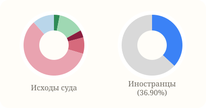

- Abgeurteilte: 475 914
- Verurteilte: 370 989
- Иностранцы: 36.90%
- Оправдан: 14 567
- Дело прекращено: 66 172
- Лишение свободы: 18 672
- Условный срок: 41 438
- Денежный штраф: 280 115
- Остальные: 54 950

### StGB §§ 142, 315 b bis d,316 sowie 222,229, §§ 323 a i.V.m. Verkehrsunfall, StVG §§ 21, §§ 22,22 a,22 b Straftaten im Straßenverkehr

StGB

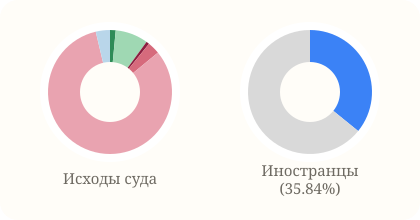

- Abgeurteilte: 185 490
- Verurteilte: 164 153
- Иностранцы: 35.84%
- Оправдан: 2 731
- Дело прекращено: 15 873
- Лишение свободы: 1 474
- Условный срок: 5 986
- Денежный штраф: 152 574
- Остальные: 6 852

### StGB 22. Abschnitt, §§ 263 bis 266 b Betrug und Untreue

StGB

- Abgeurteilte: 124 664
- Verurteilte: 103 392
- Иностранцы: 33.22%
- Оправдан: 2 779
- Дело прекращено: 15 722
- Лишение свободы: 2 506
- Условный срок: 9 236
- Денежный штраф: 88 312
- Остальные: 6 109

### Straftaten im Straßenverkehr nach dem StGB insgesamt Summe 7001 bis 7041

StGB

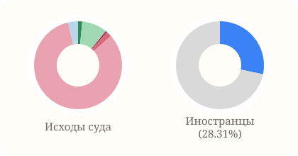

- Abgeurteilte: 124 131
- Verurteilte: 109 030
- Иностранцы: 28.31%
- Оправдан: 1 919
- Дело прекращено: 11 604
- Лишение свободы: 603
- Условный срок: 2 558
- Денежный штраф: 102 897
- Остальные: 4 550

### Straftaten im Straßenverkehr nach dem StGB und StVG ohne Trunkenheit zusammen

StGB

- Abgeurteilte: 109 244
- Verurteilte: 91 355
- Иностранцы: 43.23%
- Оправдан: 2 346
- Дело прекращено: 13 480
- Лишение свободы: 1 016
- Условный срок: 4 029
- Денежный штраф: 84 004
- Остальные: 4 369

### StGB 19. Abschnitt, §§ 242 bis 248 c Diebstahl und Unterschlagung

StGB

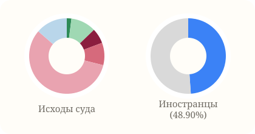

- Abgeurteilte: 106 435
- Verurteilte: 86 164
- Иностранцы: 48.90%
- Оправдан: 2 116
- Дело прекращено: 11 526
- Лишение свободы: 6 917
- Условный срок: 10 212
- Денежный штраф: 61 125
- Остальные: 14 539

### StGB § 242 Diebstahl

StGB

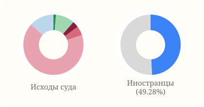

- Abgeurteilte: 79 688
- Verurteilte: 65 244
- Иностранцы: 49.28%
- Оправдан: 1 108
- Дело прекращено: 8 075
- Лишение свободы: 2 654
- Условный срок: 3 944
- Денежный штраф: 53 347
- Остальные: 10 560

### Straftaten im Straßenverkehr nach dem StGB in Trunkenheit zusammen

StGB

- Abgeurteilte: 76 246
- Verurteilte: 72 798
- Иностранцы: 26.56%
- Оправдан: 385
- Дело прекращено: 2 393
- Лишение свободы: 458
- Условный срок: 1 957
- Денежный штраф: 68 570
- Остальные: 2 483

### StGB 17. Abschnitt, §§ 223 bis 231 (o.V.) Straftaten gegen die koerperliche Unversehrtheit (o.V.)

StGB

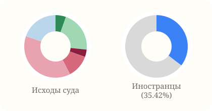

- Abgeurteilte: 73 560
- Verurteilte: 47 916
- Иностранцы: 35.42%
- Оправдан: 3 972
- Дело прекращено: 15 624
- Лишение свободы: 2 795
- Условный срок: 8 757
- Денежный штраф: 27 950
- Остальные: 14 462

### StGB § 263 Abs. 1 Betrug

StGB

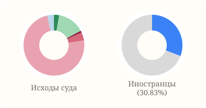

- Abgeurteilte: 73 094
- Verurteilte: 59 274
- Иностранцы: 30.83%
- Оправдан: 2 049
- Дело прекращено: 10 501
- Лишение свободы: 751
- Условный срок: 3 174
- Денежный штраф: 54 003
- Остальные: 2 616

### Straftaten im Straßenverkehr ohne Trunkenheit ohne Verkehrsunfall

StGB

- Abgeurteilte: 62 694
- Verurteilte: 55 467
- Иностранцы: 50.11%
- Оправдан: 1 008
- Дело прекращено: 4 918
- Лишение свободы: 898
- Условный срок: 3 584
- Денежный штраф: 49 582
- Остальные: 2 704

### Trunkenheit im Verkehr nach § 316 StGB insgesamt

StGB

- Abgeurteilte: 58 040
- Verurteilte: 55 734
- Иностранцы: 26.76%
- Оправдан: 268
- Дело прекращено: 1 496
- Лишение свободы: 357
- Условный срок: 1 353
- Денежный штраф: 52 818
- Остальные: 1 748

### Straftaten im Straßenverkehr in Trunkenheit ohne Verkehrsunfall

StGB

- Abgeurteilte: 52 284
- Verurteilte: 49 933
- Иностранцы: 27.71%
- Оправдан: 246
- Дело прекращено: 1 571
- Лишение свободы: 331
- Условный срок: 1 317
- Денежный штраф: 47 141
- Остальные: 1 678

### StGB § 316 Trunkenheit im Verkehr ohne Verkehrsunfall

StGB

- Abgeurteilte: 50 604
- Verurteilte: 48 599
- Иностранцы: 27.62%
- Оправдан: 212
- Дело прекращено: 1 296
- Лишение свободы: 321
- Условный срок: 1 232
- Денежный штраф: 46 001
- Остальные: 1 542

### Straftaten im Straßenverkehr ohne Trunkenheit mit Verkehrsunfall

StGB

- Abgeurteilte: 46 550
- Verurteilte: 35 888
- Иностранцы: 32.61%
- Оправдан: 1 338
- Дело прекращено: 8 562
- Лишение свободы: 118
- Условный срок: 445
- Денежный штраф: 34 422
- Остальные: 1 665

### StGB § 223 Koerperverletzung

StGB

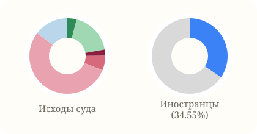

- Abgeurteilte: 40 617
- Verurteilte: 29 278
- Иностранцы: 34.55%
- Оправдан: 1 611
- Дело прекращено: 7 421
- Лишение свободы: 1 079
- Условный срок: 2 541
- Денежный штраф: 22 031
- Остальные: 5 934

### Unerlaubtes Entfernen vom Unfallort insgesamt (§ 142 StGB)

StGB

- Abgeurteilte: 36 491
- Verurteilte: 28 207
- Иностранцы: 31.92%
- Оправдан: 1 150
- Дело прекращено: 6 538
- Лишение свободы: 73
- Условный срок: 360
- Денежный штраф: 27 012
- Остальные: 1 358

### StGB § 142 Abs. 1 Unerl. Entf. vom Unfallort vor Feststellung d. Unfallbeteiligung insgesamt

StGB

- Abgeurteilte: 36 328
- Verurteilte: 28 067
- Иностранцы: 31.89%
- Оправдан: 1 147
- Дело прекращено: 6 521
- Лишение свободы: 73
- Условный срок: 359
- Денежный штраф: 26 881
- Остальные: 1 347

### StGB § 265 a Erschleichen von Leistungen

StGB

- Abgeurteilte: 33 781
- Verurteilte: 29 884
- Иностранцы: 38.79%
- Оправдан: 138
- Дело прекращено: 2 542
- Лишение свободы: 350
- Условный срок: 1 001
- Денежный штраф: 27 282
- Остальные: 2 468

### StGB 23. Abschnitt, §§ 267 bis 282 Urkundenfälschung

StGB

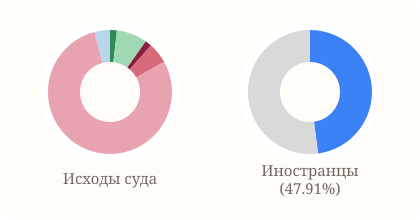

- Abgeurteilte: 33 350
- Verurteilte: 29 537
- Иностранцы: 47.91%
- Оправдан: 601
- Дело прекращено: 2 663
- Лишение свободы: 560
- Условный срок: 1 815
- Денежный штраф: 26 367
- Остальные: 1 344

### StGB § 142 Abs. 1 Unerl. Entf. vom Unfallort vor Feststellung d. Unfallbeteiligung ohne Trunkenheit bzw. Trunkenheit nicht bekannt

StGB

- Abgeurteilte: 31 971
- Verurteilte: 23 886
- Иностранцы: 32.59%
- Оправдан: 1 132
- Дело прекращено: 6 395
- Лишение свободы: 47
- Условный срок: 166
- Денежный штраф: 23 087
- Остальные: 1 144

### StGB 14. Abschnitt, §§ 185 bis 200 Beleidigung

StGB

- Abgeurteilte: 30 951
- Verurteilte: 24 825
- Иностранцы: 23.47%
- Оправдан: 666
- Дело прекращено: 4 478
- Лишение свободы: 311
- Условный срок: 554
- Денежный штраф: 22 850
- Остальные: 2 092

### StGB § 185 Beleidigung

StGB

- Abgeurteilte: 29 852
- Verurteilte: 24 122
- Иностранцы: 23.74%
- Оправдан: 612
- Дело прекращено: 4 153
- Лишение свободы: 308
- Условный срок: 539
- Денежный штраф: 22 175
- Остальные: 2 065

### StGB § 224 Abs. 1 Nrn. 2 bis 5 Gefährliche Koerperverletzung

StGB

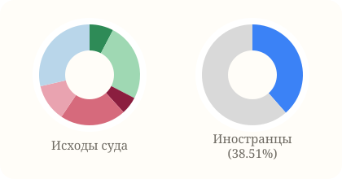

- Abgeurteilte: 28 188
- Verurteilte: 15 477
- Иностранцы: 38.51%
- Оправдан: 2 161
- Дело прекращено: 7 034
- Лишение свободы: 1 592
- Условный срок: 5 960
- Денежный штраф: 3 371
- Остальные: 8 070

### StGB § 267 Abs. 1 Urkundenfälschung

StGB

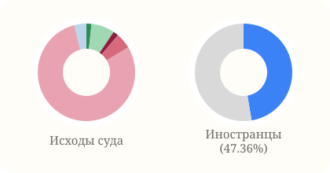

- Abgeurteilte: 26 807
- Verurteilte: 23 866
- Иностранцы: 47.36%
- Оправдан: 452
- Дело прекращено: 2 081
- Лишение свободы: 469
- Условный срок: 1 413
- Денежный штраф: 21 311
- Остальные: 1 081

### Straftaten im Straßenverkehr in Trunkenheit mit Verkehrsunfall

StGB

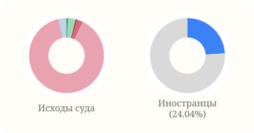

- Abgeurteilte: 23 962
- Verurteilte: 22 865
- Иностранцы: 24.04%
- Оправдан: 139
- Дело прекращено: 822
- Лишение свободы: 127
- Условный срок: 640
- Денежный штраф: 21 429
- Остальные: 805

### StGB 18. Abschnitt, §§ 232 bis 241 a Straftaten gegen die persoenliche Freiheit

StGB

- Abgeurteilte: 19 460
- Verurteilte: 13 935
- Иностранцы: 32.08%
- Оправдан: 815
- Дело прекращено: 3 935
- Лишение свободы: 357
- Условный срок: 760
- Денежный штраф: 12 016
- Остальные: 1 577

### StGB 6. Abschnitt, §§ 111 bis 121 Widerstand gegen die Staatsgewalt

StGB

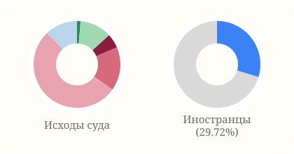

- Abgeurteilte: 15 864
- Verurteilte: 13 183
- Иностранцы: 29.72%
- Оправдан: 214
- Дело прекращено: 1 888
- Лишение свободы: 848
- Условный срок: 2 580
- Денежный штраф: 8 422
- Остальные: 1 912

### StGB 27. Abschnitt, §§ 303 bis 305 a Sachbeschädigung

StGB

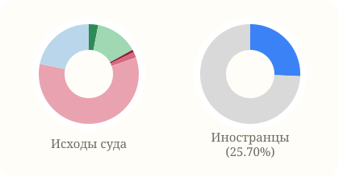

- Abgeurteilte: 14 786
- Verurteilte: 10 474
- Иностранцы: 25.70%
- Оправдан: 448
- Дело прекращено: 2 056
- Лишение свободы: 120
- Условный срок: 275
- Денежный штраф: 8 675
- Остальные: 3 212

### Gefährdung des Straßenverkehrs nach § 315 c StGB insgesamt

StGB

- Abgeurteilte: 13 792
- Verurteilte: 12 235
- Иностранцы: 26.38%
- Оправдан: 208
- Дело прекращено: 1 214
- Лишение свободы: 49
- Условный срок: 302
- Денежный штраф: 11 458
- Остальные: 561

### StGB 13. Abschnitt, §§ 174 bis 184 l Straftaten gegen die sexuelle Selbstbestimmung

StGB

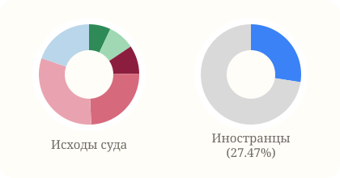

- Abgeurteilte: 13 611
- Verurteilte: 10 364
- Иностранцы: 27.47%
- Оправдан: 948
- Дело прекращено: 1 175
- Лишение свободы: 1 247
- Условный срок: 3 339
- Денежный штраф: 4 215
- Остальные: 2 687

### StGB § 303 Abs. 1 Sachbeschädigung

StGB

- Abgeurteilte: 12 806
- Verurteilte: 9 246
- Иностранцы: 27.24%
- Оправдан: 413
- Дело прекращено: 1 797
- Лишение свободы: 112
- Условный срок: 242
- Денежный штраф: 7 811
- Остальные: 2 431

### Fahrlässige Koerperverl. im Straßenverkehr insgesamt (§ 229 StGB)

StGB

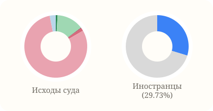

- Abgeurteilte: 12 387
- Verurteilte: 10 420
- Иностранцы: 29.73%
- Оправдан: 113
- Дело прекращено: 1 721
- Лишение свободы: 31
- Условный срок: 194
- Денежный штраф: 9 943
- Остальные: 385

### Gefährdung des Straßenverkehrs nach § 315 c StGB mit Verkehrsunfall

StGB

- Abgeurteilte: 11 226
- Verurteilte: 10 326
- Иностранцы: 25.45%
- Оправдан: 113
- Дело прекращено: 723
- Лишение свободы: 35
- Условный срок: 190
- Денежный штраф: 9 823
- Остальные: 342

### StGB 7. Abschnitt, §§ 123 bis 145 d, ohne § 142 Straftaten gegen die oeffentliche Ordnung (o.V.)

StGB

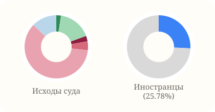

- Abgeurteilte: 10 250
- Verurteilte: 7 510
- Иностранцы: 25.78%
- Оправдан: 242
- Дело прекращено: 1 747
- Лишение свободы: 283
- Условный срок: 471
- Денежный штраф: 6 196
- Остальные: 1 311

### StGB § 229 Fahrlässige Koerperverletzung im Straßenverkehr ohne Trunkenheit

StGB

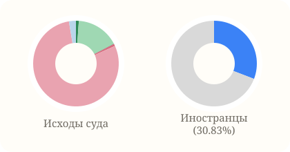

- Abgeurteilte: 10 102
- Verurteilte: 8 229
- Иностранцы: 30.83%
- Оправдан: 109
- Дело прекращено: 1 649
- Лишение свободы: 15
- Условный срок: 69
- Денежный штраф: 7 994
- Остальные: 266

### StGB § 315 c Abs. 1 Nr. 1 a Straßenverkehrs- gefährdung infolge Trunkenheit mit Verkehrs- unfall

StGB

- Abgeurteilte: 9 616
- Verurteilte: 9 093
- Иностранцы: 24.46%
- Оправдан: 64
- Дело прекращено: 421
- Лишение свободы: 33
- Условный срок: 176
- Денежный штраф: 8 659
- Остальные: 263

### StGB § 241 Bedrohung

StGB

- Abgeurteilte: 9 327
- Verurteilte: 6 953
- Иностранцы: 33.80%
- Оправдан: 321
- Дело прекращено: 1 639
- Лишение свободы: 157
- Условный срок: 285
- Денежный штраф: 6 142
- Остальные: 783

### StGB § 240 Abs. 1 Noetigung

StGB

- Abgeurteilte: 8 564
- Verurteilte: 5 909
- Иностранцы: 29.77%
- Оправдан: 415
- Дело прекращено: 1 918
- Лишение свободы: 83
- Условный срок: 267
- Денежный штраф: 5 212
- Остальные: 669

### StGB § 114 Tätl. Angriff auf Vollstreckungsbeamte

StGB

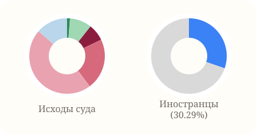

- Abgeurteilte: 8 539
- Verurteilte: 7 286
- Иностранцы: 30.29%
- Оправдан: 110
- Дело прекращено: 800
- Лишение свободы: 617
- Условный срок: 1 871
- Денежный штраф: 3 981
- Остальные: 1 160

### StGB § 243 Abs. 1 Satz 2 Nrn. 2 bis 7 Diebstahl in anderen besonders schweren Fällen

StGB

- Abgeurteilte: 7 806
- Verurteilte: 6 463
- Иностранцы: 57.42%
- Оправдан: 172
- Дело прекращено: 756
- Лишение свободы: 1 485
- Условный срок: 2 234
- Денежный штраф: 2 072
- Остальные: 1 087

### StGB 20. Abschnitt, §§ 249 bis 256, 316a Raub und Erpressung, räuberischer Angriff auf Kraftfahrer

StGB

- Abgeurteilte: 7 665
- Verurteilte: 5 329
- Иностранцы: 36.63%
- Оправдан: 622
- Дело прекращено: 913
- Лишение свободы: 1 550
- Условный срок: 1 126
- Денежный штраф: 447
- Остальные: 3 007

### StGB § 316 Trunkenheit im Verkehr mit Verkehrsunfall

StGB

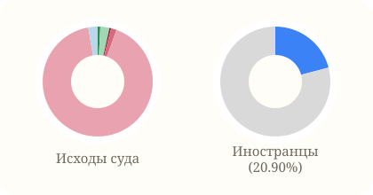

- Abgeurteilte: 7 436
- Verurteilte: 7 135
- Иностранцы: 20.90%
- Оправдан: 56
- Дело прекращено: 200
- Лишение свободы: 36
- Условный срок: 121
- Денежный штраф: 6 817
- Остальные: 206

### StGB § 243 Abs. 1 Satz 2 Nr. 1 Einbruchdiebstahl

StGB

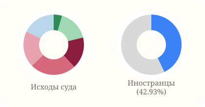

- Abgeurteilte: 7 197
- Verurteilte: 5 281
- Иностранцы: 42.93%
- Оправдан: 323
- Дело прекращено: 1 196
- Лишение свободы: 1 226
- Условный срок: 1 774
- Денежный штраф: 1 399
- Остальные: 1 279

### StGB § 263 Abs. 3 und 5 Schwerwiegende Fälle des Betruges

StGB

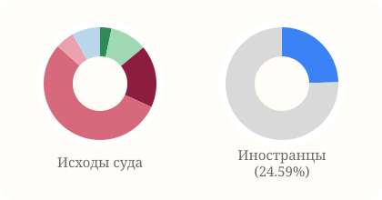

- Abgeurteilte: 6 950
- Verurteilte: 5 855
- Иностранцы: 24.59%
- Оправдан: 228
- Дело прекращено: 739
- Лишение свободы: 1 243
- Условный срок: 3 803
- Денежный штраф: 378
- Остальные: 559

### StGB § 113 Widerstand gegen Vollstreckungsbeamte

StGB

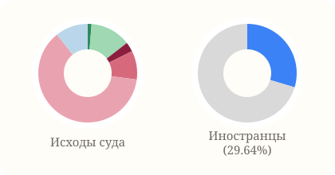

- Abgeurteilte: 6 595
- Verurteilte: 5 426
- Иностранцы: 29.64%
- Оправдан: 82
- Дело прекращено: 875
- Лишение свободы: 206
- Условный срок: 622
- Денежный штраф: 4 104
- Остальные: 706

### StGB 21. Abschnitt, §§ 257 bis 262 Begünstigung und Hehlerei

StGB

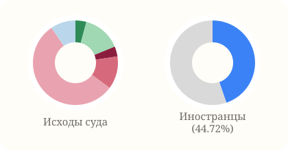

- Abgeurteilte: 4 682
- Verurteilte: 3 600
- Иностранцы: 44.72%
- Оправдан: 195
- Дело прекращено: 684
- Лишение свободы: 180
- Условный срок: 587
- Денежный штраф: 2 591
- Остальные: 445

### StGB § 246 Unterschlagung

StGB

- Abgeurteilte: 4 678
- Verurteilte: 3 440
- Иностранцы: 30.20%
- Оправдан: 266
- Дело прекращено: 773
- Лишение свободы: 60
- Условный срок: 280
- Денежный штраф: 2 859
- Остальные: 440

### StGB §§ 123, 124 Hausfriedensbruch

StGB

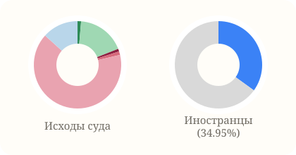

- Abgeurteilte: 4 663
- Verurteilte: 3 399
- Иностранцы: 34.95%
- Оправдан: 61
- Дело прекращено: 827
- Лишение свободы: 46
- Условный срок: 61
- Денежный штраф: 3 047
- Остальные: 621

### StGB § 184 b Verbreitung, Erwerb und Besitz kinderpornographischer Inhalte

StGB

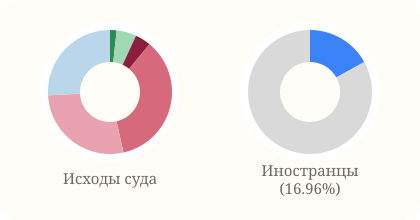

- Abgeurteilte: 4 422
- Verurteilte: 3 632
- Иностранцы: 16.96%
- Оправдан: 76
- Дело прекращено: 229
- Лишение свободы: 181
- Условный срок: 1 571
- Денежный штраф: 1 221
- Остальные: 1 144

### StGB § 142 Abs. 1 Unerl. Entf. vom Unfallort vor Feststellung d. Unfallbeteiligung in Trunkenheit

StGB

- Abgeurteilte: 4 357
- Verurteilte: 4 181
- Иностранцы: 27.89%
- Оправдан: 15
- Дело прекращено: 126
- Лишение свободы: 26
- Условный срок: 193
- Денежный штраф: 3 794
- Остальные: 203

### StGB § 266 a Abs. 1 Vorenthalten von Arbeitnehmerbeiträgen durch den Arbeitgeber

StGB

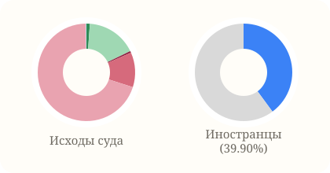

- Abgeurteilte: 4 308
- Verurteilte: 3 534
- Иностранцы: 39.90%
- Оправдан: 49
- Дело прекращено: 719
- Лишение свободы: 23
- Условный срок: 498
- Денежный штраф: 3 010
- Остальные: 9

### StGB § 229 Fahrlässige Koerperverletzung, außer im Straßenverkehr

StGB

- Abgeurteilte: 3 961
- Verurteilte: 2 739
- Иностранцы: 27.16%
- Оправдан: 106
- Дело прекращено: 959
- Лишение свободы: 23
- Условный срок: 89
- Денежный штраф: 2 463
- Остальные: 321

### StGB 10. Abschnitt, §§ 164 und 165 Falsche Verdächtigung

StGB

- Abgeurteilte: 3 846
- Verurteilte: 2 678
- Иностранцы: 31.85%
- Оправдан: 213
- Дело прекращено: 752
- Лишение свободы: 35
- Условный срок: 116
- Денежный штраф: 2 335
- Остальные: 395

### StGB § 164 Falsche Verdächtigung

StGB

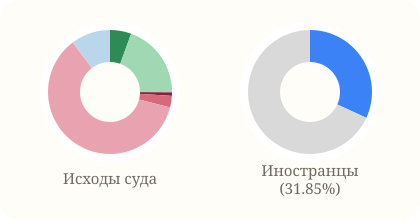

- Abgeurteilte: 3 846
- Verurteilte: 2 678
- Иностранцы: 31.85%
- Оправдан: 213
- Дело прекращено: 752
- Лишение свободы: 35
- Условный срок: 116
- Денежный штраф: 2 335
- Остальные: 395

### StGB § 244 Abs. 1 Nr. 1 Diebstahl mit Waffen

StGB

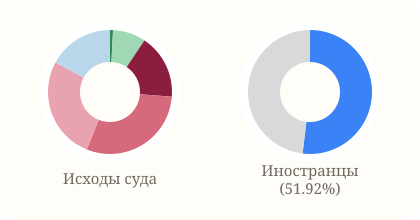

- Abgeurteilte: 3 566
- Verurteilte: 3 020
- Иностранцы: 51.92%
- Оправдан: 28
- Дело прекращено: 306
- Лишение свободы: 601
- Условный срок: 1 067
- Денежный штраф: 955
- Остальные: 609

### StGB 9. Abschnitt, §§ 153 bis 162 Falsche uneidliche Aussage und Meineid

StGB

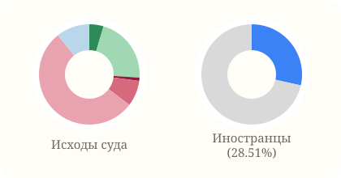

- Abgeurteilte: 3 420
- Verurteilte: 2 389
- Иностранцы: 28.51%
- Оправдан: 156
- Дело прекращено: 734
- Лишение свободы: 36
- Условный срок: 284
- Денежный штраф: 1 843
- Остальные: 367

### StGB § 263 a Computerbetrug

StGB

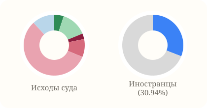

- Abgeurteilte: 3 324
- Verurteilte: 2 566
- Иностранцы: 30.94%
- Оправдан: 167
- Дело прекращено: 458
- Лишение свободы: 98
- Условный срок: 318
- Денежный штраф: 1 890
- Остальные: 393

### StGB 28. Abschnitt, §§ 306 bis 323c, ohne §§ 315 b bis d, ohne §§ 316,316 a und ohne § 323 a i.V.m. Verkehrsunfall Gemeingefährliche Straftaten

StGB

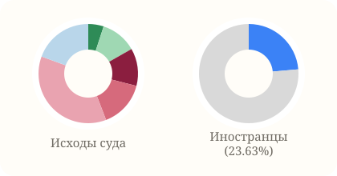

- Abgeurteilte: 2 859
- Verurteilte: 2 116
- Иностранцы: 23.63%
- Оправдан: 143
- Дело прекращено: 336
- Лишение свободы: 350
- Условный срок: 434
- Денежный штраф: 1 041
- Остальные: 555

### StGB 1. Abschnitt, §§ 80 a bis 92 b Friedensverrat, Hochverrat und Gefährdung des demokratischen Rechtsstaates

StGB

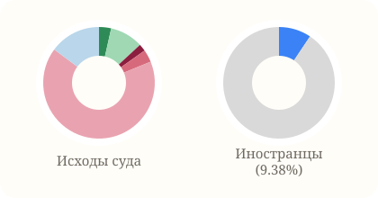

- Abgeurteilte: 2 646
- Verurteilte: 2 036
- Иностранцы: 9.38%
- Оправдан: 93
- Дело прекращено: 254
- Лишение свободы: 55
- Условный срок: 96
- Денежный штраф: 1 756
- Остальные: 392

### Gefährdung des Straßenverkehrs nach § 315 c StGB ohne Verkehrsunfall

StGB

- Abgeurteilte: 2 566
- Verurteilte: 1 909
- Иностранцы: 31.43%
- Оправдан: 95
- Дело прекращено: 491
- Лишение свободы: 14
- Условный срок: 112
- Денежный штраф: 1 635
- Остальные: 219

### StGB § 255 Räuberische Erpressung

StGB

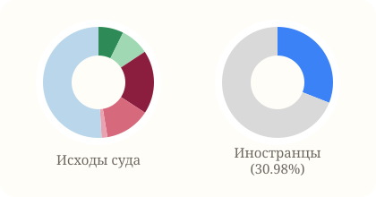

- Abgeurteilte: 2 451
- Verurteilte: 1 769
- Иностранцы: 30.98%
- Оправдан: 179
- Дело прекращено: 206
- Лишение свободы: 453
- Условный срок: 324
- Денежный штраф: 42
- Остальные: 1 247

### StGB § 153 Falsche uneidliche Aussage

StGB

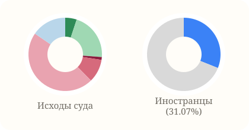

- Abgeurteilte: 2 296
- Verurteilte: 1 564
- Иностранцы: 31.07%
- Оправдан: 116
- Дело прекращено: 485
- Лишение свободы: 29
- Условный срок: 235
- Денежный штраф: 1 077
- Остальные: 354

### StGB § 229 Fahrlässige Koerperverletzung im Straßenverkehr in Trunkenheit

StGB

- Abgeurteilte: 2 285
- Verurteilte: 2 191
- Иностранцы: 25.60%
- Оправдан: 4
- Дело прекращено: 72
- Лишение свободы: 16
- Условный срок: 125
- Денежный штраф: 1 949
- Остальные: 119

### StGB §§ 277, 278 und 279 Andere Straftaten der Urkundenfälschung

StGB

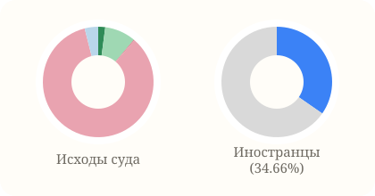

- Abgeurteilte: 2 207
- Verurteilte: 1 904
- Иностранцы: 34.66%
- Оправдан: 45
- Дело прекращено: 201
- Лишение свободы: 0
- Условный срок: 5
- Денежный штраф: 1 869
- Остальные: 87

### StGB § 264 Subventionsbetrug

StGB

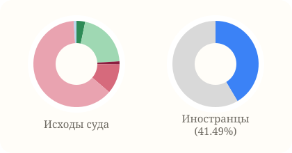

- Abgeurteilte: 2 206
- Verurteilte: 1 668
- Иностранцы: 41.49%
- Оправдан: 72
- Дело прекращено: 457
- Лишение свободы: 26
- Условный срок: 246
- Денежный штраф: 1 382
- Остальные: 23

### StGB § 184 i Sexuelle Belästigung

StGB

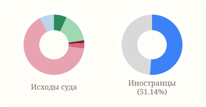

- Abgeurteilte: 2 084
- Verurteilte: 1 531
- Иностранцы: 51.14%
- Оправдан: 143
- Дело прекращено: 328
- Лишение свободы: 32
- Условный срок: 61
- Денежный штраф: 1 362
- Остальные: 158

### StGB § 249 Raub

StGB

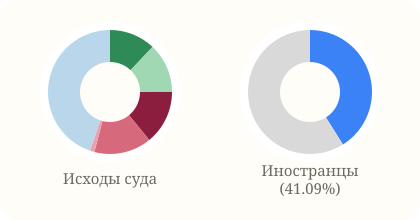

- Abgeurteilte: 1 837
- Verurteilte: 1 117
- Иностранцы: 41.09%
- Оправдан: 221
- Дело прекращено: 238
- Лишение свободы: 259
- Условный срок: 275
- Денежный штраф: 22
- Остальные: 822

### StGB § 86 a Verwenden von Kennzeichen verfassungs- widriger und terroristischer Organisationen

StGB

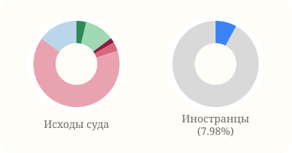

- Abgeurteilte: 1 744
- Verurteilte: 1 315
- Иностранцы: 7.98%
- Оправдан: 64
- Дело прекращено: 194
- Лишение свободы: 33
- Условный срок: 59
- Денежный штраф: 1 133
- Остальные: 261

### StGB § 315 c Abs. 1 Nr. 1 a Straßenverkehrs- gefährdung infolge Trunkenheit ohne Verkehrsunfall

StGB

- Abgeurteilte: 1 680
- Verurteilte: 1 334
- Иностранцы: 30.88%
- Оправдан: 34
- Дело прекращено: 275
- Лишение свободы: 10
- Условный срок: 85
- Денежный штраф: 1 140
- Остальные: 136

### Verbotene Kraftfahrzeugrennen nach § 315 d StGB insgesamt

StGB

- Abgeurteilte: 1 654
- Verurteilte: 1 194
- Иностранцы: 25.63%
- Оправдан: 86
- Дело прекращено: 272
- Лишение свободы: 28
- Условный срок: 97
- Денежный штраф: 836
- Остальные: 335

### StGB § 269 Fälschung beweiserheblicher Daten

StGB

- Abgeurteilte: 1 638
- Verurteilte: 1 363
- Иностранцы: 32.36%
- Оправдан: 55
- Дело прекращено: 167
- Лишение свободы: 24
- Условный срок: 141
- Денежный штраф: 1 138
- Остальные: 113

### StGB § 259 Hehlerei

StGB

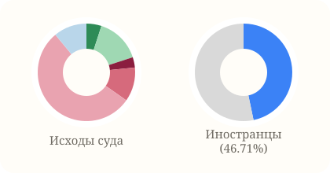

- Abgeurteilte: 1 546
- Verurteilte: 1 156
- Иностранцы: 46.71%
- Оправдан: 77
- Дело прекращено: 232
- Лишение свободы: 53
- Условный срок: 175
- Денежный штраф: 839
- Остальные: 170

### Verbotene Kraftfahrzeugrennen nach § 315 d StGB ohne Verkehrsunfall

StGB

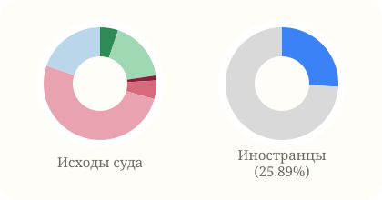

- Abgeurteilte: 1 464
- Verurteilte: 1 039
- Иностранцы: 25.89%
- Оправдан: 76
- Дело прекращено: 256
- Лишение свободы: 21
- Условный срок: 78
- Денежный штраф: 742
- Остальные: 291

### StGB 15. Abschnitt, §§ 201 bis 206 Verletzung des persoenlichen Lebens- und Geheimbereichs

StGB

- Abgeurteilte: 1 459
- Verurteilte: 1 095
- Иностранцы: 30.05%
- Оправдан: 54
- Дело прекращено: 245
- Лишение свободы: 6
- Условный срок: 56
- Денежный штраф: 977
- Остальные: 121

### StGB § 244 Abs. 4 Privatwohnungseinbruchdiebstahl

StGB

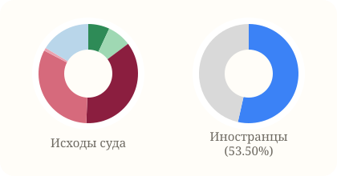

- Abgeurteilte: 1 444
- Verurteilte: 1 187
- Иностранцы: 53.50%
- Оправдан: 100
- Дело прекращено: 113
- Лишение свободы: 518
- Условный срок: 463
- Денежный штраф: 14
- Остальные: 236

### StGB § 252 Räuberischer Diebstahl

StGB

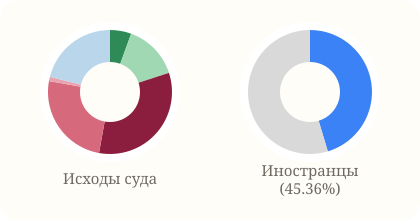

- Abgeurteilte: 1 425
- Verurteilte: 1 045
- Иностранцы: 45.36%
- Оправдан: 79
- Дело прекращено: 206
- Лишение свободы: 468
- Условный срок: 356
- Денежный штраф: 16
- Остальные: 300

### StGB § 145 d Vortäuschen einer Straftat

StGB

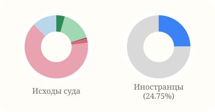

- Abgeurteilte: 1 334
- Verurteilte: 982
- Иностранцы: 24.75%
- Оправдан: 58
- Дело прекращено: 212
- Лишение свободы: 6
- Условный срок: 30
- Денежный штраф: 861
- Остальные: 167

### StGB § 176 Sexueller Missbrauch von Kindern

StGB

- Abgeurteilte: 1 228
- Verurteilte: 893
- Иностранцы: 14.33%
- Оправдан: 83
- Дело прекращено: 94
- Лишение свободы: 190
- Условный срок: 477
- Денежный штраф: 19
- Остальные: 365

### StGB 29. Abschnitt, §§ 324 bis 330 a Straftaten gegen die Umwelt

StGB

- Abgeurteilte: 1 218
- Verurteilte: 918
- Иностранцы: 37.36%
- Оправдан: 33
- Дело прекращено: 261
- Лишение свободы: 7
- Условный срок: 19
- Денежный штраф: 889
- Остальные: 9

### StGB 12. Abschnitt, §§ 169 bis 173 Straftaten gegen den Personenstand, die Ehe und die Familie

StGB

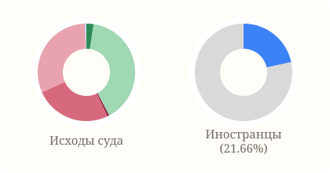

- Abgeurteilte: 1 091
- Verurteilte: 628
- Иностранцы: 21.66%
- Оправдан: 26
- Дело прекращено: 435
- Лишение свободы: 7
- Условный срок: 278
- Денежный штраф: 340
- Остальные: 5

### StGB 24. Abschnitt, §§ 283 bis 283 d Insolvenzstraftaten

StGB

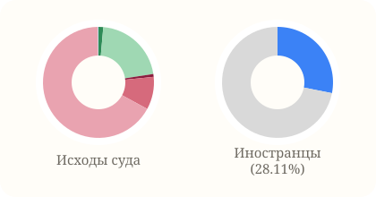

- Abgeurteilte: 1 081
- Verurteilte: 836
- Иностранцы: 28.11%
- Оправдан: 15
- Дело прекращено: 229
- Лишение свободы: 9
- Условный срок: 103
- Денежный штраф: 723
- Остальные: 2

### StGB §§ 257, 258 und 258 a Begünstigung und Strafvereitelung Strafvereitelung im Amt

StGB

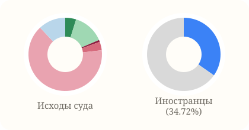

- Abgeurteilte: 1 060
- Verurteilte: 795
- Иностранцы: 34.72%
- Оправдан: 51
- Дело прекращено: 146
- Лишение свободы: 9
- Условный срок: 40
- Денежный штраф: 687
- Остальные: 127

### StGB § 250 Schwerer Raub

StGB

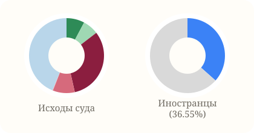

- Abgeurteilte: 1 055
- Verurteilte: 818
- Иностранцы: 36.55%
- Оправдан: 82
- Дело прекращено: 72
- Лишение свободы: 336
- Условный срок: 100
- Денежный штраф: 2
- Остальные: 463

### StGB § 315 b Gefährliche Eingriffe in den Straßenverkehr

StGB

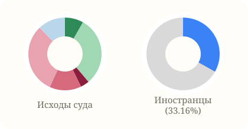

- Abgeurteilte: 1 038
- Verurteilte: 570
- Иностранцы: 33.16%
- Оправдан: 85
- Дело прекращено: 319
- Лишение свободы: 40
- Условный срок: 146
- Денежный штраф: 322
- Остальные: 126

### StGB § 303 Abs. 2 Sachbeschädigung

StGB

- Abgeurteilte: 1 027
- Verurteilte: 658
- Иностранцы: 10.94%
- Оправдан: 18
- Дело прекращено: 157
- Лишение свободы: 0
- Условный срок: 15
- Денежный штраф: 536
- Остальные: 301

### StGB § 156 Falsche Versicherung an Eides Statt

StGB

- Abgeurteilte: 1 020
- Verurteilte: 748
- Иностранцы: 23.80%
- Оправдан: 35
- Дело прекращено: 231
- Лишение свободы: 6
- Условный срок: 25
- Денежный штраф: 715
- Остальные: 8

### StGB 16. Abschnitt, §§ 211 bis 222 (o.V.) Straftaten gegen das Leben (o.V.)

StGB

- Abgeurteilte: 1 006
- Verurteilte: 669
- Иностранцы: 36.02%
- Оправдан: 66
- Дело прекращено: 99
- Лишение свободы: 431
- Условный срок: 79
- Денежный штраф: 92
- Остальные: 239

### StGB § 170 Abs. 1 Verletzung der Unterhaltspflicht

StGB

- Abgeurteilte: 1 002
- Verurteilte: 566
- Иностранцы: 17.67%
- Оправдан: 20
- Дело прекращено: 415
- Лишение свободы: 6
- Условный срок: 262
- Денежный штраф: 297
- Остальные: 2

### StGB § 145 a Verstoß gegen Weisungen während der Führungsaufsicht

StGB

- Abgeurteilte: 991
- Verurteilte: 742
- Иностранцы: 19.68%
- Оправдан: 21
- Дело прекращено: 228
- Лишение свободы: 173
- Условный срок: 180
- Денежный штраф: 385
- Остальные: 4

### StGB § 315 c Abs. 1 Nr. 1 b Straßenverkehrs- gefährdung infolge geistiger oder koerperl. Mängel mit Verkehrsunfall

StGB

- Abgeurteilte: 981
- Verurteilte: 774
- Иностранцы: 31.52%
- Оправдан: 26
- Дело прекращено: 168
- Лишение свободы: 1
- Условный срок: 4
- Денежный штраф: 753
- Остальные: 29

### StGB § 177 Abs. 6 Nr. 1 Vergewaltigung

StGB

- Abgeurteilte: 965
- Verurteilte: 595
- Иностранцы: 36.97%
- Оправдан: 225
- Дело прекращено: 51
- Лишение свободы: 206
- Условный срок: 215
- Денежный штраф: 0
- Остальные: 268

### StGB 25. Abschnitt, §§ 284 bis 297 Strafbarer Eigennutz

StGB

- Abgeurteilte: 954
- Verurteilte: 703
- Иностранцы: 47.37%
- Оправдан: 45
- Дело прекращено: 201
- Лишение свободы: 1
- Условный срок: 27
- Денежный штраф: 669
- Остальные: 11

### StGB § 283 Bankrott

StGB

- Abgeurteilte: 886
- Verurteilte: 691
- Иностранцы: 28.94%
- Оправдан: 14
- Дело прекращено: 180
- Лишение свободы: 9
- Условный срок: 97
- Денежный штраф: 584
- Остальные: 2

### StGB § 276 Verschaffen von falschen amtlichen Ausweisen

StGB

- Abgeurteilte: 882
- Verurteilte: 814
- Иностранцы: 89.56%
- Оправдан: 11
- Дело прекращено: 52
- Лишение свободы: 15
- Условный срок: 43
- Денежный штраф: 755
- Остальные: 6

### StGB § 86 Verbreiten von Propagandamitteln verfassungs- widriger und terroristischer Organisationen

StGB

- Abgeurteilte: 868
- Verurteilte: 700
- Иностранцы: 12.00%
- Оправдан: 27
- Дело прекращено: 53
- Лишение свободы: 14
- Условный срок: 34
- Денежный штраф: 617
- Остальные: 123

### StGB § 145 Missbrauch von Notrufen und Beeinträchtigung von Unfallverhütungs- und Nothilfemitteln

StGB

- Abgeurteilte: 840
- Verurteilte: 622
- Иностранцы: 22.03%
- Оправдан: 19
- Дело прекращено: 130
- Лишение свободы: 9
- Условный срок: 28
- Денежный штраф: 539
- Остальные: 115

### StGB § 266 Untreue

StGB

- Abgeurteilte: 828
- Verurteilte: 469
- Иностранцы: 17.91%
- Оправдан: 70
- Дело прекращено: 288
- Лишение свободы: 8
- Условный срок: 153
- Денежный штраф: 301
- Остальные: 8

### StGB § 130 Abs. 1 Volksverhetzung durch Aufstachelung zum Hass oder vergleichbare Äußerungen

StGB

- Abgeurteilte: 825
- Verurteilte: 616
- Иностранцы: 9.09%
- Оправдан: 28
- Дело прекращено: 105
- Лишение свободы: 26
- Условный срок: 83
- Денежный штраф: 447
- Остальные: 136

### StGB § 238 Nachstellung

StGB

- Abgeurteilte: 824
- Verurteilte: 576
- Иностранцы: 21.53%
- Оправдан: 23
- Дело прекращено: 213
- Лишение свободы: 22
- Условный срок: 95
- Денежный штраф: 454
- Остальные: 17

### StGB § 253 Abs. 1 Erpressung

StGB

- Abgeurteilte: 811
- Verurteilte: 517
- Иностранцы: 28.82%
- Оправдан: 57
- Дело прекращено: 175
- Лишение свободы: 22
- Условный срок: 59
- Денежный штраф: 364
- Остальные: 134

### StGB § 261 Abs. 6 Leichtfertige Geldwäsche

StGB

- Abgeurteilte: 811
- Verurteilte: 697
- Иностранцы: 44.91%
- Оправдан: 9
- Дело прекращено: 80
- Лишение свободы: 6
- Условный срок: 60
- Денежный штраф: 590
- Остальные: 66

### StGB § 326 Abs. 1 Unerlaubter Umgang mit Abfällen - vorsätzlich

StGB

- Abgeurteilte: 780
- Verurteilte: 615
- Иностранцы: 43.09%
- Оправдан: 20
- Дело прекращено: 143
- Лишение свободы: 5
- Условный срок: 11
- Денежный штраф: 599
- Остальные: 2

### StGB § 281 Missbrauch von Ausweispapieren

StGB

- Abgeurteilte: 770
- Verurteilte: 694
- Иностранцы: 82.56%
- Оправдан: 14
- Дело прекращено: 54
- Лишение свободы: 18
- Условный срок: 32
- Денежный штраф: 633
- Остальные: 19

### StGB § 183 Exhibitionistische Handlungen

StGB

- Abgeurteilte: 750
- Verurteilte: 604
- Иностранцы: 37.91%
- Оправдан: 31
- Дело прекращено: 106
- Лишение свободы: 26
- Условный срок: 57
- Денежный штраф: 498
- Остальные: 32

### StGB § 304 Abs. 1 Gemeinschädliche Sachbeschädigung

StGB

- Abgeurteilte: 744
- Verurteilte: 444
- Иностранцы: 17.12%
- Оправдан: 10
- Дело прекращено: 71
- Лишение свободы: 5
- Условный срок: 12
- Денежный штраф: 244
- Остальные: 402

### StGB § 323 a Vollrausch, ohne Verkehrsunfall

StGB

- Abgeurteilte: 706
- Verurteilte: 675
- Иностранцы: 22.37%
- Оправдан: 2
- Дело прекращено: 24
- Лишение свободы: 50
- Условный срок: 124
- Денежный штраф: 466
- Остальные: 40

### StGB § 244 Abs. 1 Nr. 3 Wohnungseinbruchdiebstahl

StGB

- Abgeurteilte: 698
- Verurteilte: 449
- Иностранцы: 51.00%
- Оправдан: 78
- Дело прекращено: 131
- Лишение свободы: 114
- Условный срок: 220
- Денежный штраф: 32
- Остальные: 123

### StGB § 315 d Abs. 1 Nr. 3 Verbotene Kraftfahrzeugrennen ohne Verkehrsunfall

StGB

- Abgeurteilte: 675
- Verurteilte: 534
- Иностранцы: 20.79%
- Оправдан: 11
- Дело прекращено: 86
- Лишение свободы: 12
- Условный срок: 46
- Денежный штраф: 370
- Остальные: 150

### StGB § 261 Abs. 1 Geldwäsche

StGB

- Abgeurteilte: 654
- Verurteilte: 459
- Иностранцы: 47.93%
- Оправдан: 32
- Дело прекращено: 142
- Лишение свободы: 10
- Условный срок: 81
- Денежный штраф: 339
- Остальные: 50

### StGB § 176 c Schwerer sexueller Missbrauch von Kindern

StGB

- Abgeurteilte: 617
- Verurteilte: 538
- Иностранцы: 15.06%
- Оправдан: 54
- Дело прекращено: 13
- Лишение свободы: 345
- Условный срок: 121
- Денежный штраф: 4
- Остальные: 80

### StGB § 184 Verbreitung "einfacher" pornographischer Inhalte

StGB

- Abgeurteilte: 582
- Verurteilte: 454
- Иностранцы: 21.59%
- Оправдан: 9
- Дело прекращено: 62
- Лишение свободы: 4
- Условный срок: 17
- Денежный штраф: 389
- Остальные: 101

### StGB § 244 a Schwerer Bandendiebstahl

StGB

- Abgeurteilte: 553
- Verurteilte: 472
- Иностранцы: 78.39%
- Оправдан: 15
- Дело прекращено: 54
- Лишение свободы: 233
- Условный срок: 175
- Денежный штраф: 2
- Остальные: 74

### StGB § 177 Abs. 1 Sexuelle Handlungen gegen den erkennbaren Willen

StGB

- Abgeurteilte: 536
- Verurteilte: 249
- Иностранцы: 35.74%
- Оправдан: 156
- Дело прекращено: 101
- Лишение свободы: 25
- Условный срок: 152
- Денежный штраф: 37
- Остальные: 65

### StGB § 177 Abs. 5 Sex. Handlungen unt. Anwendung v. Gewalt, Drohung od. Ausnutzen einer schutzl. Lage

StGB

- Abgeurteilte: 536
- Verurteilte: 380
- Иностранцы: 47.37%
- Оправдан: 76
- Дело прекращено: 33
- Лишение свободы: 87
- Условный срок: 236
- Денежный штраф: 8
- Остальные: 96

### StGB 8. Abschnitt, §§ 146 bis 152 c Geld- und Wertzeichenfälschung

StGB

- Abgeurteilte: 535
- Verurteilte: 378
- Иностранцы: 33.86%
- Оправдан: 64
- Дело прекращено: 54
- Лишение свободы: 43
- Условный срок: 151
- Денежный штраф: 88
- Остальные: 135

### StGB § 201 a Verletzung des hoechstpers. Lebensbereichs und von Persoenlichkeitsrechten d. Bildaufn.

StGB

- Abgeurteilte: 527
- Verurteilte: 392
- Иностранцы: 26.28%
- Оправдан: 20
- Дело прекращено: 76
- Лишение свободы: 2
- Условный срок: 10
- Денежный штраф: 358
- Остальные: 61

### StGB §§ 146 bis 149 Geld-, Wertzeichen- und Wertpapierfälschung

StGB

- Abgeurteilte: 516
- Verurteilte: 361
- Иностранцы: 32.13%
- Оправдан: 64
- Дело прекращено: 52
- Лишение свободы: 36
- Условный срок: 144
- Денежный штраф: 86
- Остальные: 134

### Fahrlässige Toetung im Straßenverkehr insgesamt (§ 222 StGB)

StGB

- Abgeurteilte: 514
- Verurteilte: 458
- Иностранцы: 19.43%
- Оправдан: 9
- Дело прекращено: 41
- Лишение свободы: 21
- Условный срок: 100
- Денежный штраф: 310
- Остальные: 33

### StGB § 186 Üble Nachrede

StGB

- Abgeurteilte: 508
- Verurteilte: 313
- Иностранцы: 12.78%
- Оправдан: 26
- Дело прекращено: 164
- Лишение свободы: 0
- Условный срок: 3
- Денежный штраф: 308
- Остальные: 7

### StGB § 224 Abs. 1 Nr. 1 Gefährliche Koerperverletzung, Vergiftung

StGB

- Abgeurteilte: 496
- Verurteilte: 250
- Иностранцы: 37.60%
- Оправдан: 48
- Дело прекращено: 147
- Лишение свободы: 25
- Условный срок: 100
- Денежный штраф: 72
- Остальные: 104

### StGB § 315 c Abs. 1 Nr. 2 b Falsches Überholen ohne Verkehrsunfall

StGB

- Abgeurteilte: 480
- Verurteilte: 312
- Иностранцы: 35.58%
- Оправдан: 39
- Дело прекращено: 118
- Лишение свободы: 3
- Условный срок: 8
- Денежный штраф: 276
- Остальные: 36

### StGB § 222 Fahrlässige Toetung im Straßenverkehr ohne Trunkenheit

StGB

- Abgeurteilte: 473
- Verurteilte: 417
- Иностранцы: 18.23%
- Оправдан: 9
- Дело прекращено: 41
- Лишение свободы: 9
- Условный срок: 81
- Денежный штраф: 306
- Остальные: 27

### StGB § 306 d Fahrlässige Brandstiftung

StGB

- Abgeurteilte: 472
- Verurteilte: 326
- Иностранцы: 24.85%
- Оправдан: 18
- Дело прекращено: 100
- Лишение свободы: 6
- Условный срок: 22
- Денежный штраф: 281
- Остальные: 45

### StGB § 176 a Sexueller Missbrauch von Kindern ohne Koerperkontakt mit dem Kind

StGB

- Abgeurteilte: 452
- Verurteilte: 353
- Иностранцы: 10.76%
- Оправдан: 17
- Дело прекращено: 34
- Лишение свободы: 30
- Условный срок: 181
- Денежный штраф: 59
- Остальные: 131

### StGB §§ 212, 213 Totschlag

StGB

- Abgeurteilte: 450
- Verurteilte: 286
- Иностранцы: 40.91%
- Оправдан: 32
- Дело прекращено: 13
- Лишение свободы: 228
- Условный срок: 18
- Денежный штраф: 0
- Остальные: 159

### StGB § 201 Verletzung der Vertraulichkeit des Wortes

StGB

- Abgeurteilte: 447
- Verurteilte: 318
- Иностранцы: 22.33%
- Оправдан: 14
- Дело прекращено: 101
- Лишение свободы: 2
- Условный срок: 5
- Денежный штраф: 292
- Остальные: 33

### StGB § 306 Brandstiftung

StGB

- Abgeurteilte: 431
- Verurteilte: 317
- Иностранцы: 11.99%
- Оправдан: 41
- Дело прекращено: 23
- Лишение свободы: 89
- Условный срок: 115
- Денежный штраф: 10
- Остальные: 153

### StGB § 187 Verleumdung

StGB

- Abgeurteilte: 428
- Verurteilte: 241
- Иностранцы: 19.09%
- Оправдан: 25
- Дело прекращено: 150
- Лишение свободы: 2
- Условный срок: 9
- Денежный штраф: 225
- Остальные: 17

### StGB 30. Abschnitt, §§ 331 bis 358 Straftaten im Amt

StGB

- Abgeurteilte: 389
- Verurteilte: 223
- Иностранцы: 21.97%
- Оправдан: 40
- Дело прекращено: 123
- Лишение свободы: 12
- Условный срок: 62
- Денежный штраф: 146
- Остальные: 6

### StGB § 315 c Abs. 1 Nr. 2 b Falsches Überholen mit Verkehrsunfall

StGB

- Abgeurteilte: 386
- Verurteilte: 284
- Иностранцы: 31.69%
- Оправдан: 14
- Дело прекращено: 84
- Лишение свободы: 0
- Условный срок: 5
- Денежный штраф: 265
- Остальные: 18

### StGB § 315 d Abs. 1 Nr. 2 Verbotene Kraftfahrzeugrennen ohne Verkehrsunfall

StGB

- Abgeurteilte: 384
- Verurteilte: 236
- Иностранцы: 34.75%
- Оправдан: 34
- Дело прекращено: 89
- Лишение свободы: 0
- Условный срок: 8
- Денежный штраф: 185
- Остальные: 68

### StGB § 306 a Schwere Brandstiftung

StGB

- Abgeurteilte: 376
- Verurteilte: 221
- Иностранцы: 23.53%
- Оправдан: 29
- Дело прекращено: 23
- Лишение свободы: 111
- Условный срок: 75
- Денежный штраф: 4
- Остальные: 134

### StGB § 293 Fischwilderei

StGB

- Abgeurteilte: 353
- Verurteilte: 316
- Иностранцы: 39.24%
- Оправдан: 1
- Дело прекращено: 32
- Лишение свободы: 1
- Условный срок: 0
- Денежный штраф: 313
- Остальные: 6

### StGB § 248 b Unbefugter Gebrauch eines Fahrzeugs

StGB

- Abgeurteilte: 347
- Verurteilte: 274
- Иностранцы: 28.47%
- Оправдан: 6
- Дело прекращено: 30
- Лишение свободы: 5
- Условный срок: 16
- Денежный штраф: 181
- Остальные: 109

### StGB § 239 Freiheitsberaubung

StGB

- Abgeurteilte: 345
- Verurteilte: 200
- Иностранцы: 37.50%
- Оправдан: 30
- Дело прекращено: 102
- Лишение свободы: 9
- Условный срок: 35
- Денежный штраф: 132
- Остальные: 37

### StGB § 184 c Verbreitung, Erwerb und Besitz jugendpornographischer Inhalte

StGB

- Abgeurteilte: 337
- Verurteilte: 245
- Иностранцы: 17.14%
- Оправдан: 3
- Дело прекращено: 32
- Лишение свободы: 2
- Условный срок: 19
- Денежный штраф: 160
- Остальные: 121

### StGB § 130 Abs. 3 Volksverhetzung durch Billigung, Leugnung oder Verharmlosung des nationalsozialistischen Voelkermordes

StGB

- Abgeurteilte: 336
- Verurteilte: 269
- Иностранцы: 5.95%
- Оправдан: 6
- Дело прекращено: 21
- Лишение свободы: 3
- Условный срок: 9
- Денежный штраф: 233
- Остальные: 64

### StGB § 115 Abs.1,2 i.V.m. §§ 113, 114 Widerstand gg. o. tätl. Angriff auf Pers., die Vollstreckungsbeamten gleichstehen

StGB

- Abgeurteilte: 333
- Verurteilte: 157
- Иностранцы: 29.94%
- Оправдан: 12
- Дело прекращено: 156
- Лишение свободы: 13
- Условный срок: 42
- Денежный штраф: 92
- Остальные: 18

### StGB § 206 Verletzung des Post- oder Fernmeldegeheimnisses

StGB

- Abgeurteilte: 324
- Verurteilte: 296
- Иностранцы: 46.62%
- Оправдан: 11
- Дело прекращено: 15
- Лишение свободы: 2
- Условный срок: 38
- Денежный штраф: 245
- Остальные: 13

### StGB § 248 c Entziehung elektrischer Energie

StGB

- Abgeurteilte: 315
- Verurteilte: 272
- Иностранцы: 16.91%
- Оправдан: 7
- Дело прекращено: 35
- Лишение свободы: 7
- Условный срок: 8
- Денежный штраф: 257
- Остальные: 1

### StGB § 260 Abs. 1 Nr. 1 Gewerbsmäßige Hehlerei

StGB

- Abgeurteilte: 315
- Verurteilte: 257
- Иностранцы: 56.42%
- Оправдан: 13
- Дело прекращено: 43
- Лишение свободы: 83
- Условный срок: 155
- Денежный штраф: 15
- Остальные: 6

### StGB § 267 Abs. 3 und 4 Schwerwiegende Fälle der Urkundenfälschung

StGB

- Abgeurteilte: 310
- Verurteilte: 275
- Иностранцы: 40.73%
- Оправдан: 6
- Дело прекращено: 26
- Лишение свободы: 28
- Условный срок: 145
- Денежный штраф: 90
- Остальные: 15

### StGB § 315 Gefährliche Eingriffe in den Bahn-, Schiffs- und Luftverkehr

StGB

- Abgeurteilte: 307
- Verurteilte: 213
- Иностранцы: 31.92%
- Оправдан: 14
- Дело прекращено: 55
- Лишение свободы: 10
- Условный срок: 32
- Денежный штраф: 143
- Остальные: 53

### StGB § 315 d Abs. 1 Nr. 1 Verbotene Kraftfahrzeugrennen ohne Verkehrsunfall

StGB

- Abgeurteilte: 277
- Verurteilte: 177
- Иностранцы: 33.90%
- Оправдан: 24
- Дело прекращено: 68
- Лишение свободы: 5
- Условный срок: 12
- Денежный штраф: 137
- Остальные: 31

### StGB § 222 Fahrlässige Toetung, außer im Straßenverkehr

StGB

- Abgeurteilte: 249
- Verurteilte: 150
- Иностранцы: 26.67%
- Оправдан: 17
- Дело прекращено: 79
- Лишение свободы: 3
- Условный срок: 54
- Денежный штраф: 88
- Остальные: 8

### StGB §§ 307, 308 Herbeiführen einer Explosion

StGB

- Abgeurteilte: 246
- Verurteilte: 188
- Иностранцы: 29.79%
- Оправдан: 14
- Дело прекращено: 21
- Лишение свободы: 61
- Условный срок: 57
- Денежный штраф: 17
- Остальные: 76

### StGB § 275 Vorbereitung d. Fälschung v. amtl. Ausweisen Vorber. der Herst. v. unricht. Impfausweisen

StGB

- Abgeurteilte: 237
- Verurteilte: 228
- Иностранцы: 35.53%
- Оправдан: 0
- Дело прекращено: 4
- Лишение свободы: 3
- Условный срок: 11
- Денежный штраф: 210
- Остальные: 9

### StGB § 126 Stoerung des oeffentlichen Friedens durch Androhung von Straftaten

StGB

- Abgeurteilte: 222
- Verurteilte: 152
- Иностранцы: 17.76%
- Оправдан: 8
- Дело прекращено: 30
- Лишение свободы: 1
- Условный срок: 8
- Денежный штраф: 125
- Остальные: 50

### StGB § 323 a Vollrausch in Verbindung mit Verkehrsunfall

StGB

- Abgeurteilte: 215
- Verurteilte: 212
- Иностранцы: 17.92%
- Оправдан: 0
- Дело прекращено: 3
- Лишение свободы: 4
- Условный срок: 6
- Денежный штраф: 198
- Остальные: 4

### StGB § 183 a Erregung oeffentlichen Ärgernisses

StGB

- Abgeurteilte: 210
- Verurteilte: 181
- Иностранцы: 29.28%
- Оправдан: 7
- Дело прекращено: 21
- Лишение свободы: 5
- Условный срок: 9
- Денежный штраф: 163
- Остальные: 5

### StGB § 285 Beteiligung am unerlaubten Glücksspiel

StGB

- Abgeurteilte: 195
- Verurteilte: 149
- Иностранцы: 65.10%
- Оправдан: 8
- Дело прекращено: 38
- Лишение свободы: 0
- Условный срок: 1
- Денежный штраф: 147
- Остальные: 1

### Verbotene Kraftfahrzeugrennen nach § 315 d StGB mit Verkehrsunfall

StGB

- Abgeurteilte: 190
- Verurteilte: 155
- Иностранцы: 23.87%
- Оправдан: 10
- Дело прекращено: 16
- Лишение свободы: 7
- Условный срок: 19
- Денежный штраф: 94
- Остальные: 44

### StGB § 111 oeffentliche Aufforderung zu Straftaten

StGB

- Abgeurteilte: 184
- Verurteilte: 151
- Иностранцы: 5.96%
- Оправдан: 6
- Дело прекращено: 22
- Лишение свободы: 2
- Условный срок: 6
- Денежный штраф: 141
- Остальные: 7

### StGB § 125 Landfriedensbruch

StGB

- Abgeurteilte: 182
- Verurteilte: 117
- Иностранцы: 12.82%
- Оправдан: 9
- Дело прекращено: 40
- Лишение свободы: 0
- Условный срок: 3
- Денежный штраф: 104
- Остальные: 26

### StGB § 271 Mittelbare Falschbeurkundung

StGB

- Abgeurteilte: 180
- Verurteilte: 128
- Иностранцы: 64.06%
- Оправдан: 10
- Дело прекращено: 39
- Лишение свободы: 1
- Условный срок: 6
- Денежный штраф: 120
- Остальные: 4

### StGB § 283 b Verletzung der Buchführungspflicht

StGB

- Abgeurteilte: 177
- Verurteilte: 138
- Иностранцы: 25.36%
- Оправдан: 1
- Дело прекращено: 38
- Лишение свободы: 0
- Условный срок: 5
- Денежный штраф: 133
- Остальные: 0

### StGB § 261 Abs. 5 Besonders schwere Fälle der Geldwäsche

StGB

- Abgeurteilte: 172
- Verurteilte: 148
- Иностранцы: 47.97%
- Оправдан: 5
- Дело прекращено: 18
- Лишение свободы: 9
- Условный срок: 43
- Денежный штраф: 85
- Остальные: 12

### StGB § 142 Abs. 2 Entf. vom Unfallort ohne nachträgl. Meldung d. Unfallbeteiligung insgesamt

StGB

- Abgeurteilte: 163
- Verurteilte: 140
- Иностранцы: 38.57%
- Оправдан: 3
- Дело прекращено: 17
- Лишение свободы: 0
- Условный срок: 1
- Денежный штраф: 131
- Остальные: 11

### StGB § 225 Misshandlung von Schutzbefohlenen

StGB

- Abgeurteilte: 162
- Verurteilte: 74
- Иностранцы: 25.68%
- Оправдан: 30
- Дело прекращено: 52
- Лишение свободы: 13
- Условный срок: 49
- Денежный штраф: 11
- Остальные: 7

### StGB § 115 Abs.3 i.V.m. §§ 113, 114 Widerstand gg.o.tätl. Angriff a. Hilfeleis. von Feuerwehr, Katast.-schutz o. Rettungsd.

StGB

- Abgeurteilte: 161
- Verurteilte: 134
- Иностранцы: 27.61%
- Оправдан: 1
- Дело прекращено: 21
- Лишение свободы: 8
- Условный срок: 38
- Денежный штраф: 81
- Остальные: 12

### StGB § 177 Abs. 6 Nr. 2, Abs. 7,8 Gemeinschaftlich begangener od. anderer schwerer sexueller Übergriff

StGB

- Abgeurteilte: 157
- Verurteilte: 126
- Иностранцы: 39.68%
- Оправдан: 22
- Дело прекращено: 1
- Лишение свободы: 79
- Условный срок: 23
- Денежный штраф: 2
- Остальные: 30

### StGB § 142 Abs. 2 Entf. vom Unfallort ohne nachträgl. Meldung d. Unfallbeteiligung ohne Trunkenheit bzw. Trunkenheit nicht bekannt

StGB

- Abgeurteilte: 151
- Verurteilte: 128
- Иностранцы: 39.06%
- Оправдан: 3
- Дело прекращено: 17
- Лишение свободы: 0
- Условный срок: 1
- Денежный штраф: 123
- Остальные: 7

### StGB § 184 f Ausübung der verbotenen Prostitution

StGB

- Abgeurteilte: 150
- Verurteilte: 141
- Иностранцы: 85.82%
- Оправдан: 0
- Дело прекращено: 9
- Лишение свободы: 1
- Условный срок: 1
- Денежный штраф: 139
- Остальные: 0

### StGB § 315 c Abs. 1 Nr. 2 a Nichtbeachten der Vorfahrt mit Verkehrsunfall

StGB

- Abgeurteilte: 145
- Verurteilte: 102
- Иностранцы: 38.24%
- Оправдан: 5
- Дело прекращено: 33
- Лишение свободы: 1
- Условный срок: 3
- Денежный штраф: 90
- Остальные: 13

### StGB § 211 Mord

StGB

- Abgeurteilte: 143
- Verurteilte: 126
- Иностранцы: 34.13%
- Оправдан: 6
- Дело прекращено: 1
- Лишение свободы: 117
- Условный срок: 0
- Денежный штраф: 0
- Остальные: 19

### StGB § 244 Abs. 1 Nr. 2 Bandendiebstahl

StGB

- Abgeurteilte: 143
- Verurteilte: 62
- Иностранцы: 61.29%
- Оправдан: 13
- Дело прекращено: 57
- Лишение свободы: 14
- Условный срок: 31
- Денежный штраф: 7
- Остальные: 21

### StGB § 315 c Abs. 1 Nr. 2 a Nichtbeachten der Vorfahrt ohne Verkehrsunfall

StGB

- Abgeurteilte: 143
- Verurteilte: 90
- Иностранцы: 33.33%
- Оправдан: 9
- Дело прекращено: 36
- Лишение свободы: 1
- Условный срок: 10
- Денежный штраф: 74
- Остальные: 13

### StGB § 315 c Abs. 1 Nr. 1 b Straßenverkehrs- gefährdung infolge geistiger oder koerperl. Mängel ohne Verkehrsunfall

StGB

- Abgeurteilte: 141
- Verurteilte: 86
- Иностранцы: 26.74%
- Оправдан: 4
- Дело прекращено: 43
- Лишение свободы: 0
- Условный срок: 2
- Денежный штраф: 77
- Остальные: 15

### StGB § 136 Verstrickungsbruch, Siegelbruch

StGB

- Abgeurteilte: 138
- Verurteilte: 105
- Иностранцы: 30.48%
- Оправдан: 7
- Дело прекращено: 26
- Лишение свободы: 1
- Условный срок: 1
- Денежный штраф: 99
- Остальные: 4

### StGB § 211 i.V.m. §§ 22, 23 Versuchter Mord

StGB

- Abgeurteilte: 138
- Verurteilte: 90
- Иностранцы: 40.00%
- Оправдан: 9
- Дело прекращено: 2
- Лишение свободы: 79
- Условный срок: 0
- Денежный штраф: 0
- Остальные: 48

### StGB § 323 c Abs. 1 Unterlassene Hilfeleistung

StGB

- Abgeurteilte: 131
- Verurteilte: 64
- Иностранцы: 18.75%
- Оправдан: 16
- Дело прекращено: 38
- Лишение свободы: 0
- Условный срок: 4
- Денежный штраф: 47
- Остальные: 26

### StGB § 235 Entziehung Minderjähriger

StGB

- Abgeurteilte: 130
- Verurteilte: 88
- Иностранцы: 68.18%
- Оправдан: 11
- Дело прекращено: 31
- Лишение свободы: 5
- Условный срок: 19
- Денежный штраф: 63
- Остальные: 1

### StGB § 334 Bestechung

StGB

- Abgeurteilte: 130
- Verurteilte: 102
- Иностранцы: 33.33%
- Оправдан: 7
- Дело прекращено: 19
- Лишение свободы: 7
- Условный срок: 25
- Денежный штраф: 68
- Остальные: 4

### StGB § 130 Abs. 2 Volksverhetzung durch Verbreiten volksverhetzender Inhalte

StGB

- Abgeurteilte: 127
- Verurteilte: 89
- Иностранцы: 5.62%
- Оправдан: 2
- Дело прекращено: 9
- Лишение свободы: 0
- Условный срок: 1
- Денежный штраф: 74
- Остальные: 41

### StGB § 132 a Missbrauch von Titeln, Berufsbezeich- nungen und Abzeichen

StGB

- Abgeurteilte: 127
- Verurteilte: 92
- Иностранцы: 9.78%
- Оправдан: 9
- Дело прекращено: 25
- Лишение свободы: 1
- Условный срок: 6
- Денежный штраф: 85
- Остальные: 1

### StGB § 315 d Abs. 2, auch i.V.m. Abs. 4 Verbotene Kraftfahrzeugrennen ohne Verkehrsunfall

StGB

- Abgeurteilte: 127
- Verurteilte: 92
- Иностранцы: 17.39%
- Оправдан: 7
- Дело прекращено: 12
- Лишение свободы: 4
- Условный срок: 12
- Денежный штраф: 50
- Остальные: 42

### StGB § 304 Abs. 2 Gemeinschädliche Sachbeschädigung

StGB

- Abgeurteilte: 125
- Verurteilte: 77
- Иностранцы: 19.48%
- Оправдан: 2
- Дело прекращено: 14
- Лишение свободы: 1
- Условный срок: 1
- Денежный штраф: 50
- Остальные: 57

### StGB § 284 Abs. 1 und 4, § 287 Unerlaubte Veranstaltung eines Glücksspiels, einer Lotterie oder einer Ausspielung

StGB

- Abgeurteilte: 124
- Verurteilte: 78
- Иностранцы: 69.23%
- Оправдан: 6
- Дело прекращено: 40
- Лишение свободы: 0
- Условный срок: 1
- Денежный штраф: 77
- Остальные: 0

### StGB § 326 Abs. 5 Nr. 1 Unerl. Umgang mit Abfällen und grenzüberschr. Verbringung von Abfällen - fahrlässig

StGB

- Abgeurteilte: 121
- Verurteilte: 88
- Иностранцы: 32.95%
- Оправдан: 4
- Дело прекращено: 29
- Лишение свободы: 0
- Условный срок: 0
- Денежный штраф: 88
- Остальные: 0

### StGB § 273 Verändern von amtlichen Ausweisen

StGB

- Abgeurteilte: 114
- Verurteilte: 101
- Иностранцы: 88.12%
- Оправдан: 2
- Дело прекращено: 10
- Лишение свободы: 2
- Условный срок: 7
- Денежный штраф: 92
- Остальные: 1

### StGB §§ 288, 289 Vereiteln der Zwangsvollstreckung, Pfandkehr

StGB

- Abgeurteilte: 113
- Verurteilte: 64
- Иностранцы: 28.12%
- Оправдан: 13
- Дело прекращено: 35
- Лишение свободы: 0
- Условный срок: 5
- Денежный штраф: 59
- Остальные: 1

### StGB § 177 Abs. 2 Nr. 2,3,4,5 Sex.Handlungen unt.Ausnutzung and.Einschränk. d. Fähigkeit z.Willensbild.od.-betätigung

StGB

- Abgeurteilte: 110
- Verurteilte: 85
- Иностранцы: 38.82%
- Оправдан: 7
- Дело прекращено: 7
- Лишение свободы: 6
- Условный срок: 43
- Денежный штраф: 21
- Остальные: 26

### StGB § 188 Gegen Personen des politischen Lebens gerich- tete Beleidigung,üble Nachrede u. Verleumdung

StGB

- Abgeurteilte: 110
- Verurteilte: 103
- Иностранцы: 8.74%
- Оправдан: 1
- Дело прекращено: 6
- Лишение свободы: 0
- Условный срок: 2
- Денежный штраф: 99
- Остальные: 2

### StGB § 125 a Besonders schwerer Fall des Landfriedensbruchs

StGB

- Abgeurteilte: 103
- Verurteilte: 58
- Иностранцы: 12.07%
- Оправдан: 4
- Дело прекращено: 33
- Лишение свободы: 3
- Условный срок: 30
- Денежный штраф: 2
- Остальные: 31

### StGB § 315 d Abs. 2, auch i.V.m. Abs. 4 Verbotene Kraftfahrzeugrennen mit Verkehrsunfall

StGB

- Abgeurteilte: 101
- Verurteilte: 85
- Иностранцы: 29.41%
- Оправдан: 4
- Дело прекращено: 4
- Лишение свободы: 2
- Условный срок: 15
- Денежный штраф: 46
- Остальные: 30

### StGB § 274 Urkundenunterdrückung, Veränderung einer Grenzbezeichnung

StGB

- Abgeurteilte: 100
- Verurteilte: 77
- Иностранцы: 31.17%
- Оправдан: 4
- Дело прекращено: 14
- Лишение свободы: 0
- Условный срок: 3
- Денежный штраф: 71
- Остальные: 8

### StGB § 132 Amtsanmaßung

StGB

- Abgeurteilte: 98
- Verurteilte: 61
- Иностранцы: 14.75%
- Оправдан: 6
- Дело прекращено: 28
- Лишение свободы: 1
- Условный срок: 2
- Денежный штраф: 54
- Остальные: 7

### StGB § 177 Abs. 2 Nr. 1, Abs. 4 Sexuelle Handlungen unt. Ausnutzen der Unfähigkeit z.Willensbildung od.-äußerung

StGB

- Abgeurteilte: 97
- Verurteilte: 62
- Иностранцы: 17.74%
- Оправдан: 12
- Дело прекращено: 16
- Лишение свободы: 11
- Условный срок: 41
- Денежный штраф: 7
- Остальные: 10

### StGB § 268 Fälschung technischer Aufzeichnungen

StGB

- Abgeurteilte: 93
- Verurteilte: 78
- Иностранцы: 62.82%
- Оправдан: 2
- Дело прекращено: 12
- Лишение свободы: 0
- Условный срок: 9
- Денежный штраф: 69
- Остальные: 1

### StGB § 202 a Ausspähen von Daten

StGB

- Abgeurteilte: 86
- Verurteilte: 45
- Иностранцы: 17.78%
- Оправдан: 1
- Дело прекращено: 33
- Лишение свободы: 0
- Условный срок: 1
- Денежный штраф: 42
- Остальные: 9

### StGB § 324, ohne Abs. 3 Gewässerverunreinigung - vorsätzlich

StGB

- Abgeurteilte: 80
- Verurteilte: 56
- Иностранцы: 32.14%
- Оправдан: 2
- Дело прекращено: 20
- Лишение свободы: 0
- Условный срок: 0
- Денежный штраф: 54
- Остальные: 4

### StGB § 140 Belohnung und Billigung von Straftaten

StGB

- Abgeurteilte: 79
- Verurteilte: 70
- Иностранцы: 14.29%
- Оправдан: 0
- Дело прекращено: 9
- Лишение свободы: 0
- Условный срок: 1
- Денежный штраф: 67
- Остальные: 2

### StGB § 171 Verletzung der Fürsorge- oder Erziehungspflicht

StGB

- Abgeurteilte: 78
- Verurteilte: 53
- Иностранцы: 60.38%
- Оправдан: 6
- Дело прекращено: 18
- Лишение свободы: 0
- Условный срок: 16
- Денежный штраф: 37
- Остальные: 1

### StGB § 265 Versicherungsmissbrauch

StGB

- Abgeurteilte: 76
- Verurteilte: 60
- Иностранцы: 40.00%
- Оправдан: 1
- Дело прекращено: 8
- Лишение свободы: 0
- Условный срок: 9
- Денежный штраф: 29
- Остальные: 29

### StGB § 284 Abs. 3 Unerlaubte Veranstaltung e. gewerbsmäßigen oder bandenmäßigen Glücksspiels

StGB

- Abgeurteilte: 76
- Verurteilte: 49
- Иностранцы: 63.27%
- Оправдан: 6
- Дело прекращено: 21
- Лишение свободы: 0
- Условный срок: 11
- Денежный штраф: 38
- Остальные: 0

### StGB § 176 b Vorbereitung des sexuellen Missbrauchs von Kindern

StGB

- Abgeurteilte: 75
- Verurteilte: 60
- Иностранцы: 10.00%
- Оправдан: 2
- Дело прекращено: 8
- Лишение свободы: 2
- Условный срок: 22
- Денежный штраф: 17
- Остальные: 24

### StGB § 239 a Erpresserischer Menschenraub

StGB

- Abgeurteilte: 74
- Verurteilte: 65
- Иностранцы: 50.77%
- Оправдан: 4
- Дело прекращено: 1
- Лишение свободы: 35
- Условный срок: 9
- Денежный штраф: 0
- Остальные: 25

### StGB § 226 Abs. 1 Schwere Koerperverletzung

StGB

- Abgeurteilte: 70
- Verurteilte: 46
- Иностранцы: 34.78%
- Оправдан: 11
- Дело прекращено: 6
- Лишение свободы: 22
- Условный срок: 12
- Денежный штраф: 0
- Остальные: 19

### StGB § 327 Abs. 2 Unerlaubtes Betreiben anderer Anlagen - vorsätzlich

StGB

- Abgeurteilte: 69
- Verurteilte: 41
- Иностранцы: 7.32%
- Оправдан: 2
- Дело прекращено: 26
- Лишение свободы: 0
- Условный срок: 0
- Денежный штраф: 41
- Остальные: 0

### StGB § 174 Sexueller Missbrauch von Schutzbefohlenen

StGB

- Abgeurteilte: 66
- Verurteilte: 49
- Иностранцы: 16.33%
- Оправдан: 12
- Дело прекращено: 5
- Лишение свободы: 5
- Условный срок: 35
- Денежный штраф: 8
- Остальные: 1

### StGB § 232 a Abs. 1 bis 5 Zwangsprostitution

StGB

- Abgeurteilte: 66
- Verurteilte: 54
- Иностранцы: 53.70%
- Оправдан: 6
- Дело прекращено: 5
- Лишение свободы: 19
- Условный срок: 28
- Денежный штраф: 1
- Остальные: 7

### StGB § 315 c Abs. 1 Nr. 2 d Zu schnelles Fahren an unübersichtlichen Stellen etc. ohne Verkehrsunfall

StGB

- Abgeurteilte: 64
- Verurteilte: 49
- Иностранцы: 28.57%
- Оправдан: 4
- Дело прекращено: 7
- Лишение свободы: 0
- Условный срок: 4
- Денежный штраф: 35
- Остальные: 14

### StGB § 324 Abs. 3 Gewässerverunreinigung - fahrlässig

StGB

- Abgeurteilte: 62
- Verurteilte: 50
- Иностранцы: 14.00%
- Оправдан: 0
- Дело прекращено: 12
- Лишение свободы: 0
- Условный срок: 0
- Денежный штраф: 50
- Остальные: 0

### StGB § 340 Koerperverletzung im Amt

StGB

- Abgeurteilte: 59
- Verurteilte: 14
- Иностранцы: 14.29%
- Оправдан: 11
- Дело прекращено: 34
- Лишение свободы: 0
- Условный срок: 2
- Денежный штраф: 12
- Остальные: 0

### StGB § 182 Abs. 1, 2 Sexueller Missbrauch von Jugendlichen unter Ausnutzung einer Zwangslage oder gegen Entgelt

StGB

- Abgeurteilte: 58
- Verurteilte: 51
- Иностранцы: 23.53%
- Оправдан: 4
- Дело прекращено: 3
- Лишение свободы: 4
- Условный срок: 17
- Денежный штраф: 28
- Остальные: 2

### StGB § 316 a Räuberischer Angriff auf Kraftfahrer

StGB

- Abgeurteilte: 58
- Verurteilte: 51
- Иностранцы: 29.41%
- Оправдан: 1
- Дело прекращено: 3
- Лишение свободы: 10
- Условный срок: 5
- Денежный штраф: 0
- Остальные: 39

### StGB § 161 Fahrlässiger Falscheid, fahrlässige falsche Versicherung an Eides Statt

StGB

- Abgeurteilte: 57
- Verurteilte: 46
- Иностранцы: 17.39%
- Оправдан: 0
- Дело прекращено: 11
- Лишение свободы: 0
- Условный срок: 3
- Денежный штраф: 42
- Остальные: 1

### StGB 26. Abschnitt, §§ 298 bis 301 Straftaten gegen den Wettbewerb

StGB

- Abgeurteilte: 54
- Verurteilte: 32
- Иностранцы: 21.88%
- Оправдан: 0
- Дело прекращено: 22
- Лишение свободы: 4
- Условный срок: 11
- Денежный штраф: 17
- Остальные: 0

### StGB § 315 d Abs. 1 Nr. 3 Verbotene Kraftfahrzeugrennen mit Verkehrsunfall

StGB

- Abgeurteilte: 54
- Verurteilte: 51
- Иностранцы: 17.65%
- Оправдан: 0
- Дело прекращено: 2
- Лишение свободы: 2
- Условный срок: 0
- Денежный штраф: 38
- Остальные: 12

### StGB § 315 c Abs. 1 Nr. 2 d Zu schnelles Fahren an unübersichtlichen Stellen etc. mit Verkehrsunfall

StGB

- Abgeurteilte: 53
- Verurteilte: 37
- Иностранцы: 40.54%
- Оправдан: 1
- Дело прекращено: 11
- Лишение свободы: 0
- Условный срок: 2
- Денежный штраф: 22
- Остальные: 17

### StGB §§ 316 b, 317 Stoerung oeffentlicher Betriebe und von Telekommunikationsanlagen

StGB

- Abgeurteilte: 53
- Verurteilte: 30
- Иностранцы: 33.33%
- Оправдан: 0
- Дело прекращено: 21
- Лишение свободы: 0
- Условный срок: 1
- Денежный штраф: 25
- Остальные: 6

### StGB § 227 Koerperverletzung mit Todesfolge

StGB

- Abgeurteilte: 51
- Verurteilte: 42
- Иностранцы: 33.33%
- Оправдан: 4
- Дело прекращено: 2
- Лишение свободы: 36
- Условный срок: 4
- Денежный штраф: 0
- Остальные: 5

### StGB § 261 Abs. 2 Geldwäsche

StGB

- Abgeurteilte: 51
- Verurteilte: 33
- Иностранцы: 30.30%
- Оправдан: 3
- Дело прекращено: 13
- Лишение свободы: 0
- Условный срок: 7
- Денежный штраф: 19
- Остальные: 9

### StGB § 348 Falschbeurkundung im Amt

StGB

- Abgeurteilte: 48
- Verurteilte: 19
- Иностранцы: 10.53%
- Оправдан: 9
- Дело прекращено: 20
- Лишение свободы: 0
- Условный срок: 4
- Денежный штраф: 15
- Остальные: 0

### StGB § 184 k Verletzung des Intimbereichs durch Bildaufnahmen

StGB

- Abgeurteilte: 47
- Verurteilte: 41
- Иностранцы: 29.27%
- Оправдан: 0
- Дело прекращено: 3
- Лишение свободы: 0
- Условный срок: 2
- Денежный штраф: 37
- Остальные: 5

### StGB § 133 Verwahrungsbruch

StGB

- Abgeurteilte: 46
- Verurteilte: 37
- Иностранцы: 27.03%
- Оправдан: 0
- Дело прекращено: 8
- Лишение свободы: 1
- Условный срок: 3
- Денежный штраф: 29
- Остальные: 5

### StGB § 154 Meineid

StGB

- Abgeurteilte: 44
- Verurteilte: 30
- Иностранцы: 30.00%
- Оправдан: 4
- Дело прекращено: 6
- Лишение свободы: 1
- Условный срок: 21
- Денежный штраф: 8
- Остальные: 4

### StGB § 131 Gewaltdarstellung

StGB

- Abgeurteilte: 42
- Verurteilte: 28
- Иностранцы: 28.57%
- Оправдан: 0
- Дело прекращено: 5
- Лишение свободы: 1
- Условный срок: 2
- Денежный штраф: 15
- Остальные: 19

### StGB 11. Abschnitt, §§ 166 bis 168 Straftaten, welche sich auf Religion und Weltanschauung beziehen

StGB

- Abgeurteilte: 41
- Verurteilte: 32
- Иностранцы: 15.62%
- Оправдан: 1
- Дело прекращено: 7
- Лишение свободы: 1
- Условный срок: 1
- Денежный штраф: 28
- Остальные: 3

### StGB § 120 Gefangenenbefreiung

StGB

- Abgeurteilte: 41
- Verurteilte: 23
- Иностранцы: 30.43%
- Оправдан: 2
- Дело прекращено: 11
- Лишение свободы: 1
- Условный срок: 1
- Денежный штраф: 19
- Остальные: 7

### StGB § 222 Fahrlässige Toetung im Straßenverkehr in Trunkenheit

StGB

- Abgeurteilte: 41
- Verurteilte: 41
- Иностранцы: 31.71%
- Оправдан: 0
- Дело прекращено: 0
- Лишение свободы: 12
- Условный срок: 19
- Денежный штраф: 4
- Остальные: 6

### StGB § 239 b Geiselnahme

StGB

- Abgeurteilte: 38
- Verurteilte: 32
- Иностранцы: 53.12%
- Оправдан: 2
- Дело прекращено: 2
- Лишение свободы: 20
- Условный срок: 5
- Денежный штраф: 0
- Остальные: 9

### StGB § 324 a, ohne Abs. 3 Bodenverunreinigung - vorsätzlich

StGB

- Abgeurteilte: 38
- Verurteilte: 26
- Иностранцы: 42.31%
- Оправдан: 3
- Дело прекращено: 9
- Лишение свободы: 0
- Условный срок: 0
- Денежный штраф: 26
- Остальные: 0

### StGB § 266 a Abs. 2 Vorenthalten von Arbeitgeberbeiträgen durch den Arbeitgeber

StGB

- Abgeurteilte: 37
- Verurteilte: 30
- Иностранцы: 30.00%
- Оправдан: 2
- Дело прекращено: 5
- Лишение свободы: 0
- Условный срок: 6
- Денежный штраф: 24
- Остальные: 0

### StGB § 266 a Abs. 4 Vorenthalten von Beiträgen durch den Arbeitgeber in besonders schweren Fällen

StGB

- Abgeurteilte: 37
- Verurteilte: 33
- Иностранцы: 66.67%
- Оправдан: 2
- Дело прекращено: 2
- Лишение свободы: 7
- Условный срок: 23
- Денежный штраф: 3
- Остальные: 0

### StGB § 303 a Datenveränderung

StGB

- Abgeurteilte: 37
- Verurteilte: 21
- Иностранцы: 14.29%
- Оправдан: 0
- Дело прекращено: 10
- Лишение свободы: 0
- Условный срок: 1
- Денежный штраф: 15
- Остальные: 11

### StGB § 332 Bestechlichkeit

StGB

- Abgeurteilte: 36
- Verurteilte: 20
- Иностранцы: 5.00%
- Оправдан: 0
- Дело прекращено: 15
- Лишение свободы: 1
- Условный срок: 15
- Денежный штраф: 4
- Остальные: 1

### StGB § 192 a Verhetzende Beleidigung

StGB

- Abgeurteilte: 34
- Verurteilte: 31
- Иностранцы: 12.90%
- Оправдан: 1
- Дело прекращено: 2
- Лишение свободы: 1
- Условный срок: 1
- Денежный штраф: 29
- Остальные: 0

### StGB § 292 Jagdwilderei

StGB

- Abgeurteilte: 34
- Verurteilte: 20
- Иностранцы: 10.00%
- Оправдан: 6
- Дело прекращено: 8
- Лишение свободы: 0
- Условный срок: 0
- Денежный штраф: 19
- Остальные: 1

### StGB §§ 309, 310, 313, 314, 318 und 319 Andere gemeingefährliche Straftaten

StGB

- Abgeurteilte: 34
- Verurteilte: 15
- Иностранцы: 26.67%
- Оправдан: 4
- Дело прекращено: 15
- Лишение свободы: 4
- Условный срок: 1
- Денежный штраф: 10
- Остальные: 0

### StGB § 202 Verletzung des Briefgeheimnisses

StGB

- Abgeurteilte: 32
- Verurteilte: 20
- Иностранцы: 10.00%
- Оправдан: 4
- Дело прекращено: 8
- Лишение свободы: 0
- Условный срок: 1
- Денежный штраф: 19
- Остальные: 0

### StGB § 299 Bestechlichkeit und Bestechung im geschäftlichen Verkehr

StGB

- Abgeurteilte: 30
- Verurteilte: 18
- Иностранцы: 22.22%
- Оправдан: 0
- Дело прекращено: 12
- Лишение свободы: 0
- Условный срок: 6
- Денежный штраф: 12
- Остальные: 0

### StGB § 315 a Gefährdung des Bahn-, Schiffs- und Luftverkehrs

StGB

- Abgeurteilte: 30
- Verurteilte: 22
- Иностранцы: 36.36%
- Оправдан: 1
- Дело прекращено: 7
- Лишение свободы: 0
- Условный срок: 0
- Денежный штраф: 18
- Остальные: 4

### StGB § 315 c Abs. 1 Nr. 2 c Falsches Fahren an Fußgängerüberwegen ohne Verkehrsunfall

StGB

- Abgeurteilte: 29
- Verurteilte: 14
- Иностранцы: 14.29%
- Оправдан: 4
- Дело прекращено: 8
- Лишение свободы: 0
- Условный срок: 1
- Денежный штраф: 12
- Остальные: 4

### StGB § 260 a Gewerbsmäßige Bandenhehlerei

StGB

- Abgeurteilte: 27
- Verurteilte: 16
- Иностранцы: 87.50%
- Оправдан: 2
- Дело прекращено: 8
- Лишение свободы: 6
- Условный срок: 10
- Денежный штраф: 0
- Остальные: 1

### StGB § 253 Abs. 4 Besonders schwerer Fall der Erpressung

StGB

- Abgeurteilte: 26
- Verurteilte: 11
- Иностранцы: 63.64%
- Оправдан: 2
- Дело прекращено: 13
- Лишение свободы: 1
- Условный срок: 7
- Денежный штраф: 1
- Остальные: 2

### StGB § 353 b Verletzung des Dienstgeheimnisses und einer besonderen Geheimhaltungspflicht

StGB

- Abgeurteilte: 26
- Verurteilte: 20
- Иностранцы: 5.00%
- Оправдан: 2
- Дело прекращено: 4
- Лишение свободы: 0
- Условный срок: 0
- Денежный штраф: 19
- Остальные: 1

### StGB § 174 c Abs. 1 Sexueller Missbrauch unter Ausnutzung eines Beratungs-, Behandlungs- oder Betreuungsverhältnisses

StGB

- Abgeurteilte: 25
- Verurteilte: 17
- Иностранцы: 23.53%
- Оправдан: 5
- Дело прекращено: 3
- Лишение свободы: 1
- Условный срок: 13
- Денежный штраф: 3
- Остальные: 0

### StGB § 129 a Bildung terroristischer Vereinigungen

StGB

- Abgeurteilte: 24
- Verurteilte: 24
- Иностранцы: 37.50%
- Оправдан: 0
- Дело прекращено: 0
- Лишение свободы: 6
- Условный срок: 14
- Денежный штраф: 0
- Остальные: 4

### StGB § 184 a Verbreitung gewalt- oder tierpornographischer Inhalte

StGB

- Abgeurteilte: 24
- Verurteilte: 14
- Иностранцы: 28.57%
- Оправдан: 1
- Дело прекращено: 2
- Лишение свободы: 0
- Условный срок: 2
- Денежный штраф: 3
- Остальные: 16

### StGB § 261 Abs. 4 Geldwäsche durch Verpflichtete

StGB

- Abgeurteilte: 24
- Verurteilte: 22
- Иностранцы: 45.45%
- Оправдан: 1
- Дело прекращено: 0
- Лишение свободы: 4
- Условный срок: 12
- Денежный штраф: 6
- Остальные: 1

### StGB § 306 f Herbeiführen einer Brandgefahr

StGB

- Abgeurteilte: 23
- Verurteilte: 16
- Иностранцы: 50.00%
- Оправдан: 0
- Дело прекращено: 3
- Лишение свободы: 1
- Условный срок: 0
- Денежный штраф: 15
- Остальные: 4

### StGB § 315 c Abs. 1 Nr. 2 f Verbotenes Wenden, Rückwärtsfahren oder ... mit Verkehrsunfall

StGB

- Abgeurteilte: 23
- Verurteilte: 21
- Иностранцы: 38.10%
- Оправдан: 1
- Дело прекращено: 1
- Лишение свободы: 0
- Условный срок: 0
- Денежный штраф: 21
- Остальные: 0

### StGB §§ 167 a, 168 Stoerung einer Bestattungsfeier, Stoerung der Totenruhe

StGB

- Abgeurteilte: 23
- Verurteilte: 19
- Иностранцы: 10.53%
- Оправдан: 0
- Дело прекращено: 3
- Лишение свободы: 0
- Условный срок: 1
- Денежный штраф: 18
- Остальные: 1

### StGB § 138 Nichtanzeige geplanter Straftaten

StGB

- Abgeurteilte: 22
- Verurteilte: 17
- Иностранцы: 17.65%
- Оправдан: 1
- Дело прекращено: 2
- Лишение свободы: 0
- Условный срок: 0
- Денежный штраф: 15
- Остальные: 4

### StGB § 303 b Computersabotage

StGB

- Abgeurteilte: 22
- Verurteilte: 11
- Иностранцы: 18.18%
- Оправдан: 4
- Дело прекращено: 4
- Лишение свободы: 0
- Условный срок: 3
- Денежный штраф: 7
- Остальные: 4

### StGB § 333 Vorteilsgewährung

StGB

- Abgeurteilte: 22
- Verurteilte: 8
- Иностранцы: 50.00%
- Оправдан: 2
- Дело прекращено: 12
- Лишение свободы: 0
- Условный срок: 0
- Денежный штраф: 8
- Остальные: 0

### StGB § 240 Abs. 4 Nr. 1 Noetigung einer Schwangeren zum Schwangerschaftsabbruch

StGB

- Abgeurteilte: 21
- Verurteilte: 9
- Иностранцы: 33.33%
- Оправдан: 1
- Дело прекращено: 9
- Лишение свободы: 1
- Условный срок: 3
- Денежный штраф: 4
- Остальные: 3

### StGB § 291 Abs. 1 Satz 1 Nr. 1 Mietwucher

StGB

- Abgeurteilte: 21
- Verurteilte: 5
- Иностранцы: 40.00%
- Оправдан: 4
- Дело прекращено: 12
- Лишение свободы: 0
- Условный срок: 0
- Денежный штраф: 5
- Остальные: 0

### StGB § 306 b Besonders schwere Brandstiftung

StGB

- Abgeurteilte: 21
- Verurteilte: 13
- Иностранцы: 46.15%
- Оправдан: 1
- Дело прекращено: 1
- Лишение свободы: 11
- Условный срок: 1
- Денежный штраф: 0
- Остальные: 7

### StGB § 356 Parteiverrat

StGB

- Abgeurteilte: 21
- Verurteilte: 7
- Иностранцы: 14.29%
- Оправдан: 3
- Дело прекращено: 11
- Лишение свободы: 0
- Условный срок: 3
- Денежный штраф: 4
- Остальные: 0

### StGB 2. Abschnitt, §§ 93 bis 101 a Landesverrat und Gefährdung der äußeren Sicherheit

StGB

- Abgeurteilte: 20
- Verurteilte: 16
- Иностранцы: 50.00%
- Оправдан: 0
- Дело прекращено: 4
- Лишение свободы: 1
- Условный срок: 8
- Денежный штраф: 2
- Остальные: 5

### StGB § 291 Abs. 1 Satz 1 Nrn. 3 und 4 Sonstiger Wucher

StGB

- Abgeurteilte: 20
- Verurteilte: 11
- Иностранцы: 18.18%
- Оправдан: 1
- Дело прекращено: 8
- Лишение свободы: 0
- Условный срок: 1
- Денежный штраф: 8
- Остальные: 2

### StGB § 189 Verunglimpfung des Andenkens Verstorbener

StGB

- Abgeurteilte: 19
- Verurteilte: 15
- Иностранцы: 6.67%
- Оправдан: 1
- Дело прекращено: 3
- Лишение свободы: 0
- Условный срок: 0
- Денежный штраф: 14
- Остальные: 1

### StGB § 241 a Politische Verdächtigung StGB § 241 a

StGB

- Abgeurteilte: 19
- Verurteilte: 15
- Иностранцы: 20.00%
- Оправдан: 0
- Дело прекращено: 0
- Лишение свободы: 0
- Условный срок: 0
- Денежный штраф: 0
- Остальные: 19

### StGB § 315 c Abs. 1 Nr. 2 f Verbotenes Wenden, Rückwärtsfahren oder ... ohne Verkehrsunfall

StGB

- Abgeurteilte: 19
- Verurteilte: 17
- Иностранцы: 29.41%
- Оправдан: 1
- Дело прекращено: 1
- Лишение свободы: 0
- Условный срок: 2
- Денежный штраф: 14
- Остальные: 1

### StGB § 324 a Abs. 3 Bodenverunreinigung - fahrlässig

StGB

- Abgeurteilte: 19
- Verurteilte: 18
- Иностранцы: 16.67%
- Оправдан: 1
- Дело прекращено: 0
- Лишение свободы: 0
- Условный срок: 0
- Денежный штраф: 18
- Остальные: 0

### StGB § 184 e i.V.m. §§ 184 b, 184 c Veranstaltung und Besuch kinder- und jugendpornogr. Darbietungen

StGB

- Abgeurteilte: 18
- Verurteilte: 18
- Иностранцы: 100.00%
- Оправдан: 0
- Дело прекращено: 0
- Лишение свободы: 0
- Условный срок: 0
- Денежный штраф: 17
- Остальные: 1

### StGB § 305 a Zerstoerung wichtiger Arbeitsmittel

StGB

- Abgeurteilte: 18
- Verurteilte: 14
- Иностранцы: 21.43%
- Оправдан: 1
- Дело прекращено: 0
- Лишение свободы: 2
- Условный срок: 0
- Денежный штраф: 10
- Остальные: 5

### StGB §§ 166, 167 Religions- und Weltanschauungs- delikte

StGB

- Abgeurteilte: 18
- Verurteilte: 13
- Иностранцы: 23.08%
- Оправдан: 1
- Дело прекращено: 4
- Лишение свободы: 1
- Условный срок: 0
- Денежный штраф: 10
- Остальные: 2

### StGB § 261 Abs. 7 i.V.m. § 261 Abs. 1 bis 6 Geldwäsche

StGB

- Abgeurteilte: 17
- Verurteilte: 15
- Иностранцы: 60.00%
- Оправдан: 1
- Дело прекращено: 1
- Лишение свободы: 0
- Условный срок: 3
- Денежный штраф: 10
- Остальные: 2

### StGB § 152 b Fälschung von Zahlungskarten mit Garantiefunktion

StGB

- Abgeurteilte: 16
- Verurteilte: 15
- Иностранцы: 80.00%
- Оправдан: 0
- Дело прекращено: 1
- Лишение свободы: 7
- Условный срок: 7
- Денежный штраф: 0
- Остальные: 1

### StGB § 181 a Zuhälterei

StGB

- Abgeurteilte: 16
- Verurteilte: 10
- Иностранцы: 40.00%
- Оправдан: 1
- Дело прекращено: 5
- Лишение свободы: 2
- Условный срок: 6
- Денежный штраф: 0
- Остальные: 2

### StGB § 203 Verletzung von Privatgeheimnissen

StGB

- Abgeurteilte: 16
- Verurteilte: 6
- Иностранцы: 0.00%
- Оправдан: 2
- Дело прекращено: 8
- Лишение свободы: 0
- Условный срок: 0
- Денежный штраф: 5
- Остальные: 1

### StGB § 221 Aussetzung

StGB

- Abgeurteilte: 16
- Verurteilte: 11
- Иностранцы: 36.36%
- Оправдан: 1
- Дело прекращено: 1
- Лишение свободы: 2
- Условный срок: 5
- Денежный штраф: 2
- Остальные: 5

### StGB § 291 Abs. 2 Besonders schwere Fälle des Wuchers

StGB

- Abgeurteilte: 16
- Verurteilte: 9
- Иностранцы: 22.22%
- Оправдан: 0
- Дело прекращено: 7
- Лишение свободы: 0
- Условный срок: 8
- Денежный штраф: 1
- Остальные: 0

### StGB 4. Abschnitt, §§ 105 bis 108 e Straftaten gegen Verfassungsorgane sowie bei Wahlen und Abstimmungen

StGB

- Abgeurteilte: 15
- Verurteilte: 9
- Иностранцы: 22.22%
- Оправдан: 0
- Дело прекращено: 5
- Лишение свободы: 0
- Условный срок: 1
- Денежный штраф: 3
- Остальные: 6

### StGB § 130 Abs. 4 Volksverhetzung durch Billigung, Verherrlichung o. Rechtfertigung der nat.soz. Gewalt- und Willkürherrschaft

StGB

- Abgeurteilte: 14
- Verurteilte: 11
- Иностранцы: 0.00%
- Оправдан: 2
- Дело прекращено: 1
- Лишение свободы: 0
- Условный срок: 1
- Денежный штраф: 9
- Остальные: 1

### StGB § 202 d Datenhehlerei

StGB

- Abgeurteilte: 14
- Verurteilte: 8
- Иностранцы: 37.50%
- Оправдан: 1
- Дело прекращено: 3
- Лишение свободы: 0
- Условный срок: 1
- Денежный штраф: 7
- Остальные: 2

### StGB § 232 Menschenhandel

StGB

- Abgeurteilte: 14
- Verurteilte: 12
- Иностранцы: 75.00%
- Оправдан: 0
- Дело прекращено: 2
- Лишение свободы: 5
- Условный срок: 7
- Денежный штраф: 0
- Остальные: 0

### StGB § 300 i.V.m. § 299 Besonders schwere Fälle der Bestechlichkeit und Bestechung im geschäftlichen Verkehr

StGB

- Abgeurteilte: 14
- Verurteilte: 9
- Иностранцы: 11.11%
- Оправдан: 0
- Дело прекращено: 5
- Лишение свободы: 4
- Условный срок: 3
- Денежный штраф: 2
- Остальные: 0

### StGB § 306 c Brandstiftung mit Todesfolge

StGB

- Abgeurteilte: 14
- Verurteilte: 9
- Иностранцы: 44.44%
- Оправдан: 0
- Дело прекращено: 0
- Лишение свободы: 7
- Условный срок: 0
- Денежный штраф: 0
- Остальные: 7

### StGB § 315 d Abs. 1 Nr. 1 Verbotene Kraftfahrzeugrennen mit Verkehrsunfall

StGB

- Abgeurteilte: 14
- Verurteilte: 7
- Иностранцы: 14.29%
- Оправдан: 1
- Дело прекращено: 6
- Лишение свободы: 0
- Условный срок: 2
- Денежный штраф: 4
- Остальные: 1

### StGB § 330 Besonders schwerer Fall einer Umweltstraftat

StGB

- Abgeurteilte: 14
- Verurteilte: 9
- Иностранцы: 0.00%
- Оправдан: 0
- Дело прекращено: 5
- Лишение свободы: 2
- Условный срок: 6
- Денежный штраф: 0
- Остальные: 1

### StGB § 335 Besonders schwere Fälle der Bestechlichkeit und Bestechung

StGB

- Abgeurteilte: 14
- Verurteilte: 14
- Иностранцы: 7.14%
- Оправдан: 0
- Дело прекращено: 0
- Лишение свободы: 4
- Условный срок: 10
- Денежный штраф: 0
- Остальные: 0

### StGB § 232 b Zwangsarbeit

StGB

- Abgeurteilte: 13
- Verurteilte: 9
- Иностранцы: 44.44%
- Оправдан: 1
- Дело прекращено: 3
- Лишение свободы: 1
- Условный срок: 1
- Денежный штраф: 4
- Остальные: 3

### StGB § 315 d Abs. 1 Nr. 2 Verbotene Kraftfahrzeugrennen mit Verkehrsunfall

StGB

- Abgeurteilte: 13
- Verurteilte: 6
- Иностранцы: 33.33%
- Оправдан: 3
- Дело прекращено: 4
- Лишение свободы: 0
- Условный срок: 0
- Денежный штраф: 6
- Остальные: 0

### StGB § 90 a Verunglimpfung des Staates und seiner Symbole

StGB

- Abgeurteilte: 13
- Verurteilte: 5
- Иностранцы: 20.00%
- Оправдан: 1
- Дело прекращено: 4
- Лишение свободы: 1
- Условный срок: 0
- Денежный штраф: 4
- Остальные: 3

### StGB § 142 Abs. 2 Entf. vom Unfallort ohne nachträgl. Meldung d. Unfallbeteiligung in Trunkenheit

StGB

- Abgeurteilte: 12
- Verurteilte: 12
- Иностранцы: 33.33%
- Оправдан: 0
- Дело прекращено: 0
- Лишение свободы: 0
- Условный срок: 0
- Денежный штраф: 8
- Остальные: 4

### StGB § 182 Abs. 3 Sexueller Missbrauch von Jugendlichen unter Ausnutzung fehlender Fähigkeit zur sexuellen Selbstbestimmung

StGB

- Abgeurteilte: 12
- Verurteilte: 10
- Иностранцы: 30.00%
- Оправдан: 0
- Дело прекращено: 2
- Лишение свободы: 1
- Условный срок: 7
- Денежный штраф: 2
- Остальные: 0

### StGB § 353 d Verbotene Mitteilungen über Gerichtsverhandlungen

StGB

- Abgeurteilte: 12
- Verurteilte: 9
- Иностранцы: 11.11%
- Оправдан: 0
- Дело прекращено: 3
- Лишение свободы: 0
- Условный срок: 0
- Денежный штраф: 9
- Остальные: 0

### StGB § 121 Gefangenenmeuterei

StGB

- Abgeurteilte: 11
- Verurteilte: 6
- Иностранцы: 50.00%
- Оправдан: 1
- Дело прекращено: 3
- Лишение свободы: 1
- Условный срок: 0
- Денежный штраф: 4
- Остальные: 2

### StGB § 328 Abs. 1 bis 3 Unerlaubter Umgang mit radioaktiven und anderen gefährlichen Stoffen und Gütern - vorsätzlich

StGB

- Abgeurteilte: 11
- Verurteilte: 5
- Иностранцы: 60.00%
- Оправдан: 0
- Дело прекращено: 5
- Лишение свободы: 0
- Условный срок: 1
- Денежный штраф: 4
- Остальные: 1

### StGB § 129 b i.V.m. § 129 a Bildung terroristischer Vereinigungen im Ausland

StGB

- Abgeurteilte: 10
- Verurteilte: 7
- Иностранцы: 42.86%
- Оправдан: 0
- Дело прекращено: 3
- Лишение свободы: 4
- Условный срок: 3
- Денежный штраф: 0
- Остальные: 0

### StGB § 174 a Sexueller Missbrauch von Gefangenen, behoerdlich Verwahrten oder Kranken u. Hilfsbedürftigen in Einrichtungen

StGB

- Abgeurteilte: 10
- Verurteilte: 7
- Иностранцы: 14.29%
- Оправдан: 1
- Дело прекращено: 2
- Лишение свободы: 0
- Условный срок: 7
- Денежный штраф: 0
- Остальные: 0

### StGB § 240 Abs. 4 Nr. 2 Noetigung unter Missbrauch der Befugnisse oder der Stellung als Amtsträger

StGB

- Abgeurteilte: 10
- Verurteilte: 5
- Иностранцы: 20.00%
- Оправдан: 1
- Дело прекращено: 4
- Лишение свободы: 0
- Условный срок: 3
- Денежный штраф: 2
- Остальные: 0

### StGB § 276 a i.V.m. § 276 Verschaffen von falschen aufenthaltsrechtlichen oder Fahrzeugpapieren

StGB

- Abgeurteilte: 10
- Verurteilte: 7
- Иностранцы: 85.71%
- Оправдан: 0
- Дело прекращено: 3
- Лишение свободы: 0
- Условный срок: 0
- Денежный штраф: 7
- Остальные: 0

### StGB § 331 Vorteilsannahme

StGB

- Abgeurteilte: 10
- Verurteilte: 5
- Иностранцы: 20.00%
- Оправдан: 1
- Дело прекращено: 4
- Лишение свободы: 0
- Условный срок: 1
- Денежный штраф: 4
- Остальные: 0

### StGB § 180 Foerderung sexueller Handlungen Minderjähriger

StGB

- Abgeurteilte: 9
- Verurteilte: 4
- Иностранцы: 0.00%
- Оправдан: 0
- Дело прекращено: 3
- Лишение свободы: 0
- Условный срок: 2
- Денежный штраф: 2
- Остальные: 2

### StGB § 184 l Inverkehrbringen, Erwerb und Besitz von Sexpuppen mit kindlichem Erscheinungsbild

StGB

- Abgeurteilte: 9
- Verurteilte: 8
- Иностранцы: 25.00%
- Оправдан: 0
- Дело прекращено: 1
- Лишение свободы: 0
- Условный срок: 0
- Денежный штраф: 8
- Остальные: 0

### StGB § 218 Schwangerschaftsabbruch

StGB

- Abgeurteilte: 9
- Verurteilte: 5
- Иностранцы: 20.00%
- Оправдан: 1
- Дело прекращено: 3
- Лишение свободы: 2
- Условный срок: 1
- Денежный штраф: 2
- Остальные: 0

### StGB § 266 b Missbrauch von Scheck- und Kreditkarten

StGB

- Abgeurteilte: 9
- Verurteilte: 5
- Иностранцы: 40.00%
- Оправдан: 1
- Дело прекращено: 3
- Лишение свободы: 0
- Условный срок: 1
- Денежный штраф: 4
- Остальные: 0

### StGB § 283 d Schuldnerbegünstigung

StGB

- Abgeurteilte: 9
- Verurteilte: 3
- Иностранцы: 0.00%
- Оправдан: 0
- Дело прекращено: 6
- Лишение свободы: 0
- Условный срок: 0
- Денежный штраф: 3
- Остальные: 0

### StGB § 315 c Abs. 1 Nr. 2 g Nichtkenntlich- machen haltender oder liegengebl. Fahrzeuge mit Verkehrsunfall

StGB

- Abgeurteilte: 9
- Verurteilte: 6
- Иностранцы: 83.33%
- Оправдан: 0
- Дело прекращено: 3
- Лишение свободы: 0
- Условный срок: 0
- Денежный штраф: 6
- Остальные: 0

### StGB § 89 a Vorbereitung einer schweren staatsgefährdenden Gewalttat

StGB

- Abgeurteilte: 9
- Verurteilte: 8
- Иностранцы: 12.50%
- Оправдан: 0
- Дело прекращено: 1
- Лишение свободы: 3
- Условный срок: 1
- Денежный штраф: 1
- Остальные: 3

### StGB §§ 107 bis 108 b Wahlvergehen

StGB

- Abgeurteilte: 9
- Verurteilte: 4
- Иностранцы: 25.00%
- Оправдан: 0
- Дело прекращено: 5
- Лишение свободы: 0
- Условный срок: 1
- Денежный штраф: 3
- Остальные: 0

### StGB § 231 Beteiligung an einer Schlägerei

StGB

- Abgeurteilte: 8
- Verurteilte: 3
- Иностранцы: 66.67%
- Оправдан: 1
- Дело прекращено: 3
- Лишение свободы: 0
- Условный срок: 0
- Денежный штраф: 2
- Остальные: 2

### StGB § 283 c Gläubigerbegünstigung

StGB

- Abgeurteilte: 8
- Verurteilte: 3
- Иностранцы: 0.00%
- Оправдан: 0
- Дело прекращено: 5
- Лишение свободы: 0
- Условный срок: 0
- Денежный штраф: 3
- Остальные: 0

### StGB § 315 c Abs. 1 Nr. 2 e Nichteinhalten der rechten Fahrbahnseite mit Verkehrsunfall

StGB

- Abgeurteilte: 8
- Verurteilte: 7
- Иностранцы: 14.29%
- Оправдан: 1
- Дело прекращено: 0
- Лишение свободы: 0
- Условный срок: 0
- Денежный штраф: 5
- Остальные: 2

### StGB § 315 c Abs. 1 Nr. 2 e Nichteinhalten der rechten Fahrbahnseite ohne Verkehrsunfall

StGB

- Abgeurteilte: 8
- Verurteilte: 5
- Иностранцы: 40.00%
- Оправдан: 0
- Дело прекращено: 3
- Лишение свободы: 0
- Условный срок: 0
- Денежный штраф: 5
- Остальные: 0

### StGB § 315 d Abs. 5 Verbotene Kraftfahrzeugrennen mit Verkehrsunfall

StGB

- Abgeurteilte: 8
- Verurteilte: 6
- Иностранцы: 0.00%
- Оправдан: 2
- Дело прекращено: 0
- Лишение свободы: 3
- Условный срок: 2
- Денежный штраф: 0
- Остальные: 1

### StGB § 323 c Abs. 2 Behinderung. v. hilfeleistenden Pers.

StGB

- Abgeurteilte: 8
- Verurteilte: 3
- Иностранцы: 33.33%
- Оправдан: 0
- Дело прекращено: 5
- Лишение свободы: 0
- Условный срок: 0
- Денежный штраф: 3
- Остальные: 0

### StGB § 202 b Abfangen von Daten

StGB

- Abgeurteilte: 7
- Verurteilte: 6
- Иностранцы: 33.33%
- Оправдан: 1
- Дело прекращено: 0
- Лишение свободы: 0
- Условный срок: 0
- Денежный штраф: 5
- Остальные: 1

### StGB § 226 Abs. 2 Absichtliche oder wissentliche schwere Koerperverletzung

StGB

- Abgeurteilte: 7
- Verurteilte: 7
- Иностранцы: 57.14%
- Оправдан: 0
- Дело прекращено: 0
- Лишение свободы: 5
- Условный срок: 2
- Денежный штраф: 0
- Остальные: 0

### StGB § 265 b Kreditbetrug

StGB

- Abgeurteilte: 7
- Verurteilte: 7
- Иностранцы: 14.29%
- Оправдан: 0
- Дело прекращено: 0
- Лишение свободы: 0
- Условный срок: 4
- Денежный штраф: 0
- Остальные: 3

### StGB § 305 Zerstoerung von Bauwerken

StGB

- Abgeurteilte: 7
- Verurteilte: 3
- Иностранцы: 66.67%
- Оправдан: 0
- Дело прекращено: 3
- Лишение свободы: 0
- Условный срок: 1
- Денежный штраф: 2
- Остальные: 1

### StGB § 129 Bildung krimineller Vereinigungen

StGB

- Abgeurteilte: 6
- Verurteilte: 5
- Иностранцы: 40.00%
- Оправдан: 0
- Дело прекращено: 1
- Лишение свободы: 1
- Условный срок: 4
- Денежный штраф: 0
- Остальные: 0

### StGB § 173 Beischlaf zwischen Verwandten

StGB

- Abgeurteilte: 6
- Verurteilte: 5
- Иностранцы: 20.00%
- Оправдан: 0
- Дело прекращено: 1
- Лишение свободы: 1
- Условный срок: 0
- Денежный штраф: 2
- Остальные: 2

### StGB § 298 Wettbewerbsbeschränkende Absprachen bei Ausschreibungen

StGB

- Abgeurteilte: 6
- Verurteilte: 3
- Иностранцы: 33.33%
- Оправдан: 0
- Дело прекращено: 3
- Лишение свободы: 0
- Условный срок: 1
- Денежный штраф: 2
- Остальные: 0

### StGB § 323 b Gefährdung einer Entziehungskur

StGB

- Abgeurteilte: 6
- Verurteilte: 4
- Иностранцы: 25.00%
- Оправдан: 2
- Дело прекращено: 0
- Лишение свободы: 0
- Условный срок: 2
- Денежный штраф: 2
- Остальные: 0

### StGB § 327 Abs. 2 und 3 Nr. 2 Unerlaubtes Betreiben anderer Anlagen - fahrlässig

StGB

- Abgeurteilte: 6
- Verurteilte: 3
- Иностранцы: 33.33%
- Оправдан: 0
- Дело прекращено: 3
- Лишение свободы: 0
- Условный срок: 0
- Денежный штраф: 3
- Остальные: 0

### StGB § 89 c Terrorismusfinanzierung

StGB

- Abgeurteilte: 6
- Verurteilte: 6
- Иностранцы: 0.00%
- Оправдан: 0
- Дело прекращено: 0
- Лишение свободы: 4
- Условный срок: 2
- Денежный штраф: 0
- Остальные: 0

### StGB §§ 105, 106 Noetigung von Verfassungsorganen

StGB

- Abgeurteilte: 6
- Verurteilte: 5
- Иностранцы: 20.00%
- Оправдан: 0
- Дело прекращено: 0
- Лишение свободы: 0
- Условный срок: 0
- Денежный штраф: 0
- Остальные: 6

### StGB § 130 a Anleitung zu Straftaten

StGB

- Abgeurteilte: 5
- Verurteilte: 1
- Иностранцы: 0.00%
- Оправдан: 0
- Дело прекращено: 4
- Лишение свободы: 0
- Условный срок: 0
- Денежный штраф: 1
- Остальные: 0

### StGB § 237 Abs. 1 Zwangsheirat - Noetigung zur Eingehung der Ehe

StGB

- Abgeurteilte: 5
- Verurteilte: 3
- Иностранцы: 66.67%
- Оправдан: 0
- Дело прекращено: 2
- Лишение свободы: 0
- Условный срок: 1
- Денежный штраф: 2
- Остальные: 0

### StGB § 266 a Abs. 3 Veruntreuen von Arbeitsentgelt durch den Arbeitgeber

StGB

- Abgeurteilte: 5
- Verurteilte: 5
- Иностранцы: 20.00%
- Оправдан: 0
- Дело прекращено: 0
- Лишение свободы: 0
- Условный срок: 0
- Денежный штраф: 5
- Остальные: 0

### StGB § 315 c Abs. 1 Nr. 2 c Falsches Fahren an Fußgängerüberwegen mit Verkehrsunfall

StGB

- Abgeurteilte: 5
- Verurteilte: 2
- Иностранцы: 100.00%
- Оправдан: 1
- Дело прекращено: 2
- Лишение свободы: 0
- Условный срок: 0
- Денежный штраф: 2
- Остальные: 0

### StGB § 327 Abs. 1 Unerlaubtes Betreiben von kerntechnischen Anlagen - vorsätzlich

StGB

- Abgeurteilte: 5
- Verurteilte: 2
- Иностранцы: 50.00%
- Оправдан: 0
- Дело прекращено: 3
- Лишение свободы: 0
- Условный срок: 0
- Денежный штраф: 2
- Остальные: 0

### StGB § 99 Geheimdienstliche Agententätigkeit

StGB

- Abgeurteilte: 5
- Verurteilte: 5
- Иностранцы: 40.00%
- Оправдан: 0
- Дело прекращено: 0
- Лишение свободы: 0
- Условный срок: 5
- Денежный штраф: 0
- Остальные: 0

### StGB §§ 95, 97 Offenbaren und Preisgabe von Staatsgeheimnissen

StGB

- Abgeurteilte: 5
- Verurteilte: 2
- Иностранцы: 100.00%
- Оправдан: 0
- Дело прекращено: 3
- Лишение свободы: 0
- Условный срок: 1
- Денежный штраф: 1
- Остальные: 0

### Menschenraub StGB § 234

StGB

- Abgeurteilte: 4
- Verurteilte: 2
- Иностранцы: 50.00%
- Оправдан: 0
- Дело прекращено: 2
- Лишение свободы: 0
- Условный срок: 2
- Денежный штраф: 0
- Остальные: 0

### StGB § 176 d Sexueller Missbrauch von Kindern mit Todesfolge

StGB

- Abgeurteilte: 4
- Verurteilte: 3
- Иностранцы: 0.00%
- Оправдан: 0
- Дело прекращено: 0
- Лишение свободы: 0
- Условный срок: 2
- Денежный штраф: 0
- Остальные: 2

### StGB § 233 Ausbeutung der Arbeitskraft

StGB

- Abgeurteilte: 4
- Verurteilte: 2
- Иностранцы: 0.00%
- Оправдан: 0
- Дело прекращено: 2
- Лишение свободы: 0
- Условный срок: 0
- Денежный штраф: 0
- Остальные: 2

### StGB § 260 Abs. 1 Nr. 2 Bandenhehlerei

StGB

- Abgeurteilte: 4
- Verurteilte: 1
- Иностранцы: 100.00%
- Оправдан: 1
- Дело прекращено: 1
- Лишение свободы: 0
- Условный срок: 1
- Денежный штраф: 0
- Остальные: 1

### StGB § 329 Abs. 4 Schädigung von Natura2000-Gebieten - vorsätzlich

StGB

- Abgeurteilte: 4
- Verurteilte: 1
- Иностранцы: 0.00%
- Оправдан: 1
- Дело прекращено: 2
- Лишение свободы: 0
- Условный срок: 0
- Денежный штраф: 1
- Остальные: 0

### StGB §§ 352, 353 Gebühren- und Abgabenüberhebung, Leistungskürzung

StGB

- Abgeurteilte: 4
- Verurteilte: 2
- Иностранцы: 50.00%
- Оправдан: 1
- Дело прекращено: 1
- Лишение свободы: 0
- Условный срок: 0
- Денежный штраф: 2
- Остальные: 0

### StGB §§ 96, 97 b Andere Straftaten wg. Verrats von Staatsge- heimnissen bzw. zum Schutz von Staatsgeh.

StGB

- Abgeurteilte: 4
- Verurteilte: 3
- Иностранцы: 100.00%
- Оправдан: 0
- Дело прекращено: 1
- Лишение свободы: 0
- Условный срок: 2
- Денежный штраф: 1
- Остальные: 0

### StGB § 100 Friedensgefährdende Beziehungen

StGB

- Abgeurteilte: 3
- Verurteilte: 3
- Иностранцы: 0.00%
- Оправдан: 0
- Дело прекращено: 0
- Лишение свободы: 0
- Условный срок: 0
- Денежный штраф: 0
- Остальные: 3

### StGB § 127 Betreiben krimineller Handelsplattformen im Internet

StGB

- Abgeurteilte: 3
- Verurteilte: 2
- Иностранцы: 50.00%
- Оправдан: 0
- Дело прекращено: 0
- Лишение свободы: 0
- Условный срок: 0
- Денежный штраф: 2
- Остальные: 1

### StGB § 152 i.V.m. §§ 146-149 Geld-, Wert- zeichen und -papierfälschung von Geld,Wert- zeichen u. -papieren e. fremden Währungsgeb.

StGB

- Abgeurteilte: 3
- Verurteilte: 2
- Иностранцы: 0.00%
- Оправдан: 0
- Дело прекращено: 1
- Лишение свободы: 0
- Условный срок: 0
- Денежный штраф: 2
- Остальные: 0

### StGB § 160 Verleitung zur Falschaussage

StGB

- Abgeurteilte: 3
- Verurteilte: 1
- Иностранцы: 0.00%
- Оправдан: 1
- Дело прекращено: 1
- Лишение свободы: 0
- Условный срок: 0
- Денежный штраф: 1
- Остальные: 0

### StGB § 174 b Sexueller Missbrauch unter Ausnutzung einer Amtsstellung

StGB

- Abgeurteilte: 3
- Verurteilte: 2
- Иностранцы: 0.00%
- Оправдан: 1
- Дело прекращено: 0
- Лишение свободы: 2
- Условный срок: 0
- Денежный штраф: 0
- Остальные: 0

### StGB § 202 c Vorbereiten des Ausspähens und Abfangens von Daten

StGB

- Abgeurteilte: 3
- Verurteilte: 2
- Иностранцы: 50.00%
- Оправдан: 0
- Дело прекращено: 1
- Лишение свободы: 0
- Условный срок: 0
- Денежный штраф: 2
- Остальные: 0

### StGB § 204 Verwertung fremder Geheimnisse

StGB

- Abgeurteilte: 3
- Verurteilte: 2
- Иностранцы: 50.00%
- Оправдан: 0
- Дело прекращено: 0
- Лишение свободы: 0
- Условный срок: 0
- Денежный штраф: 2
- Остальные: 1

### StGB § 325 Abs. 1 Luftverunreinigung - vorsätzlich

StGB

- Abgeurteilte: 3
- Verurteilte: 2
- Иностранцы: 50.00%
- Оправдан: 0
- Дело прекращено: 1
- Лишение свободы: 0
- Условный срок: 0
- Денежный штраф: 2
- Остальные: 0

### StGB § 326 Abs. 2 Grenzüberschreitende Verbringung von Abfällen - vorsätzlich

StGB

- Abgeurteilte: 3
- Verurteilte: 2
- Иностранцы: 50.00%
- Оправдан: 0
- Дело прекращено: 1
- Лишение свободы: 0
- Условный срок: 1
- Денежный штраф: 1
- Остальные: 0

### StGB § 339 Rechtsbeugung

StGB

- Abgeurteilte: 3
- Verurteilte: 1
- Иностранцы: 0.00%
- Оправдан: 2
- Дело прекращено: 0
- Лишение свободы: 0
- Условный срок: 0
- Денежный штраф: 1
- Остальные: 0

### StGB §§ 344, 345 Verfolgung Unschuldiger, Vollstreckung gegen Unschuldige

StGB

- Abgeurteilte: 3
- Verurteilte: 1
- Иностранцы: 0.00%
- Оправдан: 2
- Дело прекращено: 0
- Лишение свободы: 0
- Условный срок: 1
- Денежный штраф: 0
- Остальные: 0

### StGB § 100 a Landesverräterische Fälschung

StGB

- Abgeurteilte: 2
- Verurteilte: 2
- Иностранцы: 0.00%
- Оправдан: 0
- Дело прекращено: 0
- Лишение свободы: 0
- Условный срок: 0
- Денежный штраф: 0
- Остальные: 2

### StGB § 126 a Gefährdendes Verbreiten personenbezogener Daten

StGB

- Abgeurteilte: 2
- Verurteilte: 2
- Иностранцы: 0.00%
- Оправдан: 0
- Дело прекращено: 0
- Лишение свободы: 0
- Условный срок: 0
- Денежный штраф: 2
- Остальные: 0

### StGB § 145 c Verstoß gegen das Berufsverbot

StGB

- Abgeurteilte: 2
- Verurteilte: 2
- Иностранцы: 0.00%
- Оправдан: 0
- Дело прекращено: 0
- Лишение свободы: 0
- Условный срок: 1
- Денежный штраф: 1
- Остальные: 0

### StGB § 169 Personenstandsfälschung

StGB

- Abgeurteilte: 2
- Verurteilte: 2
- Иностранцы: 100.00%
- Оправдан: 0
- Дело прекращено: 0
- Лишение свободы: 0
- Условный срок: 0
- Денежный штраф: 2
- Остальные: 0

### StGB § 172 Doppelehe doppelte Lebenspartnerschaft

StGB

- Abgeurteilte: 2
- Verurteilte: 1
- Иностранцы: 100.00%
- Оправдан: 0
- Дело прекращено: 1
- Лишение свободы: 0
- Условный срок: 0
- Денежный штраф: 1
- Остальные: 0

### StGB § 251 Raub mit Todesfolge

StGB

- Abgeurteilte: 2
- Verurteilte: 1
- Иностранцы: 100.00%
- Оправдан: 1
- Дело прекращено: 0
- Лишение свободы: 1
- Условный срок: 0
- Денежный штраф: 0
- Остальные: 0

### StGB § 264 a Kapitalanlagebetrug

StGB

- Abgeurteilte: 2
- Verurteilte: 2
- Иностранцы: 50.00%
- Оправдан: 0
- Дело прекращено: 0
- Лишение свободы: 0
- Условный срок: 0
- Денежный штраф: 1
- Остальные: 1

### StGB § 276 a i.V.m. § 275 Vorbereitung der Fälschung von aufenthaltsrechtlichen oder Fahrzeugpapieren

StGB

- Abgeurteilte: 2
- Verurteilte: 2
- Иностранцы: 50.00%
- Оправдан: 0
- Дело прекращено: 0
- Лишение свободы: 0
- Условный срок: 0
- Денежный штраф: 2
- Остальные: 0

### StGB § 300 i.V.m. § 299 a, 299 b Besonders schwere Fälle der Bestechlichkeit und Bestechung im Gesundheitswesen

StGB

- Abgeurteilte: 2
- Verurteilte: 2
- Иностранцы: 50.00%
- Оправдан: 0
- Дело прекращено: 0
- Лишение свободы: 0
- Условный срок: 1
- Денежный штраф: 1
- Остальные: 0

### StGB § 315 c Abs. 1 Nr. 2 g Nichtkenntlich- machen haltender oder liegengebl. Fahrzeuge ohne Verkehrsunfall

StGB

- Abgeurteilte: 2
- Verurteilte: 2
- Иностранцы: 50.00%
- Оправдан: 0
- Дело прекращено: 0
- Лишение свободы: 0
- Условный срок: 0
- Денежный штраф: 2
- Остальные: 0

### StGB 3. Abschnitt, §§ 102 bis 104 a Straftaten gegen ausländische Staaten

StGB

- Abgeurteilte: 1
- Verurteilte: 1
- Иностранцы: 100.00%
- Оправдан: 0
- Дело прекращено: 0
- Лишение свободы: 0
- Условный срок: 0
- Денежный штраф: 0
- Остальные: 1

### StGB 5. Abschnitt, §§ 109 bis 109 k Straftaten gegen die Landesverteidigung

StGB

- Abgeurteilte: 1
- Verurteilte: 1
- Иностранцы: 0.00%
- Оправдан: 0
- Дело прекращено: 0
- Лишение свободы: 0
- Условный срок: 0
- Денежный штраф: 0
- Остальные: 1

### StGB § 109 Wehrpflichtentziehung durch Verstümmelung

StGB

- Abgeurteilte: 1
- Verurteilte: 1
- Иностранцы: 0.00%
- Оправдан: 0
- Дело прекращено: 0
- Лишение свободы: 0
- Условный срок: 0
- Денежный штраф: 0
- Остальные: 1

### StGB § 170 Abs. 2 Verletzung der Unterhaltspflicht gegenüber einer Schwangeren

StGB

- Abgeurteilte: 1
- Verurteilte: 1
- Иностранцы: 0.00%
- Оправдан: 0
- Дело прекращено: 0
- Лишение свободы: 0
- Условный срок: 0
- Денежный штраф: 1
- Остальные: 0

### StGB § 184 g Jugendgefährdende Prostitution

StGB

- Abgeurteilte: 1
- Verurteilte: 1
- Иностранцы: 100.00%
- Оправдан: 0
- Дело прекращено: 0
- Лишение свободы: 0
- Условный срок: 0
- Денежный штраф: 1
- Остальные: 0

### StGB § 216 Toetung auf Verlangen

StGB

- Abgeurteilte: 1
- Verurteilte: 1
- Иностранцы: 0.00%
- Оправдан: 0
- Дело прекращено: 0
- Лишение свободы: 0
- Условный срок: 1
- Денежный штраф: 0
- Остальные: 0

### StGB § 236 Kinderhandel

StGB

- Abgeurteilte: 1
- Verurteilte: 1
- Иностранцы: 0.00%
- Оправдан: 0
- Дело прекращено: 0
- Лишение свободы: 0
- Условный срок: 0
- Денежный штраф: 0
- Остальные: 1

### StGB § 261 Abs. 9 i.V.m. § 261 Abs. 1 bis 6 Geldwäsche

StGB

- Abgeurteilte: 1
- Verurteilte: 1
- Иностранцы: 100.00%
- Оправдан: 0
- Дело прекращено: 0
- Лишение свободы: 0
- Условный срок: 0
- Денежный штраф: 1
- Остальные: 0

### StGB § 283 a Besonders schwerer Fall des Bankrotts

StGB

- Abgeurteilte: 1
- Verurteilte: 1
- Иностранцы: 0.00%
- Оправдан: 0
- Дело прекращено: 0
- Лишение свободы: 0
- Условный срок: 1
- Денежный штраф: 0
- Остальные: 0

### StGB § 291 Abs. 1 Satz 1 Nr. 2 Kreditwucher

StGB

- Abgeurteilte: 1
- Verurteilte: 1
- Иностранцы: 100.00%
- Оправдан: 0
- Дело прекращено: 0
- Лишение свободы: 0
- Условный срок: 0
- Денежный штраф: 1
- Остальные: 0

### StGB § 343 Aussageerpressung

StGB

- Abgeurteilte: 1
- Verurteilte: 1
- Иностранцы: 0.00%
- Оправдан: 0
- Дело прекращено: 0
- Лишение свободы: 0
- Условный срок: 1
- Денежный штраф: 0
- Остальные: 0

### StGB § 91 Anleitung zur Begehung einer schweren staatsgefährdenden Gewalttat

StGB

- Abgeurteilte: 1
- Verurteilte: 1
- Иностранцы: 0.00%
- Оправдан: 0
- Дело прекращено: 0
- Лишение свободы: 0
- Условный срок: 0
- Денежный штраф: 0
- Остальные: 1

### StGB §§ 102, 104 Straftaten gegen ausländische Staaten

StGB

- Abgeurteilte: 1
- Verurteilte: 1
- Иностранцы: 100.00%
- Оправдан: 0
- Дело прекращено: 0
- Лишение свободы: 0
- Условный срок: 0
- Денежный штраф: 0
- Остальные: 1

### StGB §§ 290, 297 Andere Straftaten des strafbaren Eigennutzes

StGB

- Abgeurteilte: 1
- Verurteilte: 1
- Иностранцы: 0.00%
- Оправдан: 0
- Дело прекращено: 0
- Лишение свободы: 0
- Условный срок: 0
- Денежный штраф: 1
- Остальные: 0

### StGB §§ 81 bis 83 Hochverrat

StGB

- Abgeurteilte: 1
- Verurteilte: 1
- Иностранцы: 0.00%
- Оправдан: 0
- Дело прекращено: 0
- Лишение свободы: 0
- Условный срок: 0
- Денежный штраф: 1
- Остальные: 0

### StGB §§ 94, 97 a Landesverrat und Verrat illegaler Geheimnisse

StGB

- Abgeurteilte: 1
- Verurteilte: 1
- Иностранцы: 100.00%
- Оправдан: 0
- Дело прекращено: 0
- Лишение свободы: 1
- Условный срок: 0
- Денежный штраф: 0
- Остальные: 0

## 2023

### Straftaten ohne Straftaten im Straßenverkehr nach dem StGB insgesamt Summe 1012 bis 1690

StGBoV

- Abgeurteilte: 487 968
- Verurteilte: 379 650
- Иностранцы: 39.29%
- Оправдан: 14 868
- Дело прекращено: 66 718
- Лишение свободы: 18 927
- Условный срок: 43 504
- Денежный штраф: 284 271
- Остальные: 59 680

### StGB §§ 142, 315 b bis d,316 sowie 222,229, §§ 323 a i.V.m. Verkehrsunfall, StVG §§ 21, §§ 22,22 a,22 b Straftaten im Straßenverkehr

StGB

- Abgeurteilte: 187 744
- Verurteilte: 165 934
- Иностранцы: 36.98%
- Оправдан: 2 734
- Дело прекращено: 16 473
- Лишение свободы: 1 369
- Условный срок: 6 049
- Денежный штраф: 154 611
- Остальные: 6 508

### StGB 19. Abschnitt, §§ 242 bis 248 c Diebstahl und Unterschlagung

StGB

- Abgeurteilte: 126 758
- Verurteilte: 104 405
- Иностранцы: 52.53%
- Оправдан: 2 060
- Дело прекращено: 12 024
- Лишение свободы: 7 292
- Условный срок: 11 073
- Денежный штраф: 76 523
- Остальные: 17 786

### Straftaten im Straßenverkehr nach dem StGB insgesamt Summe 7001 bis 7041

StGB

- Abgeurteilte: 126 459
- Verurteilte: 110 946
- Иностранцы: 29.53%
- Оправдан: 1 890
- Дело прекращено: 12 133
- Лишение свободы: 555
- Условный срок: 2 610
- Денежный штраф: 104 911
- Остальные: 4 360

### StGB 22. Abschnitt, §§ 263 bis 266 b Betrug und Untreue

StGB

- Abgeurteilte: 110 931
- Verurteilte: 90 939
- Иностранцы: 34.38%
- Оправдан: 2 683
- Дело прекращено: 14 697
- Лишение свободы: 2 171
- Условный срок: 8 344
- Денежный штраф: 77 563
- Остальные: 5 473

### Straftaten im Straßenverkehr nach dem StGB und StVG ohne Trunkenheit zusammen

StGB

- Abgeurteilte: 110 358
- Verurteilte: 92 182
- Иностранцы: 43.77%
- Оправдан: 2 297
- Дело прекращено: 13 872
- Лишение свободы: 956
- Условный срок: 4 067
- Денежный штраф: 84 979
- Остальные: 4 187

### StGB § 242 Diebstahl

StGB

- Abgeurteilte: 97 797
- Verurteilte: 81 291
- Иностранцы: 52.62%
- Оправдан: 1 149
- Дело прекращено: 8 508
- Лишение свободы: 2 773
- Условный срок: 4 280
- Денежный штраф: 67 566
- Остальные: 13 521

### StGB 17. Abschnitt, §§ 223 bis 231 (o.V.) Straftaten gegen die körperliche Unversehrtheit (o.V.)

StGB

- Abgeurteilte: 79 719
- Verurteilte: 52 297
- Иностранцы: 36.11%
- Оправдан: 4 259
- Дело прекращено: 16 304
- Лишение свободы: 2 880
- Условный срок: 9 508
- Денежный штраф: 30 613
- Остальные: 16 155

### Straftaten im Straßenverkehr nach dem StGB in Trunkenheit zusammen

StGB

- Abgeurteilte: 77 386
- Verurteilte: 73 752
- Иностранцы: 28.49%
- Оправдан: 437
- Дело прекращено: 2 601
- Лишение свободы: 413
- Условный срок: 1 982
- Денежный штраф: 69 632
- Остальные: 2 321

### StGB § 263 Abs. 1 Betrug

StGB

- Abgeurteilte: 65 946
- Verurteilte: 52 925
- Иностранцы: 31.32%
- Оправдан: 1 990
- Дело прекращено: 9 876
- Лишение свободы: 668
- Условный срок: 2 888
- Денежный штраф: 48 135
- Остальные: 2 389

### Straftaten im Straßenverkehr ohne Trunkenheit ohne Verkehrsunfall

StGB

- Abgeurteilte: 62 184
- Verurteilte: 55 011
- Иностранцы: 51.38%
- Оправдан: 1 002
- Дело прекращено: 4 935
- Лишение свободы: 858
- Условный срок: 3 567
- Денежный штраф: 49 333
- Остальные: 2 489

### Trunkenheit im Verkehr nach § 316 StGB insgesamt

StGB

- Abgeurteilte: 58 321
- Verurteilte: 55 872
- Иностранцы: 28.83%
- Оправдан: 289
- Дело прекращено: 1 671
- Лишение свободы: 298
- Условный срок: 1 375
- Денежный штраф: 53 093
- Остальные: 1 595

### Straftaten im Straßenverkehr in Trunkenheit ohne Verkehrsunfall

StGB

- Abgeurteilte: 52 540
- Verurteilte: 50 139
- Иностранцы: 29.98%
- Оправдан: 279
- Дело прекращено: 1 649
- Лишение свободы: 276
- Условный срок: 1 307
- Денежный штраф: 47 502
- Остальные: 1 527

### StGB § 316 Trunkenheit im Verkehr ohne Verkehrsunfall

StGB

- Abgeurteilte: 50 850
- Verurteilte: 48 780
- Иностранцы: 29.90%
- Оправдан: 231
- Дело прекращено: 1 394
- Лишение свободы: 265
- Условный срок: 1 231
- Денежный штраф: 46 329
- Остальные: 1 400

### Straftaten im Straßenverkehr ohne Trunkenheit mit Verkehrsunfall

StGB

- Abgeurteilte: 48 174
- Verurteilte: 37 171
- Иностранцы: 32.51%
- Оправдан: 1 295
- Дело прекращено: 8 937
- Лишение свободы: 98
- Условный срок: 500
- Денежный штраф: 35 646
- Остальные: 1 698

### StGB § 223 Körperverletzung

StGB

- Abgeurteilte: 44 312
- Verurteilte: 32 033
- Иностранцы: 35.25%
- Оправдан: 1 758
- Дело прекращено: 7 820
- Лишение свободы: 1 088
- Условный срок: 2 693
- Денежный штраф: 24 340
- Остальные: 6 613

### Unerlaubtes Entfernen vom Unfallort insgesamt (§ 142 StGB)

StGB

- Abgeurteilte: 37 855
- Verurteilte: 29 384
- Иностранцы: 32.04%
- Оправдан: 1 078
- Дело прекращено: 6 798
- Лишение свободы: 76
- Условный срок: 365
- Денежный штраф: 28 169
- Остальные: 1 369

### StGB § 142 Abs. 1 Unerl. Entf. vom Unfallort vor Feststellung d. Unfallbeteiligung insgesamt

StGB

- Abgeurteilte: 37 705
- Verurteilte: 29 268
- Иностранцы: 32.00%
- Оправдан: 1 073
- Дело прекращено: 6 770
- Лишение свободы: 76
- Условный срок: 364
- Денежный штраф: 28 058
- Остальные: 1 364

### StGB § 142 Abs. 1 Unerl. Entf. vom Unfallort vor Feststellung d. Unfallbeteiligung ohne Trunkenheit bzw. Trunkenheit nicht bekannt

StGB

- Abgeurteilte: 32 938
- Verurteilte: 24 689
- Иностранцы: 32.52%
- Оправдан: 1 055
- Дело прекращено: 6 626
- Лишение свободы: 41
- Условный срок: 194
- Денежный штраф: 23 836
- Остальные: 1 186

### StGB 14. Abschnitt, §§ 185 bis 200 Beleidigung

StGB

- Abgeurteilte: 30 658
- Verurteilte: 24 643
- Иностранцы: 23.91%
- Оправдан: 617
- Дело прекращено: 4 411
- Лишение свободы: 270
- Условный срок: 579
- Денежный штраф: 22 741
- Остальные: 2 040

### StGB § 224 Abs. 1 Nrn. 2 bis 5 Gefährliche Körperverletzung

StGB

- Abgeurteilte: 30 516
- Verurteilte: 17 062
- Иностранцы: 39.06%
- Оправдан: 2 316
- Дело прекращено: 7 223
- Лишение свободы: 1 673
- Условный срок: 6 554
- Денежный штраф: 3 677
- Остальные: 9 073

### StGB § 185 Beleidigung

StGB

- Abgeurteilte: 29 435
- Verurteilte: 23 830
- Иностранцы: 24.29%
- Оправдан: 569
- Дело прекращено: 4 087
- Лишение свободы: 263
- Условный срок: 551
- Денежный штраф: 21 982
- Остальные: 1 983

### StGB 23. Abschnitt, §§ 267 bis 282 Urkundenfälschung

StGB

- Abgeurteilte: 29 231
- Verurteilte: 25 063
- Иностранцы: 50.29%
- Оправдан: 638
- Дело прекращено: 2 969
- Лишение свободы: 562
- Условный срок: 1 773
- Денежный штраф: 22 030
- Остальные: 1 259

### StGB § 265 a Erschleichen von Leistungen

StGB

- Abgeurteilte: 27 947
- Verurteilte: 24 436
- Иностранцы: 42.23%
- Оправдан: 128
- Дело прекращено: 2 188
- Лишение свободы: 210
- Условный срок: 674
- Денежный штраф: 22 580
- Остальные: 2 167

### Straftaten im Straßenverkehr in Trunkenheit mit Verkehrsunfall

StGB

- Abgeurteilte: 24 846
- Verurteilte: 23 613
- Иностранцы: 25.32%
- Оправдан: 158
- Дело прекращено: 952
- Лишение свободы: 137
- Условный срок: 675
- Денежный штраф: 22 130
- Остальные: 794

### StGB § 267 Abs. 1 Urkundenfälschung

StGB

- Abgeurteilte: 23 434
- Verurteilte: 20 278
- Иностранцы: 49.71%
- Оправдан: 471
- Дело прекращено: 2 256
- Лишение свободы: 474
- Условный срок: 1 373
- Денежный штраф: 17 861
- Остальные: 999

### StGB 18. Abschnitt, §§ 232 bis 241 a Straftaten gegen die persönliche Freiheit

StGB

- Abgeurteilte: 19 881
- Verurteilte: 14 278
- Иностранцы: 32.38%
- Оправдан: 828
- Дело прекращено: 3 937
- Лишение свободы: 363
- Условный срок: 855
- Денежный штраф: 12 229
- Остальные: 1 669

### StGB 6. Abschnitt, §§ 111 bis 121 Widerstand gegen die Staatsgewalt

StGB

- Abgeurteilte: 16 937
- Verurteilte: 14 038
- Иностранцы: 30.93%
- Оправдан: 257
- Дело прекращено: 2 066
- Лишение свободы: 847
- Условный срок: 2 933
- Денежный штраф: 9 059
- Остальные: 1 775

### StGB 13. Abschnitt, §§ 174 bis 184 l Straftaten gegen die sexuelle Selbstbestimmung

StGB

- Abgeurteilte: 15 031
- Verurteilte: 11 273
- Иностранцы: 28.51%
- Оправдан: 1 129
- Дело прекращено: 1 366
- Лишение свободы: 1 284
- Условный срок: 4 141
- Денежный штраф: 4 226
- Остальные: 2 885

### Gefährdung des Straßenverkehrs nach § 315 c StGB insgesamt

StGB

- Abgeurteilte: 14 272
- Verurteilte: 12 657
- Иностранцы: 27.82%
- Оправдан: 228
- Дело прекращено: 1 276
- Лишение свободы: 53
- Условный срок: 310
- Денежный штраф: 11 845
- Остальные: 560

### StGB 27. Abschnitt, §§ 303 bis 305 a Sachbeschädigung

StGB

- Abgeurteilte: 14 124
- Verurteilte: 9 990
- Иностранцы: 28.16%
- Оправдан: 397
- Дело прекращено: 2 005
- Лишение свободы: 135
- Условный срок: 305
- Денежный штраф: 8 363
- Остальные: 2 919

### Fahrlässige Körperverl. im Straßenverkehr insgesamt (§ 229 StGB)

StGB

- Abgeurteilte: 12 820
- Verurteilte: 10 772
- Иностранцы: 29.07%
- Оправдан: 133
- Дело прекращено: 1 767
- Лишение свободы: 35
- Условный срок: 200
- Денежный штраф: 10 299
- Остальные: 386

### StGB § 303 Abs. 1 Sachbeschädigung

StGB

- Abgeurteilte: 12 175
- Verurteilte: 8 783
- Иностранцы: 29.69%
- Оправдан: 363
- Дело прекращено: 1 791
- Лишение свободы: 124
- Условный срок: 272
- Денежный штраф: 7 475
- Остальные: 2 150

### Gefährdung des Straßenverkehrs nach § 315 c StGB mit Verkehrsunfall

StGB

- Abgeurteilte: 11 750
- Verurteilte: 10 791
- Иностранцы: 27.01%
- Оправдан: 125
- Дело прекращено: 777
- Лишение свободы: 31
- Условный срок: 208
- Денежный штраф: 10 250
- Остальные: 359

### StGB § 229 Fahrlässige Körperverletzung im Straßenverkehr ohne Trunkenheit

StGB

- Abgeurteilte: 10 468
- Verurteilte: 8 502
- Иностранцы: 29.73%
- Оправдан: 126
- Дело прекращено: 1 706
- Лишение свободы: 13
- Условный срок: 83
- Денежный штраф: 8 263
- Остальные: 277

### StGB 7. Abschnitt, §§ 123 bis 145 d, ohne § 142 Straftaten gegen die öffentliche Ordnung (o.V.)

StGB

- Abgeurteilte: 10 184
- Verurteilte: 7 555
- Иностранцы: 27.29%
- Оправдан: 260
- Дело прекращено: 1 711
- Лишение свободы: 306
- Условный срок: 426
- Денежный штраф: 6 381
- Остальные: 1 100

### StGB § 315 c Abs. 1 Nr. 1 a auch i.V.m. Abs.3 Straßenverkehrsgefährdung infolge Trunkenheit mit Verkehrsunfall

StGB

- Abgeurteilte: 9 993
- Verurteilte: 9 417
- Иностранцы: 26.10%
- Оправдан: 74
- Дело прекращено: 465
- Лишение свободы: 30
- Условный срок: 194
- Денежный штраф: 8 932
- Остальные: 298

### StGB § 241 Bedrohung

StGB

- Abgeurteilte: 9 621
- Verurteilte: 7 081
- Иностранцы: 35.00%
- Оправдан: 326
- Дело прекращено: 1 754
- Лишение свободы: 151
- Условный срок: 323
- Денежный штраф: 6 225
- Остальные: 842

### StGB § 114 Tätl. Angriff auf Vollstreckungsbeamte

StGB

- Abgeurteilte: 9 353
- Verurteilte: 7 935
- Иностранцы: 31.37%
- Оправдан: 125
- Дело прекращено: 976
- Лишение свободы: 625
- Условный срок: 2 122
- Денежный штраф: 4 425
- Остальные: 1 080

### StGB § 243 Abs. 1 Satz 2 Nrn. 2 bis 7 Diebstahl in anderen besonders schweren Fällen

StGB

- Abgeurteilte: 8 980
- Verurteilte: 7 567
- Иностранцы: 61.91%
- Оправдан: 165
- Дело прекращено: 892
- Лишение свободы: 1 636
- Условный срок: 2 464
- Денежный штраф: 2 705
- Остальные: 1 118

### StGB 20. Abschnitt, §§ 249 bis 256, 316a Raub und Erpressung, räuberischer Angriff auf Kraftfahrer

StGB

- Abgeurteilte: 8 638
- Verurteilte: 6 201
- Иностранцы: 40.72%
- Оправдан: 577
- Дело прекращено: 913
- Лишение свободы: 1 686
- Условный срок: 1 354
- Денежный штраф: 448
- Остальные: 3 660

### StGB § 240 Abs. 1 Nötigung

StGB

- Abgeurteilte: 8 455
- Verurteilte: 5 970
- Иностранцы: 29.45%
- Оправдан: 398
- Дело прекращено: 1 765
- Лишение свободы: 88
- Условный срок: 277
- Денежный штраф: 5 235
- Остальные: 692

### StGB § 316 Trunkenheit im Verkehr mit Verkehrsunfall

StGB

- Abgeurteilte: 7 471
- Verurteilte: 7 092
- Иностранцы: 21.46%
- Оправдан: 58
- Дело прекращено: 277
- Лишение свободы: 33
- Условный срок: 144
- Денежный штраф: 6 764
- Остальные: 195

### StGB § 243 Abs. 1 Satz 2 Nr. 1 Einbruchdiebstahl

StGB

- Abgeurteilte: 7 077
- Verurteilte: 5 357
- Иностранцы: 46.76%
- Оправдан: 253
- Дело прекращено: 1 051
- Лишение свободы: 1 228
- Условный срок: 1 825
- Денежный штраф: 1 437
- Остальные: 1 283

### StGB § 113 Widerstand gegen Vollstreckungsbeamte

StGB

- Abgeurteilte: 6 883
- Verurteilte: 5 658
- Иностранцы: 30.84%
- Оправдан: 106
- Дело прекращено: 887
- Лишение свободы: 202
- Условный срок: 715
- Денежный штраф: 4 320
- Остальные: 653

### StGB § 263 Abs. 3 und 5 Schwerwiegende Fälle des Betruges

StGB

- Abgeurteilte: 6 730
- Verurteilte: 5 566
- Иностранцы: 25.64%
- Оправдан: 229
- Дело прекращено: 832
- Лишение свободы: 1 132
- Условный срок: 3 700
- Денежный штраф: 388
- Остальные: 449

### StGB 21. Abschnitt, §§ 257 bis 262 Begünstigung und Hehlerei

StGB

- Abgeurteilte: 5 599
- Verurteilte: 4 377
- Иностранцы: 42.79%
- Оправдан: 209
- Дело прекращено: 744
- Лишение свободы: 165
- Условный срок: 623
- Денежный штраф: 3 140
- Остальные: 718

### StGB § 184 b Verbreitung, Erwerb und Besitz kinderpornographischer Inhalte

StGB

- Abgeurteilte: 4 939
- Verurteilte: 4 008
- Иностранцы: 17.42%
- Оправдан: 175
- Дело прекращено: 249
- Лишение свободы: 242
- Условный срок: 2 299
- Денежный штраф: 763
- Остальные: 1 211

### StGB § 246 Unterschlagung

StGB

- Abgeurteilte: 4 867
- Verurteilte: 3 597
- Иностранцы: 32.44%
- Оправдан: 249
- Дело прекращено: 808
- Лишение свободы: 69
- Условный срок: 293
- Денежный штраф: 2 993
- Остальные: 455

### StGB § 142 Abs. 1 Unerl. Entf. vom Unfallort vor Feststellung d. Unfallbeteiligung in Trunkenheit

StGB

- Abgeurteilte: 4 767
- Verurteilte: 4 579
- Иностранцы: 29.18%
- Оправдан: 18
- Дело прекращено: 144
- Лишение свободы: 35
- Условный срок: 170
- Денежный штраф: 4 222
- Остальные: 178

### StGB § 244 Abs. 1 Nr. 1 Diebstahl mit Waffen

StGB

- Abgeurteilte: 4 523
- Verurteilte: 3 823
- Иностранцы: 57.42%
- Оправдан: 55
- Дело прекращено: 343
- Лишение свободы: 720
- Условный срок: 1 256
- Денежный штраф: 1 315
- Остальные: 834

### StGB § 266 a Abs. 1 Vorenthalten von Arbeitnehmerbeiträgen durch den Arbeitgeber

StGB

- Abgeurteilte: 4 388
- Verurteilte: 3 624
- Иностранцы: 41.61%
- Оправдан: 37
- Дело прекращено: 725
- Лишение свободы: 22
- Условный срок: 388
- Денежный штраф: 3 208
- Остальные: 8

### StGB §§ 123, 124 Hausfriedensbruch

StGB

- Abgeurteilte: 4 383
- Verurteilte: 3 218
- Иностранцы: 38.41%
- Оправдан: 71
- Дело прекращено: 787
- Лишение свободы: 54
- Условный срок: 54
- Денежный штраф: 2 955
- Остальные: 462

### StGB § 229 Fahrlässige Körperverletzung, außer im Straßenverkehr

StGB

- Abgeurteilte: 4 068
- Verurteilte: 2 784
- Иностранцы: 28.23%
- Оправдан: 94
- Дело прекращено: 1 033
- Лишение свободы: 17
- Условный срок: 91
- Денежный штраф: 2 530
- Остальные: 303

### StGB 10. Abschnitt, §§ 164 und 165 Falsche Verdächtigung

StGB

- Abgeurteilte: 3 601
- Verurteilte: 2 537
- Иностранцы: 34.33%
- Оправдан: 193
- Дело прекращено: 665
- Лишение свободы: 31
- Условный срок: 102
- Денежный штраф: 2 200
- Остальные: 410

### StGB § 164 Falsche Verdächtigung

StGB

- Abgeurteilte: 3 601
- Verurteilte: 2 537
- Иностранцы: 34.33%
- Оправдан: 193
- Дело прекращено: 665
- Лишение свободы: 31
- Условный срок: 102
- Денежный штраф: 2 200
- Остальные: 410

### StGB § 263 a Computerbetrug

StGB

- Abgeurteilte: 3 180
- Verurteilte: 2 479
- Иностранцы: 30.05%
- Оправдан: 151
- Дело прекращено: 415
- Лишение свободы: 96
- Условный срок: 263
- Денежный штраф: 1 847
- Остальные: 408

### StGB 9. Abschnitt, §§ 153 bis 162 Falsche uneidliche Aussage und Meineid

StGB

- Abgeurteilte: 3 159
- Verurteilte: 2 188
- Иностранцы: 26.78%
- Оправдан: 178
- Дело прекращено: 685
- Лишение свободы: 39
- Условный срок: 251
- Денежный штраф: 1 709
- Остальные: 297

### StGB 1. Abschnitt, §§ 80 a bis 92 b Friedensverrat, Hochverrat und Gefährdung des demokratischen Rechtsstaates

StGB

- Abgeurteilte: 2 851
- Verurteilte: 2 244
- Иностранцы: 11.27%
- Оправдан: 96
- Дело прекращено: 277
- Лишение свободы: 51
- Условный срок: 99
- Денежный штраф: 1 940
- Остальные: 388

### StGB 28. Abschnitt, §§ 306 bis 323c, ohne §§ 315 b bis d, ohne §§ 316,316 a und ohne § 323 a i.V.m. Verkehrsunfall Gemeingefährliche Straftaten

StGB

- Abgeurteilte: 2 829
- Verurteilte: 2 130
- Иностранцы: 25.82%
- Оправдан: 131
- Дело прекращено: 279
- Лишение свободы: 282
- Условный срок: 434
- Денежный штраф: 1 098
- Остальные: 605

### StGB § 255 Räuberische Erpressung

StGB

- Abgeurteilte: 2 820
- Verurteilte: 2 110
- Иностранцы: 32.56%
- Оправдан: 168
- Дело прекращено: 205
- Лишение свободы: 508
- Условный срок: 359
- Денежный штраф: 48
- Остальные: 1 532

### StGB § 184 i Sexuelle Belästigung

StGB

- Abgeurteilte: 2 608
- Verurteilte: 1 919
- Иностранцы: 49.61%
- Оправдан: 144
- Дело прекращено: 451
- Лишение свободы: 20
- Условный срок: 73
- Денежный штраф: 1 725
- Остальные: 195

### Gefährdung des Straßenverkehrs nach § 315 c StGB ohne Verkehrsunfall

StGB

- Abgeurteilte: 2 522
- Verurteilte: 1 866
- Иностранцы: 32.48%
- Оправдан: 103
- Дело прекращено: 499
- Лишение свободы: 22
- Условный срок: 102
- Денежный штраф: 1 595
- Остальные: 201

### StGB § 229 Fahrlässige Körperverletzung im Straßenverkehr in Trunkenheit

StGB

- Abgeurteilte: 2 352
- Verurteilte: 2 270
- Иностранцы: 26.56%
- Оправдан: 7
- Дело прекращено: 61
- Лишение свободы: 22
- Условный срок: 117
- Денежный штраф: 2 036
- Остальные: 109

### StGB § 249 Raub

StGB

- Abgeurteilte: 2 112
- Verurteilte: 1 341
- Иностранцы: 50.11%
- Оправдан: 206
- Дело прекращено: 234
- Лишение свободы: 284
- Условный срок: 354
- Денежный штраф: 16
- Остальные: 1 018

### StGB § 153 Falsche uneidliche Aussage

StGB

- Abgeurteilte: 2 088
- Verurteilte: 1 401
- Иностранцы: 28.98%
- Оправдан: 127
- Дело прекращено: 456
- Лишение свободы: 33
- Условный срок: 200
- Денежный штраф: 985
- Остальные: 287

### StGB § 86 a Verwenden von Kennzeichen verfassungs- widriger und terroristischer Organisationen

StGB

- Abgeurteilte: 1 969
- Verurteilte: 1 529
- Иностранцы: 10.92%
- Оправдан: 59
- Дело прекращено: 208
- Лишение свободы: 33
- Условный срок: 61
- Денежный штраф: 1 318
- Остальные: 290

### StGB § 315 c Abs. 1 Nr. 1 a auch i.V.m. Abs.3 Straßenverkehrsgefährdung infolge Trunkenheit ohne Verkehrsunfall

StGB

- Abgeurteilte: 1 690
- Verurteilte: 1 359
- Иностранцы: 32.89%
- Оправдан: 48
- Дело прекращено: 255
- Лишение свободы: 11
- Условный срок: 76
- Денежный штраф: 1 173
- Остальные: 127

### StGB § 269 Fälschung beweiserheblicher Daten

StGB

- Abgeurteilte: 1 688
- Verurteilte: 1 424
- Иностранцы: 34.69%
- Оправдан: 57
- Дело прекращено: 164
- Лишение свободы: 21
- Условный срок: 139
- Денежный штраф: 1 210
- Остальные: 97

### StGB § 264 Subventionsbetrug

StGB

- Abgeurteilte: 1 641
- Verurteilte: 1 189
- Иностранцы: 42.22%
- Оправдан: 69
- Дело прекращено: 379
- Лишение свободы: 22
- Условный срок: 212
- Денежный штраф: 947
- Остальные: 12

### StGB § 259 Hehlerei

StGB

- Abgeurteilte: 1 635
- Verurteilte: 1 291
- Иностранцы: 49.11%
- Оправдан: 59
- Дело прекращено: 197
- Лишение свободы: 60
- Условный срок: 181
- Денежный штраф: 921
- Остальные: 217

### StGB § 252 Räuberischer Diebstahl

StGB

- Abgeurteilte: 1 563
- Verurteilte: 1 211
- Иностранцы: 48.72%
- Оправдан: 62
- Дело прекращено: 196
- Лишение свободы: 497
- Условный срок: 445
- Денежный штраф: 25
- Остальные: 338

### Verbotene Kraftfahrzeugrennen nach § 315 d StGB insgesamt

StGB

- Abgeurteilte: 1 507
- Verurteilte: 1 110
- Иностранцы: 25.14%
- Оправдан: 65
- Дело прекращено: 238
- Лишение свободы: 35
- Условный срок: 113
- Денежный штраф: 744
- Остальные: 312

### StGB § 244 Abs. 4 Privatwohnungseinbruchdiebstahl

StGB

- Abgeurteilte: 1 488
- Verurteilte: 1 268
- Иностранцы: 57.26%
- Оправдан: 82
- Дело прекращено: 92
- Лишение свободы: 533
- Условный срок: 514
- Денежный штраф: 21
- Остальные: 246

### StGB 15. Abschnitt, §§ 201 bis 206 Verletzung des persönlichen Lebens- und Geheimbereichs

StGB

- Abgeurteilte: 1 427
- Verurteilte: 1 098
- Иностранцы: 31.51%
- Оправдан: 44
- Дело прекращено: 227
- Лишение свободы: 7
- Условный срок: 64
- Денежный штраф: 972
- Остальные: 113

### StGB § 145 d Vortäuschen einer Straftat

StGB

- Abgeurteilte: 1 331
- Verurteilte: 986
- Иностранцы: 23.83%
- Оправдан: 49
- Дело прекращено: 211
- Лишение свободы: 6
- Условный срок: 23
- Денежный штраф: 862
- Остальные: 180

### StGB §§ 277, 278 und 279 Andere Straftaten der Urkundenfälschung

StGB

- Abgeurteilte: 1 276
- Verurteilte: 883
- Иностранцы: 21.29%
- Оправдан: 55
- Дело прекращено: 299
- Лишение свободы: 1
- Условный срок: 4
- Денежный штраф: 865
- Остальные: 52

### Verbotene Kraftfahrzeugrennen nach § 315 d StGB ohne Verkehrsunfall

StGB

- Abgeurteilte: 1 256
- Verurteilte: 917
- Иностранцы: 24.75%
- Оправдан: 51
- Дело прекращено: 205
- Лишение свободы: 24
- Условный срок: 82
- Денежный штраф: 633
- Остальные: 261

### StGB § 261 Abs. 6 Leichtfertige Geldwäsche

StGB

- Abgeurteilte: 1 245
- Verurteilte: 1 084
- Иностранцы: 41.70%
- Оправдан: 15
- Дело прекращено: 100
- Лишение свободы: 6
- Условный срок: 71
- Денежный штраф: 894
- Остальные: 159

### StGB § 250 Schwerer Raub

StGB

- Abgeurteilte: 1 236
- Verurteilte: 985
- Иностранцы: 41.62%
- Оправдан: 71
- Дело прекращено: 70
- Лишение свободы: 363
- Условный срок: 126
- Денежный штраф: 1
- Остальные: 605

### StGB § 176 Sexueller Missbrauch von Kindern

StGB

- Abgeurteilte: 1 185
- Verurteilte: 842
- Иностранцы: 15.20%
- Оправдан: 95
- Дело прекращено: 83
- Лишение свободы: 167
- Условный срок: 461
- Денежный штраф: 12
- Остальные: 367

### StGB 25. Abschnitt, §§ 284 bis 297 Strafbarer Eigennutz

StGB

- Abgeurteilte: 1 146
- Verurteilte: 840
- Иностранцы: 52.98%
- Оправдан: 59
- Дело прекращено: 238
- Лишение свободы: 2
- Условный срок: 37
- Денежный штраф: 799
- Остальные: 11

### StGB 29. Abschnitt, §§ 324 bis 330 a Straftaten gegen die Umwelt

StGB

- Abgeurteilte: 1 086
- Verurteilte: 797
- Иностранцы: 38.64%
- Оправдан: 28
- Дело прекращено: 255
- Лишение свободы: 3
- Условный срок: 22
- Денежный штраф: 766
- Остальные: 12

### StGB § 315 c Abs. 1 Nr. 1 b auch i.V.m. Abs.3 Straßenverkehrsgefährdung infolge geistiger oder körperl. Mängel mit Verkehrsunfall

StGB

- Abgeurteilte: 1 072
- Verurteilte: 822
- Иностранцы: 31.02%
- Оправдан: 32
- Дело прекращено: 212
- Лишение свободы: 1
- Условный срок: 3
- Денежный штраф: 808
- Остальные: 16

### StGB § 177 Abs. 6 Nr. 1 Vergewaltigung

StGB

- Abgeurteilte: 1 061
- Verurteilte: 688
- Иностранцы: 38.66%
- Оправдан: 244
- Дело прекращено: 34
- Лишение свободы: 257
- Условный срок: 245
- Денежный штраф: 0
- Остальные: 281

### StGB § 261 Abs. 1 Geldwäsche

StGB

- Abgeurteilte: 1 060
- Verurteilte: 789
- Иностранцы: 38.66%
- Оправдан: 45
- Дело прекращено: 180
- Лишение свободы: 6
- Условный срок: 107
- Денежный штраф: 591
- Остальные: 131

### StGB 16. Abschnitt, §§ 211 bis 222 (o.V.) Straftaten gegen das Leben (o.V.)

StGB

- Abgeurteilte: 1 059
- Verurteilte: 682
- Иностранцы: 38.86%
- Оправдан: 76
- Дело прекращено: 119
- Лишение свободы: 471
- Условный срок: 53
- Денежный штраф: 104
- Остальные: 236

### StGB § 303 Abs. 2 Sachbeschädigung

StGB

- Abgeurteilte: 1 059
- Verurteilte: 652
- Иностранцы: 14.42%
- Оправдан: 16
- Дело прекращено: 132
- Лишение свободы: 3
- Условный срок: 8
- Денежный штраф: 547
- Остальные: 353

### StGB § 276 Verschaffen von falschen amtlichen Ausweisen

StGB

- Abgeurteilte: 1 032
- Verurteilte: 944
- Иностранцы: 87.61%
- Оправдан: 17
- Дело прекращено: 67
- Лишение свободы: 15
- Условный срок: 43
- Денежный штраф: 880
- Остальные: 10

### StGB § 238 Nachstellung

StGB

- Abgeurteilte: 1 028
- Verurteilte: 726
- Иностранцы: 23.00%
- Оправдан: 45
- Дело прекращено: 243
- Лишение свободы: 31
- Условный срок: 147
- Денежный штраф: 536
- Остальные: 26

### StGB 24. Abschnitt, §§ 283 bis 283 d Insolvenzstraftaten

StGB

- Abgeurteilte: 1 016
- Verurteilte: 802
- Иностранцы: 29.93%
- Оправдан: 17
- Дело прекращено: 197
- Лишение свободы: 7
- Условный срок: 75
- Денежный штраф: 718
- Остальные: 2

### StGB § 145 a Verstoß gegen Weisungen während der Führungsaufsicht

StGB

- Abgeurteilte: 980
- Verurteilte: 746
- Иностранцы: 20.78%
- Оправдан: 21
- Дело прекращено: 210
- Лишение свободы: 164
- Условный срок: 168
- Денежный штраф: 408
- Остальные: 9

### StGB § 156 Falsche Versicherung an Eides Statt

StGB

- Abgeurteilte: 977
- Verurteilte: 725
- Иностранцы: 22.48%
- Оправдан: 45
- Дело прекращено: 205
- Лишение свободы: 4
- Условный срок: 30
- Денежный штраф: 690
- Остальные: 3

### StGB §§ 257, 258 und 258 a Begünstigung und Strafvereitelung Strafvereitelung im Amt

StGB

- Abgeurteilte: 972
- Verurteilte: 719
- Иностранцы: 35.19%
- Оправдан: 47
- Дело прекращено: 135
- Лишение свободы: 5
- Условный срок: 35
- Денежный штраф: 614
- Остальные: 136

### StGB § 315 b Gefährliche Eingriffe in den Straßenverkehr

StGB

- Abgeurteilte: 946
- Verurteilte: 487
- Иностранцы: 33.26%
- Оправдан: 82
- Дело прекращено: 331
- Лишение свободы: 38
- Условный срок: 115
- Денежный штраф: 285
- Остальные: 95

### StGB 12. Abschnitt, §§ 169 bis 173 Straftaten gegen den Personenstand, die Ehe und die Familie

StGB

- Abgeurteilte: 927
- Verurteilte: 525
- Иностранцы: 19.43%
- Оправдан: 18
- Дело прекращено: 383
- Лишение свободы: 5
- Условный срок: 211
- Денежный штраф: 309
- Остальные: 1

### StGB § 266 Untreue

StGB

- Abgeurteilte: 917
- Verurteilte: 575
- Иностранцы: 18.78%
- Оправдан: 76
- Дело прекращено: 261
- Лишение свободы: 9
- Условный срок: 168
- Денежный штраф: 389
- Остальные: 14

### StGB § 130 Abs. 1 Volksverhetzung durch Aufstachelung zum Hass oder vergleichbare Äußerungen

StGB

- Abgeurteilte: 843
- Verurteilte: 619
- Иностранцы: 8.08%
- Оправдан: 33
- Дело прекращено: 128
- Лишение свободы: 24
- Условный срок: 85
- Денежный штраф: 481
- Остальные: 92

### StGB § 170 Abs. 1 Verletzung der Unterhaltspflicht

StGB

- Abgeurteilte: 841
- Verurteilte: 463
- Иностранцы: 16.85%
- Оправдан: 17
- Дело прекращено: 361
- Лишение свободы: 3
- Условный срок: 200
- Денежный штраф: 260
- Остальные: 0

### StGB § 283 Bankrott

StGB

- Abgeurteilte: 840
- Verurteilte: 664
- Иностранцы: 28.92%
- Оправдан: 15
- Дело прекращено: 161
- Лишение свободы: 4
- Условный срок: 68
- Денежный штраф: 591
- Остальные: 1

### StGB § 86 Verbreiten von Propagandamitteln verfassungs- widriger und terroristischer Organisationen

StGB

- Abgeurteilte: 839
- Verurteilte: 687
- Иностранцы: 11.94%
- Оправдан: 24
- Дело прекращено: 67
- Лишение свободы: 14
- Условный срок: 29
- Денежный штраф: 608
- Остальные: 97

### StGB § 145 Missbrauch von Notrufen und Beeinträchtigung von Unfallverhütungs- und Nothilfemitteln

StGB

- Abgeurteilte: 824
- Verurteilte: 624
- Иностранцы: 28.53%
- Оправдан: 20
- Дело прекращено: 115
- Лишение свободы: 2
- Условный срок: 14
- Денежный штраф: 542
- Остальные: 131

### StGB § 253 Abs. 1 Erpressung

StGB

- Abgeurteilte: 819
- Verurteilte: 489
- Иностранцы: 30.06%
- Оправдан: 68
- Дело прекращено: 202
- Лишение свободы: 20
- Условный срок: 52
- Денежный штраф: 358
- Остальные: 119

### StGB § 183 Exhibitionistische Handlungen

StGB

- Abgeurteilte: 814
- Verurteilte: 648
- Иностранцы: 39.20%
- Оправдан: 44
- Дело прекращено: 111
- Лишение свободы: 19
- Условный срок: 51
- Денежный штраф: 566
- Остальные: 23

### StGB § 281 Missbrauch von Ausweispapieren

StGB

- Abgeurteilte: 812
- Verurteilte: 717
- Иностранцы: 83.54%
- Оправдан: 9
- Дело прекращено: 61
- Лишение свободы: 17
- Условный срок: 25
- Денежный штраф: 650
- Остальные: 50

### StGB § 304 Abs. 1 Gemeinschädliche Sachbeschädigung

StGB

- Abgeurteilte: 705
- Verurteilte: 440
- Иностранцы: 20.23%
- Оправдан: 16
- Дело прекращено: 64
- Лишение свободы: 6
- Условный срок: 20
- Денежный штраф: 268
- Остальные: 331

### StGB § 326 Abs. 1 Unerlaubter Umgang mit Abfällen - vorsätzlich

StGB

- Abgeurteilte: 695
- Verurteilte: 529
- Иностранцы: 42.91%
- Оправдан: 19
- Дело прекращено: 141
- Лишение свободы: 1
- Условный срок: 12
- Денежный штраф: 512
- Остальные: 10

### StGB § 323 a Vollrausch, ohne Verkehrsunfall

StGB

- Abgeurteilte: 675
- Verurteilte: 646
- Иностранцы: 26.93%
- Оправдан: 3
- Дело прекращено: 24
- Лишение свободы: 30
- Условный срок: 101
- Денежный штраф: 477
- Остальные: 40

### StGB § 315 d Abs. 1 Nr. 3 Verbotene Kraftfahrzeugrennen ohne Verkehrsunfall

StGB

- Abgeurteilte: 664
- Verurteilte: 532
- Иностранцы: 20.68%
- Оправдан: 19
- Дело прекращено: 79
- Лишение свободы: 14
- Условный срок: 55
- Денежный штраф: 361
- Остальные: 136

### StGB § 176 c Schwerer sexueller Missbrauch von Kindern

StGB

- Abgeurteilte: 647
- Verurteilte: 559
- Иностранцы: 13.95%
- Оправдан: 47
- Дело прекращено: 12
- Лишение свободы: 346
- Условный срок: 120
- Денежный штраф: 8
- Остальные: 114

### StGB § 177 Abs. 1 Sexuelle Handlungen gegen den erkennbaren Willen

StGB

- Abgeurteilte: 620
- Verurteilte: 283
- Иностранцы: 39.58%
- Оправдан: 178
- Дело прекращено: 105
- Лишение свободы: 17
- Условный срок: 176
- Денежный штраф: 44
- Остальные: 100

### StGB § 244 Abs. 1 Nr. 3 Wohnungseinbruchdiebstahl

StGB

- Abgeurteilte: 595
- Verurteilte: 390
- Иностранцы: 55.13%
- Оправдан: 55
- Дело прекращено: 129
- Лишение свободы: 110
- Условный срок: 164
- Денежный штраф: 26
- Остальные: 111

### StGB § 177 Abs. 5 Sex. Handlungen unt. Anwendung v. Gewalt, Drohung od. Ausnutzen einer schutzl. Lage

StGB

- Abgeurteilte: 580
- Verurteilte: 389
- Иностранцы: 51.67%
- Оправдан: 75
- Дело прекращено: 59
- Лишение свободы: 83
- Условный срок: 241
- Денежный штраф: 16
- Остальные: 106

### StGB § 244 a Schwerer Bandendiebstahl

StGB

- Abgeurteilte: 569
- Verurteilte: 484
- Иностранцы: 77.48%
- Оправдан: 21
- Дело прекращено: 57
- Лишение свободы: 198
- Условный срок: 207
- Денежный штраф: 1
- Остальные: 85

### StGB § 184 Verbreitung "einfacher" pornographischer Inhalte

StGB

- Abgeurteilte: 555
- Verurteilte: 423
- Иностранцы: 18.68%
- Оправдан: 11
- Дело прекращено: 67
- Лишение свободы: 0
- Условный срок: 23
- Денежный штраф: 376
- Остальные: 78

### Fahrlässige Tötung im Straßenverkehr insgesamt (§ 222 StGB)

StGB

- Abgeurteilte: 544
- Verurteilte: 476
- Иностранцы: 21.43%
- Оправдан: 14
- Дело прекращено: 49
- Лишение свободы: 18
- Условный срок: 118
- Денежный штраф: 309
- Остальные: 36

### StGB § 201 a Verletzung des höchstpers. Lebensbereichs und von Persönlichkeitsrechten d. Bildaufn.

StGB

- Abgeurteilte: 522
- Verurteilte: 400
- Иностранцы: 22.50%
- Оправдан: 4
- Дело прекращено: 79
- Лишение свободы: 3
- Условный срок: 22
- Денежный штраф: 344
- Остальные: 70

### StGB §§ 212, 213 Totschlag

StGB

- Abgeurteilte: 521
- Verurteilte: 321
- Иностранцы: 43.93%
- Оправдан: 47
- Дело прекращено: 19
- Лишение свободы: 281
- Условный срок: 6
- Денежный штраф: 0
- Остальные: 168

### StGB 8. Abschnitt, §§ 146 bis 152 c Geld- und Wertzeichenfälschung

StGB

- Abgeurteilte: 511
- Verurteilte: 347
- Иностранцы: 37.18%
- Оправдан: 61
- Дело прекращено: 53
- Лишение свободы: 52
- Условный срок: 124
- Денежный штраф: 86
- Остальные: 135

### StGB 30. Abschnitt, §§ 331 bis 358 Straftaten im Amt

StGB

- Abgeurteilte: 507
- Verurteilte: 319
- Иностранцы: 29.78%
- Оправдан: 46
- Дело прекращено: 136
- Лишение свободы: 11
- Условный срок: 100
- Денежный штраф: 202
- Остальные: 12

### StGB § 224 Abs. 1 Nr. 1 Gefährliche Körperverletzung, Vergiftung

StGB

- Abgeurteilte: 491
- Verurteilte: 223
- Иностранцы: 31.39%
- Оправдан: 42
- Дело прекращено: 154
- Лишение свободы: 24
- Условный срок: 84
- Денежный штраф: 59
- Остальные: 128

### StGB §§ 146 bis 149 Geld-, Wertzeichen- und Wertpapierfälschung

StGB

- Abgeurteilte: 489
- Verurteilte: 329
- Иностранцы: 33.74%
- Оправдан: 60
- Дело прекращено: 51
- Лишение свободы: 44
- Условный срок: 116
- Денежный штраф: 84
- Остальные: 134

### StGB § 184 c Verbreitung, Erwerb und Besitz jugendpornographischer Inhalte

StGB

- Abgeurteilte: 481
- Verurteilte: 345
- Иностранцы: 20.00%
- Оправдан: 5
- Дело прекращено: 41
- Лишение свободы: 3
- Условный срок: 35
- Денежный штраф: 232
- Остальные: 165

### StGB § 222 Fahrlässige Tötung im Straßenverkehr ohne Trunkenheit

StGB

- Abgeurteilte: 479
- Verurteilte: 413
- Иностранцы: 20.82%
- Оправдан: 14
- Дело прекращено: 47
- Лишение свободы: 3
- Условный срок: 82
- Денежный штраф: 303
- Остальные: 30

### StGB § 187 Verleumdung

StGB

- Abgeurteilte: 469
- Verurteilte: 281
- Иностранцы: 17.08%
- Оправдан: 18
- Дело прекращено: 149
- Лишение свободы: 2
- Условный срок: 12
- Денежный штраф: 250
- Остальные: 38

### StGB § 306 d Fahrlässige Brandstiftung

StGB

- Abgeurteilte: 468
- Verurteilte: 326
- Иностранцы: 25.15%
- Оправдан: 26
- Дело прекращено: 94
- Лишение свободы: 4
- Условный срок: 21
- Денежный штраф: 280
- Остальные: 43

### StGB § 186 Üble Nachrede

StGB

- Abgeurteilte: 457
- Verurteilte: 277
- Иностранцы: 13.00%
- Оправдан: 24
- Дело прекращено: 143
- Лишение свободы: 3
- Условный срок: 1
- Денежный штраф: 272
- Остальные: 14

### StGB § 176 a Sexueller Missbrauch von Kindern ohne Körperkontakt mit dem Kind

StGB

- Abgeurteilte: 446
- Verurteilte: 330
- Иностранцы: 10.30%
- Оправдан: 21
- Дело прекращено: 40
- Лишение свободы: 37
- Условный срок: 179
- Денежный штраф: 32
- Остальные: 137

### StGB § 315 c Abs. 1 Nr. 2 b auch i.V.m. Abs.3 Falsches Überholen mit Verkehrsunfall

StGB

- Abgeurteilte: 426
- Verurteilte: 353
- Иностранцы: 39.09%
- Оправдан: 15
- Дело прекращено: 54
- Лишение свободы: 0
- Условный срок: 5
- Денежный штраф: 341
- Остальные: 11

### StGB § 130 Abs. 3 Volksverhetzung durch Billigung, Leugnung oder Verharmlosung des nationalsozialistischen Völkermordes

StGB

- Abgeurteilte: 424
- Verurteilte: 351
- Иностранцы: 6.55%
- Оправдан: 15
- Дело прекращено: 25
- Лишение свободы: 2
- Условный срок: 5
- Денежный штраф: 319
- Остальные: 58

### StGB § 306 Brandstiftung

StGB

- Abgeurteilte: 424
- Verurteilte: 302
- Иностранцы: 15.23%
- Оправдан: 32
- Дело прекращено: 21
- Лишение свободы: 66
- Условный срок: 117
- Денежный штраф: 9
- Остальные: 179

### StGB § 315 c Abs. 1 Nr. 2 b auch i.V.m. Abs.3 Falsches Überholen ohne Verkehrsunfall

StGB

- Abgeurteilte: 423
- Verurteilte: 272
- Иностранцы: 36.76%
- Оправдан: 28
- Дело прекращено: 113
- Лишение свободы: 5
- Условный срок: 11
- Денежный штраф: 239
- Остальные: 27

### StGB § 201 Verletzung der Vertraulichkeit des Wortes

StGB

- Abgeurteilte: 419
- Verurteilte: 298
- Иностранцы: 26.17%
- Оправдан: 16
- Дело прекращено: 94
- Лишение свободы: 2
- Условный срок: 6
- Денежный штраф: 278
- Остальные: 23

### StGB § 306 a Schwere Brandstiftung

StGB

- Abgeurteilte: 392
- Verurteilte: 234
- Иностранцы: 28.63%
- Оправдан: 26
- Дело прекращено: 12
- Лишение свободы: 89
- Условный срок: 86
- Денежный штраф: 13
- Остальные: 166

### StGB § 239 Freiheitsberaubung

StGB

- Abgeurteilte: 375
- Verurteilte: 226
- Иностранцы: 36.73%
- Оправдан: 28
- Дело прекращено: 103
- Лишение свободы: 6
- Условный срок: 41
- Денежный штраф: 162
- Остальные: 35

### StGB § 206 Verletzung des Post- oder Fernmeldegeheimnisses

StGB

- Abgeurteilte: 364
- Verurteilte: 327
- Иностранцы: 50.15%
- Оправдан: 14
- Дело прекращено: 21
- Лишение свободы: 2
- Условный срок: 33
- Денежный штраф: 283
- Остальные: 11

### StGB § 293 Fischwilderei

StGB

- Abgeurteilte: 364
- Verurteilte: 330
- Иностранцы: 46.67%
- Оправдан: 0
- Дело прекращено: 25
- Лишение свободы: 0
- Условный срок: 2
- Денежный штраф: 326
- Остальные: 11

### StGB § 248 c Entziehung elektrischer Energie

StGB

- Abgeurteilte: 362
- Verurteilte: 292
- Иностранцы: 19.86%
- Оправдан: 14
- Дело прекращено: 53
- Лишение свободы: 2
- Условный срок: 12
- Денежный штраф: 276
- Остальные: 5

### StGB § 248 b Unbefugter Gebrauch eines Fahrzeugs

StGB

- Abgeurteilte: 339
- Verurteilte: 250
- Иностранцы: 31.60%
- Оправдан: 4
- Дело прекращено: 40
- Лишение свободы: 8
- Условный срок: 15
- Денежный штраф: 168
- Остальные: 104

### StGB § 260 Abs. 1 Nr. 1 Gewerbsmäßige Hehlerei

StGB

- Abgeurteilte: 326
- Verurteilte: 239
- Иностранцы: 45.19%
- Оправдан: 21
- Дело прекращено: 63
- Лишение свободы: 67
- Условный срок: 148
- Денежный штраф: 12
- Остальные: 15

### StGB § 315 Gefährliche Eingriffe in den Bahn-, Schiffs- und Luftverkehr

StGB

- Abgeurteilte: 300
- Verurteilte: 226
- Иностранцы: 28.76%
- Оправдан: 9
- Дело прекращено: 43
- Лишение свободы: 5
- Условный срок: 38
- Денежный штраф: 150
- Остальные: 55

### StGB § 126 Störung des öffentlichen Friedens durch Androhung von Straftaten

StGB

- Abgeurteilte: 267
- Verurteilte: 190
- Иностранцы: 18.42%
- Оправдан: 5
- Дело прекращено: 33
- Лишение свободы: 4
- Условный срок: 15
- Денежный штраф: 146
- Остальные: 64

### StGB § 267 Abs. 3 und 4 Schwerwiegende Fälle der Urkundenfälschung

StGB

- Abgeurteilte: 267
- Verurteilte: 230
- Иностранцы: 38.26%
- Оправдан: 9
- Дело прекращено: 25
- Лишение свободы: 23
- Условный срок: 137
- Денежный штраф: 54
- Остальные: 19

### StGB § 115 Abs.1,2 i.V.m. §§ 113, 114 Widerstand gg. o. tätl. Angriff auf Pers., die Vollstreckungsbeamten gleichstehen

StGB

- Abgeurteilte: 261
- Verurteilte: 123
- Иностранцы: 36.59%
- Оправдан: 16
- Дело прекращено: 115
- Лишение свободы: 6
- Условный срок: 39
- Денежный штраф: 75
- Остальные: 10

### StGB § 315 d Abs. 1 Nr. 2 Verbotene Kraftfahrzeugrennen ohne Verkehrsunfall

StGB

- Abgeurteilte: 253
- Verurteilte: 151
- Иностранцы: 39.07%
- Оправдан: 20
- Дело прекращено: 56
- Лишение свободы: 0
- Условный срок: 1
- Денежный штраф: 115
- Остальные: 61

### Verbotene Kraftfahrzeugrennen nach § 315 d StGB mit Verkehrsunfall

StGB

- Abgeurteilte: 251
- Verurteilte: 193
- Иностранцы: 26.94%
- Оправдан: 14
- Дело прекращено: 33
- Лишение свободы: 11
- Условный срок: 31
- Денежный штраф: 111
- Остальные: 51

### StGB § 222 Fahrlässige Tötung, außer im Straßenverkehr

StGB

- Abgeurteilte: 248
- Verurteilte: 144
- Иностранцы: 25.00%
- Оправдан: 15
- Дело прекращено: 88
- Лишение свободы: 3
- Условный срок: 38
- Денежный штраф: 101
- Остальные: 3

### StGB § 188 Gegen Personen des politischen Lebens gerich- tete Beleidigung,üble Nachrede u. Verleumdung

StGB

- Abgeurteilte: 232
- Verurteilte: 206
- Иностранцы: 6.80%
- Оправдан: 4
- Дело прекращено: 22
- Лишение свободы: 2
- Условный срок: 13
- Денежный штраф: 191
- Остальные: 0

### StGB §§ 307, 308 Herbeiführen einer Explosion

StGB

- Abgeurteilte: 218
- Verurteilte: 176
- Иностранцы: 28.41%
- Оправдан: 8
- Дело прекращено: 9
- Лишение свободы: 58
- Условный срок: 54
- Денежный штраф: 17
- Остальные: 72

### StGB § 115 Abs.3 i.V.m. §§ 113, 114 Widerstand gg.o.tätl. Angriff a. Hilfeleis. von Feuerwehr, Katast.-schutz o. Rettungsd.

StGB

- Abgeurteilte: 217
- Verurteilte: 169
- Иностранцы: 22.49%
- Оправдан: 2
- Дело прекращено: 36
- Лишение свободы: 10
- Условный срок: 46
- Денежный штраф: 102
- Остальные: 21

### StGB § 140 Belohnung und Billigung von Straftaten

StGB

- Abgeurteilte: 216
- Verurteilte: 171
- Иностранцы: 14.04%
- Оправдан: 5
- Дело прекращено: 33
- Лишение свободы: 0
- Условный срок: 4
- Денежный штраф: 163
- Остальные: 11

### StGB § 183 a Erregung öffentlichen Ärgernisses

StGB

- Abgeurteilte: 209
- Verurteilte: 183
- Иностранцы: 39.89%
- Оправдан: 5
- Дело прекращено: 19
- Лишение свободы: 6
- Условный срок: 6
- Денежный штраф: 169
- Остальные: 4

### StGB § 315 d Abs. 1 Nr. 1 Verbotene Kraftfahrzeugrennen ohne Verkehrsunfall

StGB

- Abgeurteilte: 209
- Verurteilte: 137
- Иностранцы: 24.09%
- Оправдан: 7
- Дело прекращено: 52
- Лишение свободы: 3
- Условный срок: 9
- Денежный штраф: 111
- Остальные: 27

### StGB § 285 Beteiligung am unerlaubten Glücksspiel

StGB

- Abgeurteilte: 201
- Verurteilte: 140
- Иностранцы: 62.86%
- Оправдан: 20
- Дело прекращено: 41
- Лишение свободы: 0
- Условный срок: 1
- Денежный штраф: 139
- Остальные: 0

### StGB § 334 Bestechung

StGB

- Abgeurteilte: 199
- Verurteilte: 162
- Иностранцы: 50.00%
- Оправдан: 6
- Дело прекращено: 27
- Лишение свободы: 7
- Условный срок: 52
- Денежный штраф: 99
- Остальные: 8

### StGB § 275 Vorbereitung d. Fälschung v. amtl. Ausweisen Vorber. der Herst. v. unricht. Impfausweisen

StGB

- Abgeurteilte: 194
- Verurteilte: 168
- Иностранцы: 31.55%
- Оправдан: 6
- Дело прекращено: 16
- Лишение свободы: 6
- Условный срок: 16
- Денежный штраф: 140
- Остальные: 10

### StGB § 323 a Vollrausch in Verbindung mit Verkehrsunfall

StGB

- Abgeurteilte: 194
- Verurteilte: 188
- Иностранцы: 21.81%
- Оправдан: 1
- Дело прекращено: 3
- Лишение свободы: 2
- Условный срок: 14
- Денежный штраф: 167
- Остальные: 7

### StGB § 130 Abs. 2 Volksverhetzung durch Verbreiten volksverhetzender Inhalte

StGB

- Abgeurteilte: 191
- Verurteilte: 139
- Иностранцы: 2.88%
- Оправдан: 4
- Дело прекращено: 21
- Лишение свободы: 1
- Условный срок: 0
- Денежный штраф: 129
- Остальные: 36

### StGB § 284 Abs. 1 und 4, § 287 Unerlaubte Veranstaltung eines Glücksspiels, einer Lotterie oder einer Ausspielung

StGB

- Abgeurteilte: 189
- Verurteilte: 116
- Иностранцы: 68.10%
- Оправдан: 9
- Дело прекращено: 64
- Лишение свободы: 0
- Условный срок: 1
- Денежный штраф: 115
- Остальные: 0

### StGB § 271 Mittelbare Falschbeurkundung

StGB

- Abgeurteilte: 186
- Verurteilte: 133
- Иностранцы: 72.93%
- Оправдан: 5
- Дело прекращено: 41
- Лишение свободы: 0
- Условный срок: 6
- Денежный штраф: 124
- Остальные: 10

### StGB § 225 Misshandlung von Schutzbefohlenen

StGB

- Abgeurteilte: 179
- Verurteilte: 76
- Иностранцы: 26.32%
- Оправдан: 39
- Дело прекращено: 62
- Лишение свободы: 15
- Условный срок: 53
- Денежный штраф: 6
- Остальные: 4

### StGB § 111 Öffentliche Aufforderung zu Straftaten

StGB

- Abgeurteilte: 170
- Verurteilte: 122
- Иностранцы: 7.38%
- Оправдан: 8
- Дело прекращено: 37
- Лишение свободы: 3
- Условный срок: 6
- Денежный штраф: 113
- Остальные: 3

### StGB § 261 Abs. 5 Besonders schwere Fälle der Geldwäsche

StGB

- Abgeurteilte: 167
- Verurteilte: 142
- Иностранцы: 44.37%
- Оправдан: 5
- Дело прекращено: 14
- Лишение свободы: 12
- Условный срок: 48
- Денежный штраф: 54
- Остальные: 34

### StGB § 284 Abs. 3 Unerlaubte Veranstaltung e. gewerbsmäßigen oder bandenmäßigen Glücksspiels

StGB

- Abgeurteilte: 166
- Verurteilte: 125
- Иностранцы: 71.20%
- Оправдан: 9
- Дело прекращено: 32
- Лишение свободы: 2
- Условный срок: 20
- Денежный штраф: 103
- Остальные: 0

### StGB § 244 Abs. 1 Nr. 2 Bandendiebstahl

StGB

- Abgeurteilte: 161
- Verurteilte: 86
- Иностранцы: 81.40%
- Оправдан: 13
- Дело прекращено: 51
- Лишение свободы: 15
- Условный срок: 43
- Денежный штраф: 15
- Остальные: 24

### StGB § 315 c Abs. 1 Nr. 1 b auch i.V.m. Abs.3 Straßenverkehrsgefährdung infolge geistiger oder körperl. Mängel ohne Verkehrsunfall

StGB

- Abgeurteilte: 161
- Verurteilte: 79
- Иностранцы: 21.52%
- Оправдан: 7
- Дело прекращено: 69
- Лишение свободы: 0
- Условный срок: 1
- Денежный штраф: 72
- Остальные: 12

### StGB § 315 c Abs. 1 Nr. 2 a auch i.V.m. Abs.3 Nichtbeachten der Vorfahrt mit Verkehrsunfall

StGB

- Abgeurteilte: 156
- Verurteilte: 124
- Иностранцы: 33.87%
- Оправдан: 4
- Дело прекращено: 24
- Лишение свободы: 0
- Условный срок: 3
- Денежный штраф: 111
- Остальные: 14

### StGB § 142 Abs. 2 Entf. vom Unfallort ohne nachträgl. Meldung d. Unfallbeteiligung insgesamt

StGB

- Abgeurteilte: 150
- Verurteilte: 116
- Иностранцы: 43.97%
- Оправдан: 5
- Дело прекращено: 28
- Лишение свободы: 0
- Условный срок: 1
- Денежный штраф: 111
- Остальные: 5

### StGB § 177 Abs. 6 Nr. 2, Abs. 7,8 Gemeinschaftlich begangener od. anderer schwerer sexueller Übergriff

StGB

- Abgeurteilte: 148
- Verurteilte: 104
- Иностранцы: 46.15%
- Оправдан: 19
- Дело прекращено: 5
- Лишение свободы: 63
- Условный срок: 23
- Денежный штраф: 1
- Остальные: 37

### StGB § 283 b Verletzung der Buchführungspflicht

StGB

- Abgeurteilte: 147
- Verurteilte: 123
- Иностранцы: 35.77%
- Оправдан: 0
- Дело прекращено: 24
- Лишение свободы: 0
- Условный срок: 2
- Денежный штраф: 120
- Остальные: 1

### StGB § 142 Abs. 2 Entf. vom Unfallort ohne nachträgl. Meldung d. Unfallbeteiligung ohne Trunkenheit bzw. Trunkenheit nicht bekannt

StGB

- Abgeurteilte: 146
- Verurteilte: 112
- Иностранцы: 43.75%
- Оправдан: 5
- Дело прекращено: 28
- Лишение свободы: 0
- Условный срок: 1
- Денежный штраф: 108
- Остальные: 4

### StGB § 211 Mord

StGB

- Abgeurteilte: 139
- Verurteilte: 110
- Иностранцы: 35.45%
- Оправдан: 7
- Дело прекращено: 6
- Лишение свободы: 101
- Условный срок: 1
- Денежный штраф: 0
- Остальные: 24

### StGB § 125 Landfriedensbruch

StGB

- Abgeurteilte: 138
- Verurteilte: 69
- Иностранцы: 5.80%
- Оправдан: 11
- Дело прекращено: 51
- Лишение свободы: 1
- Условный срок: 2
- Денежный штраф: 63
- Остальные: 10

### StGB § 323 c Abs. 1 Unterlassene Hilfeleistung

StGB

- Abgeurteilte: 137
- Verurteilte: 71
- Иностранцы: 29.58%
- Оправдан: 13
- Дело прекращено: 35
- Лишение свободы: 0
- Условный срок: 8
- Денежный штраф: 55
- Остальные: 26

### StGB § 274 Urkundenunterdrückung, Veränderung einer Grenzbezeichnung

StGB

- Abgeurteilte: 134
- Verurteilte: 111
- Иностранцы: 36.94%
- Оправдан: 3
- Дело прекращено: 16
- Лишение свободы: 4
- Условный срок: 7
- Денежный штраф: 96
- Остальные: 8

### StGB § 315 c Abs. 1 Nr. 2 a auch i.V.m. Abs.3 Nichtbeachten der Vorfahrt ohne Verkehrsunfall

StGB

- Abgeurteilte: 134
- Verurteilte: 80
- Иностранцы: 27.50%
- Оправдан: 16
- Дело прекращено: 31
- Лишение свободы: 3
- Условный срок: 8
- Денежный штраф: 60
- Остальные: 16

### StGB §§ 288, 289 Vereiteln der Zwangsvollstreckung, Pfandkehr

StGB

- Abgeurteilte: 125
- Verurteilte: 80
- Иностранцы: 26.25%
- Оправдан: 11
- Дело прекращено: 34
- Лишение свободы: 0
- Условный срок: 7
- Денежный штраф: 73
- Остальные: 0

### StGB § 184 f Ausübung der verbotenen Prostitution

StGB

- Abgeurteilte: 123
- Verurteilte: 112
- Иностранцы: 95.54%
- Оправдан: 2
- Дело прекращено: 9
- Лишение свободы: 1
- Условный срок: 3
- Денежный штраф: 108
- Остальные: 0

### StGB § 304 Abs. 2 Gemeinschädliche Sachbeschädigung

StGB

- Abgeurteilte: 123
- Verurteilte: 72
- Иностранцы: 19.44%
- Оправдан: 1
- Дело прекращено: 12
- Лишение свободы: 1
- Условный срок: 1
- Денежный штраф: 49
- Остальные: 59

### StGB § 177 Abs. 2 Nr. 2,3,4,5 Sex.Handlungen unt.Ausnutzung and.Einschränk. d. Fähigkeit z.Willensbild.od.-betätigung

StGB

- Abgeurteilte: 122
- Verurteilte: 89
- Иностранцы: 46.07%
- Оправдан: 14
- Дело прекращено: 13
- Лишение свободы: 3
- Условный срок: 45
- Денежный штраф: 30
- Остальные: 17

### StGB § 315 d Abs. 2, auch i.V.m. Abs. 4 Verbotene Kraftfahrzeugrennen mit Verkehrsunfall

StGB

- Abgeurteilte: 122
- Verurteilte: 98
- Иностранцы: 31.63%
- Оправдан: 5
- Дело прекращено: 13
- Лишение свободы: 3
- Условный срок: 20
- Денежный штраф: 59
- Остальные: 22

### StGB § 211 i.V.m. §§ 22, 23 Versuchter Mord

StGB

- Abgeurteilte: 121
- Verurteilte: 87
- Иностранцы: 45.98%
- Оправдан: 5
- Дело прекращено: 1
- Лишение свободы: 79
- Условный срок: 2
- Денежный штраф: 0
- Остальные: 34

### StGB § 326 Abs. 5 Nr. 1 Unerl. Umgang mit Abfällen und grenzüberschr. Verbringung von Abfällen - fahrlässig

StGB

- Abgeurteilte: 118
- Verurteilte: 87
- Иностранцы: 34.48%
- Оправдан: 1
- Дело прекращено: 30
- Лишение свободы: 0
- Условный срок: 1
- Денежный штраф: 86
- Остальные: 0

### StGB § 235 Entziehung Minderjähriger

StGB

- Abgeurteilte: 117
- Verurteilte: 71
- Иностранцы: 49.30%
- Оправдан: 6
- Дело прекращено: 36
- Лишение свободы: 5
- Условный срок: 17
- Денежный штраф: 49
- Остальные: 4

### StGB § 239 a Erpresserischer Menschenraub

StGB

- Abgeurteilte: 117
- Verurteilte: 96
- Иностранцы: 45.83%
- Оправдан: 10
- Дело прекращено: 5
- Лишение свободы: 50
- Условный срок: 18
- Денежный штраф: 2
- Остальные: 32

### StGB § 132 Amtsanmaßung

StGB

- Abgeurteilte: 115
- Verurteilte: 80
- Иностранцы: 23.75%
- Оправдан: 6
- Дело прекращено: 25
- Лишение свободы: 2
- Условный срок: 1
- Денежный штраф: 71
- Остальные: 10

### StGB § 315 d Abs. 2, auch i.V.m. Abs. 4 Verbotene Kraftfahrzeugrennen ohne Verkehrsunfall

StGB

- Abgeurteilte: 114
- Verurteilte: 85
- Иностранцы: 27.06%
- Оправдан: 5
- Дело прекращено: 15
- Лишение свободы: 7
- Условный срок: 17
- Денежный штраф: 36
- Остальные: 34

### StGB § 132 a Missbrauch von Titeln, Berufsbezeich- nungen und Abzeichen

StGB

- Abgeurteilte: 111
- Verurteilte: 78
- Иностранцы: 16.67%
- Оправдан: 2
- Дело прекращено: 29
- Лишение свободы: 2
- Условный срок: 4
- Денежный штраф: 71
- Остальные: 3

### StGB § 177 Abs. 2 Nr. 1, Abs. 4 Sexuelle Handlungen unt. Ausnutzen der Unfähigkeit z.Willensbildung od.-äußerung

StGB

- Abgeurteilte: 107
- Verurteilte: 61
- Иностранцы: 27.87%
- Оправдан: 26
- Дело прекращено: 14
- Лишение свободы: 1
- Условный срок: 44
- Денежный штраф: 8
- Остальные: 14

### StGB § 261 Abs. 2 Geldwäsche

StGB

- Abgeurteilte: 107
- Verurteilte: 46
- Иностранцы: 43.48%
- Оправдан: 14
- Дело прекращено: 40
- Лишение свободы: 0
- Условный срок: 4
- Денежный штраф: 36
- Остальные: 13

### StGB § 136 Verstrickungsbruch, Siegelbruch

StGB

- Abgeurteilte: 102
- Verurteilte: 80
- Иностранцы: 32.50%
- Оправдан: 4
- Дело прекращено: 18
- Лишение свободы: 3
- Условный срок: 1
- Денежный штраф: 75
- Остальные: 1

### StGB § 273 Verändern von amtlichen Ausweisen

StGB

- Abgeurteilte: 100
- Verurteilte: 82
- Иностранцы: 90.24%
- Оправдан: 3
- Дело прекращено: 12
- Лишение свободы: 0
- Условный срок: 3
- Денежный штраф: 79
- Остальные: 3

### StGB § 226 Abs. 1 Schwere Körperverletzung

StGB

- Abgeurteilte: 89
- Verurteilte: 69
- Иностранцы: 44.93%
- Оправдан: 5
- Дело прекращено: 9
- Лишение свободы: 32
- Условный срок: 23
- Денежный штраф: 0
- Остальные: 20

### StGB § 268 Fälschung technischer Aufzeichnungen

StGB

- Abgeurteilte: 89
- Verurteilte: 76
- Иностранцы: 60.53%
- Оправдан: 3
- Дело прекращено: 10
- Лишение свободы: 1
- Условный срок: 20
- Денежный штраф: 54
- Остальные: 1

### StGB § 174 Sexueller Missbrauch von Schutzbefohlenen

StGB

- Abgeurteilte: 84
- Verurteilte: 67
- Иностранцы: 8.96%
- Оправдан: 10
- Дело прекращено: 7
- Лишение свободы: 9
- Условный срок: 43
- Денежный штраф: 15
- Остальные: 0

### StGB § 340 Körperverletzung im Amt

StGB

- Abgeurteilte: 79
- Verurteilte: 20
- Иностранцы: 0.00%
- Оправдан: 18
- Дело прекращено: 40
- Лишение свободы: 0
- Условный срок: 4
- Денежный штраф: 16
- Остальные: 1

### StGB 26. Abschnitt, §§ 298 bis 301 Straftaten gegen den Wettbewerb

StGB

- Abgeurteilte: 77
- Verurteilte: 31
- Иностранцы: 9.68%
- Оправдан: 3
- Дело прекращено: 42
- Лишение свободы: 4
- Условный срок: 14
- Денежный штраф: 13
- Остальные: 1

### StGB § 265 Versicherungsmissbrauch

StGB

- Abgeurteilte: 77
- Verurteilte: 57
- Иностранцы: 45.61%
- Оправдан: 2
- Дело прекращено: 11
- Лишение свободы: 1
- Условный срок: 4
- Денежный штраф: 40
- Остальные: 19

### StGB § 171 Verletzung der Fürsorge- oder Erziehungspflicht

StGB

- Abgeurteilte: 75
- Verurteilte: 53
- Иностранцы: 39.62%
- Оправдан: 1
- Дело прекращено: 20
- Лишение свободы: 2
- Условный срок: 7
- Денежный штраф: 44
- Остальные: 1

### StGB § 182 Abs. 1, 2 Sexueller Missbrauch von Jugendlichen unter Ausnutzung einer Zwangslage oder gegen Entgelt

StGB

- Abgeurteilte: 75
- Verurteilte: 58
- Иностранцы: 31.03%
- Оправдан: 4
- Дело прекращено: 13
- Лишение свободы: 3
- Условный срок: 25
- Денежный штраф: 26
- Остальные: 4

### StGB § 324, ohne Abs. 3 Gewässerverunreinigung - vorsätzlich

StGB

- Abgeurteilte: 71
- Verurteilte: 45
- Иностранцы: 35.56%
- Оправдан: 2
- Дело прекращено: 24
- Лишение свободы: 0
- Условный срок: 2
- Денежный штраф: 42
- Остальные: 1

### StGB § 202 a Ausspähen von Daten

StGB

- Abgeurteilte: 69
- Verurteilte: 42
- Иностранцы: 21.43%
- Оправдан: 4
- Дело прекращено: 18
- Лишение свободы: 0
- Условный срок: 1
- Денежный штраф: 41
- Остальные: 5

### StGB § 315 d Abs. 1 Nr. 3 Verbotene Kraftfahrzeugrennen mit Verkehrsunfall

StGB

- Abgeurteilte: 69
- Verurteilte: 58
- Иностранцы: 17.24%
- Оправдан: 1
- Дело прекращено: 8
- Лишение свободы: 1
- Условный срок: 5
- Денежный штраф: 35
- Остальные: 19

### StGB § 222 Fahrlässige Tötung im Straßenverkehr in Trunkenheit

StGB

- Abgeurteilte: 65
- Verurteilte: 63
- Иностранцы: 25.40%
- Оправдан: 0
- Дело прекращено: 2
- Лишение свободы: 15
- Условный срок: 36
- Денежный штраф: 6
- Остальные: 6

### StGB § 327 Abs. 2 Unerlaubtes Betreiben anderer Anlagen - vorsätzlich

StGB

- Abgeurteilte: 65
- Verurteilte: 38
- Иностранцы: 21.05%
- Оправдан: 3
- Дело прекращено: 24
- Лишение свободы: 1
- Условный срок: 4
- Денежный штраф: 33
- Остальные: 0

### StGB § 315 c Abs. 1 Nr. 2 d auch i.V.m. Abs.3 Zu schnelles Fahren an unübersichtlichen Stellen etc. mit Verkehrsunfall

StGB

- Abgeurteilte: 62
- Verurteilte: 44
- Иностранцы: 22.73%
- Оправдан: 0
- Дело прекращено: 12
- Лишение свободы: 0
- Условный срок: 3
- Денежный штраф: 28
- Остальные: 19

### StGB § 353 b Verletzung des Dienstgeheimnisses und einer besonderen Geheimhaltungspflicht

StGB

- Abgeurteilte: 60
- Verurteilte: 46
- Иностранцы: 4.35%
- Оправдан: 5
- Дело прекращено: 8
- Лишение свободы: 0
- Условный срок: 6
- Денежный штраф: 40
- Остальные: 1

### StGB § 176 b Vorbereitung des sexuellen Missbrauchs von Kindern

StGB

- Abgeurteilte: 59
- Verurteilte: 47
- Иностранцы: 12.77%
- Оправдан: 0
- Дело прекращено: 4
- Лишение свободы: 1
- Условный срок: 18
- Денежный штраф: 23
- Остальные: 13

### StGB § 138 Nichtanzeige geplanter Straftaten

StGB

- Abgeurteilte: 56
- Verurteilte: 48
- Иностранцы: 16.67%
- Оправдан: 2
- Дело прекращено: 2
- Лишение свободы: 1
- Условный срок: 2
- Денежный штраф: 42
- Остальные: 7

### StGB § 315 a Gefährdung des Bahn-, Schiffs- und Luftverkehrs

StGB

- Abgeurteilte: 55
- Verurteilte: 41
- Иностранцы: 36.59%
- Оправдан: 3
- Дело прекращено: 10
- Лишение свободы: 1
- Условный срок: 1
- Денежный штраф: 37
- Остальные: 3

### StGB § 316 a Räuberischer Angriff auf Kraftfahrer

StGB

- Abgeurteilte: 55
- Verurteilte: 40
- Иностранцы: 27.50%
- Оправдан: 0
- Дело прекращено: 2
- Лишение свободы: 9
- Условный срок: 4
- Денежный штраф: 0
- Остальные: 40

### StGB § 125 a Besonders schwerer Fall des Landfriedensbruchs

StGB

- Abgeurteilte: 53
- Verurteilte: 35
- Иностранцы: 17.14%
- Оправдан: 8
- Дело прекращено: 6
- Лишение свободы: 4
- Условный срок: 19
- Денежный штраф: 3
- Остальные: 13

### StGB § 266 a Abs. 4 Vorenthalten von Beiträgen durch den Arbeitgeber in besonders schweren Fällen

StGB

- Abgeurteilte: 53
- Verurteilte: 50
- Иностранцы: 66.00%
- Оправдан: 0
- Дело прекращено: 3
- Лишение свободы: 9
- Условный срок: 38
- Денежный штраф: 3
- Остальные: 0

### StGB § 315 c Abs. 1 Nr. 2 d auch i.V.m. Abs.3 Zu schnelles Fahren an unübersichtlichen Stellen etc. ohne Verkehrsunfall

StGB

- Abgeurteilte: 53
- Verurteilte: 42
- Иностранцы: 30.95%
- Оправдан: 1
- Дело прекращено: 8
- Лишение свободы: 3
- Условный срок: 5
- Денежный штраф: 20
- Остальные: 16

### StGB § 154 Meineid

StGB

- Abgeurteilte: 49
- Verurteilte: 32
- Иностранцы: 31.25%
- Оправдан: 6
- Дело прекращено: 9
- Лишение свободы: 2
- Условный срок: 21
- Денежный штраф: 4
- Остальные: 7

### StGB § 184 k Verletzung des Intimbereichs durch Bildaufnahmen

StGB

- Abgeurteilte: 49
- Verurteilte: 39
- Иностранцы: 23.08%
- Оправдан: 2
- Дело прекращено: 5
- Лишение свободы: 0
- Условный срок: 1
- Денежный штраф: 37
- Остальные: 4

### StGB § 324 Abs. 3 Gewässerverunreinigung - fahrlässig

StGB

- Abgeurteilte: 48
- Verurteilte: 36
- Иностранцы: 30.56%
- Оправдан: 0
- Дело прекращено: 12
- Лишение свободы: 0
- Условный срок: 0
- Денежный штраф: 36
- Остальные: 0

### StGB §§ 316 b, 317 Störung öffentlicher Betriebe und von Telekommunikationsanlagen

StGB

- Abgeurteilte: 47
- Verurteilte: 29
- Иностранцы: 24.14%
- Оправдан: 1
- Дело прекращено: 16
- Лишение свободы: 0
- Условный срок: 3
- Денежный штраф: 21
- Остальные: 6

### StGB 11. Abschnitt, §§ 166 bis 168 Straftaten, welche sich auf Religion und Weltanschauung beziehen

StGB

- Abgeurteilte: 46
- Verurteilte: 31
- Иностранцы: 19.35%
- Оправдан: 0
- Дело прекращено: 11
- Лишение свободы: 1
- Условный срок: 1
- Денежный штраф: 28
- Остальные: 5

### StGB § 192 a Verhetzende Beleidigung

StGB

- Abgeurteilte: 46
- Verurteilte: 34
- Иностранцы: 2.94%
- Оправдан: 1
- Дело прекращено: 8
- Лишение свободы: 0
- Условный срок: 0
- Денежный штраф: 34
- Остальные: 3

### StGB § 227 Körperverletzung mit Todesfolge

StGB

- Abgeurteilte: 46
- Verurteilte: 35
- Иностранцы: 40.00%
- Оправдан: 5
- Дело прекращено: 1
- Лишение свободы: 23
- Условный срок: 6
- Денежный штраф: 0
- Остальные: 11

### StGB § 232 a Abs. 1 bis 5 Zwangsprostitution

StGB

- Abgeurteilte: 42
- Verurteilte: 25
- Иностранцы: 56.00%
- Оправдан: 8
- Дело прекращено: 8
- Лишение свободы: 8
- Условный срок: 13
- Денежный штраф: 2
- Остальные: 3

### StGB § 161 Fahrlässiger Falscheid, fahrlässige falsche Versicherung an Eides Statt

StGB

- Abgeurteilte: 40
- Verurteilte: 29
- Иностранцы: 24.14%
- Оправдан: 0
- Дело прекращено: 11
- Лишение свободы: 0
- Условный срок: 0
- Денежный штраф: 29
- Остальные: 0

### StGB § 332 Bestechlichkeit

StGB

- Abgeurteilte: 40
- Verurteilte: 18
- Иностранцы: 11.11%
- Оправдан: 3
- Дело прекращено: 19
- Лишение свободы: 0
- Условный срок: 16
- Денежный штраф: 2
- Остальные: 0

### StGB § 120 Gefangenenbefreiung

StGB

- Abgeurteilte: 39
- Verurteilte: 17
- Иностранцы: 41.18%
- Оправдан: 0
- Дело прекращено: 15
- Лишение свободы: 0
- Условный срок: 1
- Денежный штраф: 16
- Остальные: 7

### StGB § 348 Falschbeurkundung im Amt

StGB

- Abgeurteilte: 39
- Verurteilte: 17
- Иностранцы: 29.41%
- Оправдан: 5
- Дело прекращено: 17
- Лишение свободы: 0
- Условный срок: 5
- Денежный штраф: 11
- Остальные: 1

### StGB § 260 a Gewerbsmäßige Bandenhehlerei

StGB

- Abgeurteilte: 38
- Verurteilte: 26
- Иностранцы: 80.77%
- Оправдан: 1
- Дело прекращено: 11
- Лишение свободы: 4
- Условный срок: 20
- Денежный штраф: 0
- Остальные: 2

### StGB § 133 Verwahrungsbruch

StGB

- Abgeurteilte: 33
- Verurteilte: 29
- Иностранцы: 10.34%
- Оправдан: 1
- Дело прекращено: 3
- Лишение свободы: 0
- Условный срок: 1
- Денежный штраф: 27
- Остальные: 1

### StGB § 291 Abs. 1 Satz 1 Nr. 1 Mietwucher

StGB

- Abgeurteilte: 32
- Verurteilte: 12
- Иностранцы: 25.00%
- Оправдан: 2
- Дело прекращено: 18
- Лишение свободы: 0
- Условный срок: 1
- Денежный штраф: 11
- Остальные: 0

### StGB § 324 a, ohne Abs. 3 Bodenverunreinigung - vorsätzlich

StGB

- Abgeurteilte: 32
- Verurteilte: 29
- Иностранцы: 41.38%
- Оправдан: 1
- Дело прекращено: 2
- Лишение свободы: 0
- Условный срок: 1
- Денежный штраф: 28
- Остальные: 0

### StGB § 266 a Abs. 2 Vorenthalten von Arbeitgeberbeiträgen durch den Arbeitgeber

StGB

- Abgeurteilte: 31
- Verurteilte: 29
- Иностранцы: 48.28%
- Оправдан: 1
- Дело прекращено: 1
- Лишение свободы: 2
- Условный срок: 7
- Денежный штраф: 20
- Остальные: 0

### StGB § 291 Abs. 1 Satz 1 Nrn. 3 und 4 Sonstiger Wucher

StGB

- Abgeurteilte: 30
- Verurteilte: 17
- Иностранцы: 41.18%
- Оправдан: 2
- Дело прекращено: 11
- Лишение свободы: 0
- Условный срок: 0
- Денежный штраф: 17
- Остальные: 0

### StGB § 306 f Herbeiführen einer Brandgefahr

StGB

- Abgeurteilte: 30
- Verurteilte: 18
- Иностранцы: 27.78%
- Оправдан: 2
- Дело прекращено: 6
- Лишение свободы: 0
- Условный срок: 1
- Денежный штраф: 15
- Остальные: 6

### StGB § 239 b Geiselnahme

StGB

- Abgeurteilte: 29
- Verurteilte: 21
- Иностранцы: 66.67%
- Оправдан: 3
- Дело прекращено: 3
- Лишение свободы: 16
- Условный срок: 5
- Денежный штраф: 0
- Остальные: 2

### StGB § 261 Abs. 4 Geldwäsche durch Verpflichtete

StGB

- Abgeurteilte: 29
- Verurteilte: 24
- Иностранцы: 41.67%
- Оправдан: 2
- Дело прекращено: 2
- Лишение свободы: 3
- Условный срок: 3
- Денежный штраф: 13
- Остальные: 6

### StGB § 299 Bestechlichkeit und Bestechung im geschäftlichen Verkehr

StGB

- Abgeurteilte: 29
- Verurteilte: 9
- Иностранцы: 11.11%
- Оправдан: 3
- Дело прекращено: 16
- Лишение свободы: 0
- Условный срок: 7
- Денежный штраф: 2
- Остальные: 1

### StGB § 184 a Verbreitung gewalt- oder tierpornographischer Inhalte

StGB

- Abgeurteilte: 28
- Verurteilte: 19
- Иностранцы: 21.05%
- Оправдан: 0
- Дело прекращено: 4
- Лишение свободы: 0
- Условный срок: 0
- Денежный штраф: 15
- Остальные: 9

### StGB § 129 a Bildung terroristischer Vereinigungen

StGB

- Abgeurteilte: 27
- Verurteilte: 27
- Иностранцы: 48.15%
- Оправдан: 0
- Дело прекращено: 0
- Лишение свободы: 17
- Условный срок: 8
- Денежный штраф: 0
- Остальные: 2

### StGB § 131 Gewaltdarstellung

StGB

- Abgeurteilte: 27
- Verurteilte: 16
- Иностранцы: 31.25%
- Оправдан: 2
- Дело прекращено: 1
- Лишение свободы: 0
- Условный срок: 1
- Денежный штраф: 13
- Остальные: 10

### StGB § 232 b Zwangsarbeit

StGB

- Abgeurteilte: 27
- Verurteilte: 21
- Иностранцы: 28.57%
- Оправдан: 1
- Дело прекращено: 1
- Лишение свободы: 2
- Условный срок: 4
- Денежный штраф: 6
- Остальные: 13

### StGB § 253 Abs. 4 Besonders schwerer Fall der Erpressung

StGB

- Abgeurteilte: 27
- Verurteilte: 19
- Иностранцы: 21.05%
- Оправдан: 2
- Дело прекращено: 4
- Лишение свободы: 2
- Условный срок: 14
- Денежный штраф: 0
- Остальные: 5

### StGB §§ 167 a, 168 Störung einer Bestattungsfeier, Störung der Totenruhe

StGB

- Abgeurteilte: 27
- Verurteilte: 18
- Иностранцы: 16.67%
- Оправдан: 0
- Дело прекращено: 5
- Лишение свободы: 1
- Условный срок: 1
- Денежный штраф: 16
- Остальные: 4

### StGB § 240 Abs. 4 Nr. 1 Nötigung einer Schwangeren zum Schwangerschaftsabbruch

StGB

- Abgeurteilte: 26
- Verurteilte: 19
- Иностранцы: 42.11%
- Оправдан: 2
- Дело прекращено: 3
- Лишение свободы: 1
- Условный срок: 5
- Денежный штраф: 8
- Остальные: 7

### StGB § 292 Jagdwilderei

StGB

- Abgeurteilte: 26
- Verurteilte: 16
- Иностранцы: 25.00%
- Оправдан: 3
- Дело прекращено: 7
- Лишение свободы: 0
- Условный срок: 2
- Денежный штраф: 14
- Остальные: 0

### StGB § 303 a Datenveränderung

StGB

- Abgeurteilte: 26
- Verurteilte: 19
- Иностранцы: 15.79%
- Оправдан: 1
- Дело прекращено: 2
- Лишение свободы: 0
- Условный срок: 1
- Денежный штраф: 5
- Остальные: 17

### StGB § 315 c Abs. 1 Nr. 2 c auch i.V.m. Abs.3 Falsches Fahren an Fußgängerüberwegen ohne Verkehrsunfall

StGB

- Abgeurteilte: 26
- Verurteilte: 8
- Иностранцы: 37.50%
- Оправдан: 1
- Дело прекращено: 17
- Лишение свободы: 0
- Условный срок: 0
- Денежный штраф: 8
- Остальные: 0

### StGB § 315 c Abs. 1 Nr. 2 f auch i.V.m. Abs.3 Verbotenes Wenden, Rückwärtsfahren o. Fahren entgegen d. Fahrtrichtung ohne Verkehrsunfall

StGB

- Abgeurteilte: 25
- Verurteilte: 21
- Иностранцы: 19.05%
- Оправдан: 0
- Дело прекращено: 4
- Лишение свободы: 0
- Условный срок: 1
- Денежный штраф: 20
- Остальные: 0

### StGB § 129 Bildung krimineller Vereinigungen

StGB

- Abgeurteilte: 23
- Verurteilte: 17
- Иностранцы: 47.06%
- Оправдан: 1
- Дело прекращено: 5
- Лишение свободы: 8
- Условный срок: 9
- Денежный штраф: 0
- Остальные: 0

### StGB § 174 c Abs. 1 Sexueller Missbrauch unter Ausnutzung eines Beratungs-, Behandlungs- oder Betreuungsverhältnisses

StGB

- Abgeurteilte: 23
- Verurteilte: 14
- Иностранцы: 14.29%
- Оправдан: 2
- Дело прекращено: 7
- Лишение свободы: 0
- Условный срок: 11
- Денежный штраф: 3
- Остальные: 0

### StGB § 306 b Besonders schwere Brandstiftung

StGB

- Abgeurteilte: 22
- Verurteilte: 16
- Иностранцы: 31.25%
- Оправдан: 3
- Дело прекращено: 0
- Лишение свободы: 11
- Условный срок: 4
- Денежный штраф: 1
- Остальные: 3

### StGB § 315 c Abs. 1 Nr. 2 f auch i.V.m. Abs.3 Verbotenes Wenden, Rückwärtsfahren o. Fahren entgegen d. Fahrtrichtung mit Verkehrsunfall

StGB

- Abgeurteilte: 22
- Verurteilte: 17
- Иностранцы: 47.06%
- Оправдан: 0
- Дело прекращено: 5
- Лишение свободы: 0
- Условный срок: 0
- Денежный штраф: 17
- Остальные: 0

### StGB §§ 309, 310, 313, 314, 318 und 319 Andere gemeingefährliche Straftaten

StGB

- Abgeurteilte: 22
- Verurteilte: 14
- Иностранцы: 42.86%
- Оправдан: 1
- Дело прекращено: 6
- Лишение свободы: 3
- Условный срок: 0
- Денежный штраф: 10
- Остальные: 2

### StGB § 202 Verletzung des Briefgeheimnisses

StGB

- Abgeurteilte: 21
- Verurteilte: 12
- Иностранцы: 8.33%
- Оправдан: 2
- Дело прекращено: 7
- Лишение свободы: 0
- Условный срок: 0
- Денежный штраф: 11
- Остальные: 1

### StGB § 298 Wettbewerbsbeschränkende Absprachen bei Ausschreibungen

StGB

- Abgeurteilte: 21
- Verurteilte: 6
- Иностранцы: 0.00%
- Оправдан: 0
- Дело прекращено: 15
- Лишение свободы: 0
- Условный срок: 1
- Денежный штраф: 5
- Остальные: 0

### StGB § 315 d Abs. 1 Nr. 1 Verbotene Kraftfahrzeugrennen mit Verkehrsunfall

StGB

- Abgeurteilte: 21
- Verurteilte: 12
- Иностранцы: 41.67%
- Оправдан: 1
- Дело прекращено: 8
- Лишение свободы: 1
- Условный срок: 2
- Денежный штраф: 7
- Остальные: 2

### StGB § 335 Besonders schwere Fälle der Bestechlichkeit und Bestechung

StGB

- Abgeurteilte: 21
- Verurteilte: 14
- Иностранцы: 14.29%
- Оправдан: 2
- Дело прекращено: 5
- Лишение свободы: 5
- Условный срок: 9
- Денежный штраф: 0
- Остальные: 0

### StGB 4. Abschnitt, §§ 105 bis 108 e Straftaten gegen Verfassungsorgane sowie bei Wahlen und Abstimmungen

StGB

- Abgeurteilte: 20
- Verurteilte: 9
- Иностранцы: 33.33%
- Оправдан: 4
- Дело прекращено: 2
- Лишение свободы: 0
- Условный срок: 0
- Денежный штраф: 5
- Остальные: 9

### StGB § 305 a Zerstörung wichtiger Arbeitsmittel

StGB

- Abgeurteilte: 20
- Verurteilte: 16
- Иностранцы: 25.00%
- Оправдан: 0
- Дело прекращено: 2
- Лишение свободы: 1
- Условный срок: 1
- Денежный штраф: 14
- Остальные: 2

### StGB § 315 d Abs. 1 Nr. 2 Verbotene Kraftfahrzeugrennen mit Verkehrsunfall

StGB

- Abgeurteilte: 20
- Verurteilte: 8
- Иностранцы: 25.00%
- Оправдан: 6
- Дело прекращено: 3
- Лишение свободы: 0
- Условный срок: 1
- Денежный штраф: 6
- Остальные: 4

### StGB § 189 Verunglimpfung des Andenkens Verstorbener

StGB

- Abgeurteilte: 19
- Verurteilte: 15
- Иностранцы: 20.00%
- Оправдан: 1
- Дело прекращено: 2
- Лишение свободы: 0
- Условный срок: 2
- Денежный штраф: 12
- Остальные: 2

### StGB § 315 d Abs. 5 Verbotene Kraftfahrzeugrennen mit Verkehrsunfall

StGB

- Abgeurteilte: 19
- Verurteilte: 17
- Иностранцы: 23.53%
- Оправдан: 1
- Дело прекращено: 1
- Лишение свободы: 6
- Условный срок: 3
- Денежный штраф: 4
- Остальные: 4

### StGB §§ 166, 167 Religions- und Weltanschauungs- delikte

StGB

- Abgeurteilte: 19
- Verurteilte: 13
- Иностранцы: 23.08%
- Оправдан: 0
- Дело прекращено: 6
- Лишение свободы: 0
- Условный срок: 0
- Денежный штраф: 12
- Остальные: 1

### StGB § 152 b Fälschung von Zahlungskarten mit Garantiefunktion

StGB

- Abgeurteilte: 18
- Verurteilte: 17
- Иностранцы: 100.00%
- Оправдан: 0
- Дело прекращено: 1
- Лишение свободы: 8
- Условный срок: 8
- Денежный штраф: 1
- Остальные: 0

### StGB § 276 a i.V.m. § 276 Verschaffen von falschen aufenthaltsrechtlichen oder Fahrzeugpapieren

StGB

- Abgeurteilte: 18
- Verurteilte: 16
- Иностранцы: 100.00%
- Оправдан: 0
- Дело прекращено: 2
- Лишение свободы: 0
- Условный срок: 0
- Денежный штраф: 16
- Остальные: 0

### StGB § 306 c Brandstiftung mit Todesfolge

StGB

- Abgeurteilte: 18
- Verurteilte: 16
- Иностранцы: 25.00%
- Оправдан: 1
- Дело прекращено: 0
- Лишение свободы: 14
- Условный срок: 0
- Денежный штраф: 0
- Остальные: 3

### StGB § 89 a Vorbereitung einer schweren staatsgefährdenden Gewalttat

StGB

- Abgeurteilte: 17
- Verurteilte: 5
- Иностранцы: 20.00%
- Оправдан: 12
- Дело прекращено: 0
- Лишение свободы: 3
- Условный срок: 1
- Денежный штраф: 0
- Остальные: 1

### StGB § 315 d Abs. 5 Verbotene Kraftfahrzeugrennen ohne Verkehrsunfall

StGB

- Abgeurteilte: 16
- Verurteilte: 12
- Иностранцы: 16.67%
- Оправдан: 0
- Дело прекращено: 3
- Лишение свободы: 0
- Условный срок: 0
- Денежный штраф: 10
- Остальные: 3

### StGB § 283 d Schuldnerbegünstigung

StGB

- Abgeurteilte: 15
- Verurteilte: 7
- Иностранцы: 42.86%
- Оправдан: 1
- Дело прекращено: 7
- Лишение свободы: 0
- Условный срок: 0
- Денежный штраф: 7
- Остальные: 0

### StGB § 333 Vorteilsgewährung

StGB

- Abgeurteilte: 15
- Verurteilte: 12
- Иностранцы: 16.67%
- Оправдан: 1
- Дело прекращено: 2
- Лишение свободы: 0
- Условный срок: 3
- Денежный штраф: 9
- Остальные: 0

### StGB § 356 Parteiverrat

StGB

- Abgeurteilte: 15
- Verurteilte: 7
- Иностранцы: 0.00%
- Оправдан: 3
- Дело прекращено: 5
- Лишение свободы: 0
- Условный срок: 1
- Денежный штраф: 6
- Остальные: 0

### StGB § 121 Gefangenenmeuterei

StGB

- Abgeurteilte: 14
- Verurteilte: 14
- Иностранцы: 64.29%
- Оправдан: 0
- Дело прекращено: 0
- Лишение свободы: 1
- Условный срок: 4
- Денежный штраф: 8
- Остальные: 1

### StGB § 129 b i.V.m. § 129 a Bildung terroristischer Vereinigungen im Ausland

StGB

- Abgeurteilte: 14
- Verurteilte: 14
- Иностранцы: 64.29%
- Оправдан: 0
- Дело прекращено: 0
- Лишение свободы: 6
- Условный срок: 8
- Денежный штраф: 0
- Остальные: 0

### StGB § 181 a Zuhälterei

StGB

- Abgeurteilte: 14
- Verurteilte: 11
- Иностранцы: 45.45%
- Оправдан: 1
- Дело прекращено: 2
- Лишение свободы: 3
- Условный срок: 4
- Денежный штраф: 1
- Остальные: 3

### StGB § 182 Abs. 3 Sexueller Missbrauch von Jugendlichen unter Ausnutzung fehlender Fähigkeit zur sexuellen Selbstbestimmung

StGB

- Abgeurteilte: 14
- Verurteilte: 11
- Иностранцы: 9.09%
- Оправдан: 1
- Дело прекращено: 2
- Лишение свободы: 1
- Условный срок: 8
- Денежный штраф: 2
- Остальные: 0

### StGB § 203 Verletzung von Privatgeheimnissen

StGB

- Abgeurteilte: 14
- Verurteilte: 7
- Иностранцы: 42.86%
- Оправдан: 2
- Дело прекращено: 4
- Лишение свободы: 0
- Условный срок: 0
- Денежный штраф: 6
- Остальные: 2

### StGB § 221 Aussetzung

StGB

- Abgeurteilte: 14
- Verurteilte: 11
- Иностранцы: 27.27%
- Оправдан: 0
- Дело прекращено: 0
- Лишение свободы: 5
- Условный срок: 3
- Денежный штраф: 0
- Остальные: 6

### StGB § 226 Abs. 2 Absichtliche oder wissentliche schwere Körperverletzung

StGB

- Abgeurteilte: 14
- Verurteilte: 13
- Иностранцы: 76.92%
- Оправдан: 0
- Дело прекращено: 1
- Лишение свободы: 8
- Условный срок: 3
- Денежный штраф: 1
- Остальные: 1

### StGB § 261 Abs. 7 i.V.m. § 261 Abs. 1 bis 6 Geldwäsche

StGB

- Abgeurteilte: 14
- Verurteilte: 12
- Иностранцы: 33.33%
- Оправдан: 0
- Дело прекращено: 1
- Лишение свободы: 1
- Условный срок: 4
- Денежный штраф: 4
- Остальные: 4

### StGB § 300 i.V.m. § 299 Besonders schwere Fälle der Bestechlichkeit und Bestechung im geschäftlichen Verkehr

StGB

- Abgeurteilte: 14
- Verurteilte: 14
- Иностранцы: 7.14%
- Оправдан: 0
- Дело прекращено: 0
- Лишение свободы: 4
- Условный срок: 6
- Денежный штраф: 4
- Остальные: 0

### StGB § 291 Abs. 2 Besonders schwere Fälle des Wuchers

StGB

- Abgeurteilte: 13
- Verurteilte: 4
- Иностранцы: 0.00%
- Оправдан: 3
- Дело прекращено: 6
- Лишение свободы: 0
- Условный срок: 3
- Денежный штраф: 1
- Остальные: 0

### StGB § 323 c Abs. 2 Behinderung. v. hilfeleistenden Pers.

StGB

- Abgeurteilte: 13
- Verurteilte: 9
- Иностранцы: 33.33%
- Оправдан: 1
- Дело прекращено: 3
- Лишение свободы: 0
- Условный срок: 0
- Денежный штраф: 9
- Остальные: 0

### StGB § 353 d Verbotene Mitteilungen über Gerichtsverhandlungen

StGB

- Abgeurteilte: 13
- Verurteilte: 7
- Иностранцы: 14.29%
- Оправдан: 2
- Дело прекращено: 4
- Лишение свободы: 0
- Условный срок: 0
- Денежный штраф: 7
- Остальные: 0

### StGB 2. Abschnitt, §§ 93 bis 101 a Landesverrat und Gefährdung der äußeren Sicherheit

StGB

- Abgeurteilte: 12
- Verurteilte: 9
- Иностранцы: 66.67%
- Оправдан: 0
- Дело прекращено: 1
- Лишение свободы: 0
- Условный срок: 3
- Денежный штраф: 4
- Остальные: 4

### StGB § 218 Schwangerschaftsabbruch

StGB

- Abgeurteilte: 12
- Verurteilte: 6
- Иностранцы: 83.33%
- Оправдан: 1
- Дело прекращено: 5
- Лишение свободы: 2
- Условный срок: 3
- Денежный штраф: 1
- Остальные: 0

### StGB § 324 a Abs. 3 Bodenverunreinigung - fahrlässig

StGB

- Abgeurteilte: 12
- Verurteilte: 7
- Иностранцы: 0.00%
- Оправдан: 1
- Дело прекращено: 4
- Лишение свободы: 0
- Условный срок: 0
- Денежный штраф: 7
- Остальные: 0

### StGB § 299 a Bestechlichkeit im Gesundheitswesen

StGB

- Abgeurteilte: 11
- Verurteilte: 2
- Иностранцы: 50.00%
- Оправдан: 0
- Дело прекращено: 9
- Лишение свободы: 0
- Условный срок: 0
- Денежный штраф: 2
- Остальные: 0

### StGB § 331 Vorteilsannahme

StGB

- Abgeurteilte: 11
- Verurteilte: 8
- Иностранцы: 0.00%
- Оправдан: 0
- Дело прекращено: 3
- Лишение свободы: 0
- Условный срок: 1
- Денежный штраф: 7
- Остальные: 0

### StGB § 85 Verstoß gegen ein Vereinigungsverbot

StGB

- Abgeurteilte: 11
- Verurteilte: 11
- Иностранцы: 9.09%
- Оправдан: 0
- Дело прекращено: 0
- Лишение свободы: 0
- Условный срок: 6
- Денежный штраф: 5
- Остальные: 0

### StGB §§ 105, 106 Nötigung von Verfassungsorganen

StGB

- Abgeurteilte: 11
- Verurteilte: 5
- Иностранцы: 20.00%
- Оправдан: 0
- Дело прекращено: 1
- Лишение свободы: 0
- Условный срок: 0
- Денежный штраф: 1
- Остальные: 9

### StGB § 174 a Sexueller Missbrauch von Gefangenen, behördlich Verwahrten oder Kranken u. Hilfsbedürftigen in Einrichtungen

StGB

- Abgeurteilte: 10
- Verurteilte: 5
- Иностранцы: 20.00%
- Оправдан: 3
- Дело прекращено: 2
- Лишение свободы: 1
- Условный срок: 3
- Денежный штраф: 1
- Остальные: 0

### StGB § 180 Förderung sexueller Handlungen Minderjähriger

StGB

- Abgeurteilte: 10
- Verurteilte: 7
- Иностранцы: 14.29%
- Оправдан: 0
- Дело прекращено: 2
- Лишение свободы: 1
- Условный срок: 2
- Денежный штраф: 4
- Остальные: 1

### StGB § 283 a Besonders schwerer Fall des Bankrotts

StGB

- Abgeurteilte: 9
- Verurteilte: 8
- Иностранцы: 12.50%
- Оправдан: 0
- Дело прекращено: 1
- Лишение свободы: 3
- Условный срок: 5
- Денежный штраф: 0
- Остальные: 0

### StGB § 327 Abs. 2 und 3 Nr. 2 Unerlaubtes Betreiben anderer Anlagen - fahrlässig

StGB

- Abgeurteilte: 9
- Verurteilte: 8
- Иностранцы: 0.00%
- Оправдан: 0
- Дело прекращено: 1
- Лишение свободы: 0
- Условный срок: 0
- Денежный штраф: 8
- Остальные: 0

### StGB § 202 d Datenhehlerei

StGB

- Abgeurteilte: 8
- Verurteilte: 8
- Иностранцы: 12.50%
- Оправдан: 0
- Дело прекращено: 0
- Лишение свободы: 0
- Условный срок: 1
- Денежный штраф: 7
- Остальные: 0

### StGB § 232 Menschenhandel

StGB

- Abgeurteilte: 8
- Verurteilte: 2
- Иностранцы: 100.00%
- Оправдан: 1
- Дело прекращено: 3
- Лишение свободы: 0
- Условный срок: 1
- Денежный штраф: 0
- Остальные: 3

### StGB § 241 a Politische Verdächtigung

StGB

- Abgeurteilte: 8
- Verurteilte: 5
- Иностранцы: 40.00%
- Оправдан: 0
- Дело прекращено: 0
- Лишение свободы: 0
- Условный срок: 0
- Денежный штраф: 0
- Остальные: 8

### StGB § 266 b Missbrauch von Scheck- und Kreditkarten

StGB

- Abgeurteilte: 8
- Verurteilte: 5
- Иностранцы: 80.00%
- Оправдан: 0
- Дело прекращено: 3
- Лишение свободы: 0
- Условный срок: 1
- Денежный штраф: 4
- Остальные: 0

### StGB § 303 b Computersabotage

StGB

- Abgeurteilte: 8
- Verurteilte: 4
- Иностранцы: 25.00%
- Оправдан: 0
- Дело прекращено: 2
- Лишение свободы: 0
- Условный срок: 1
- Денежный штраф: 2
- Остальные: 3

### StGB § 305 Zerstörung von Bauwerken

StGB

- Abgeurteilte: 8
- Verurteilte: 4
- Иностранцы: 0.00%
- Оправдан: 0
- Дело прекращено: 0
- Лишение свободы: 0
- Условный срок: 1
- Денежный штраф: 3
- Остальные: 4

### StGB § 315 c Abs. 1 Nr. 2 e auch i.V.m. Abs.3 Nichteinhalten der rechten Fahrbahnseite ohne Verkehrsunfall

StGB

- Abgeurteilte: 8
- Verurteilte: 4
- Иностранцы: 0.00%
- Оправдан: 2
- Дело прекращено: 2
- Лишение свободы: 0
- Условный срок: 0
- Денежный штраф: 2
- Остальные: 2

### StGB § 327 Abs. 1 Unerlaubtes Betreiben von kerntechnischen Anlagen - vorsätzlich

StGB

- Abgeurteilte: 8
- Verurteilte: 2
- Иностранцы: 0.00%
- Оправдан: 0
- Дело прекращено: 6
- Лишение свободы: 0
- Условный срок: 0
- Денежный штраф: 2
- Остальные: 0

### StGB § 90 a Verunglimpfung des Staates und seiner Symbole

StGB

- Abgeurteilte: 8
- Verurteilte: 5
- Иностранцы: 0.00%
- Оправдан: 1
- Дело прекращено: 2
- Лишение свободы: 0
- Условный срок: 1
- Денежный штраф: 4
- Остальные: 0

### StGB § 315 c Abs. 1 Nr. 2 g auch i.V.m. Abs.3 Nichtkenntlichmachen haltender oder liegen- gebliebener Fahrzeuge mit Verkehrsunfall

StGB

- Abgeurteilte: 7
- Verurteilte: 4
- Иностранцы: 50.00%
- Оправдан: 0
- Дело прекращено: 3
- Лишение свободы: 0
- Условный срок: 0
- Денежный штраф: 4
- Остальные: 0

### StGB § 323 b Gefährdung einer Entziehungskur

StGB

- Abgeurteilte: 7
- Verurteilte: 5
- Иностранцы: 0.00%
- Оправдан: 2
- Дело прекращено: 0
- Лишение свободы: 1
- Условный срок: 0
- Денежный штраф: 4
- Остальные: 0

### StGB § 329 Abs. 1 bis 3 Gefährdung schutzbedürftiger Gebiete - vorsätzlich

StGB

- Abgeurteilte: 7
- Verurteilte: 2
- Иностранцы: 0.00%
- Оправдан: 0
- Дело прекращено: 5
- Лишение свободы: 0
- Условный срок: 0
- Денежный штраф: 2
- Остальные: 0

### StGB §§ 107 bis 108 b Wahlvergehen

StGB

- Abgeurteilte: 7
- Verurteilte: 2
- Иностранцы: 0.00%
- Оправдан: 4
- Дело прекращено: 1
- Лишение свободы: 0
- Условный срок: 0
- Денежный штраф: 2
- Остальные: 0

### StGB § 126 a Gefährdendes Verbreiten personenbezogener Daten

StGB

- Abgeurteilte: 6
- Verurteilte: 6
- Иностранцы: 16.67%
- Оправдан: 0
- Дело прекращено: 0
- Лишение свободы: 0
- Условный срок: 0
- Денежный штраф: 6
- Остальные: 0

### StGB § 129 b i.V.m. § 129 Bildung krimineller Vereinigungen im Ausland

StGB

- Abgeurteilte: 6
- Verurteilte: 6
- Иностранцы: 100.00%
- Оправдан: 0
- Дело прекращено: 0
- Лишение свободы: 4
- Условный срок: 2
- Денежный штраф: 0
- Остальные: 0

### StGB § 251 Raub mit Todesfolge

StGB

- Abgeurteilte: 6
- Verurteilte: 6
- Иностранцы: 66.67%
- Оправдан: 0
- Дело прекращено: 0
- Лишение свободы: 3
- Условный срок: 0
- Денежный штраф: 0
- Остальные: 3

### StGB § 315 c Abs. 1 Nr. 2 c auch i.V.m. Abs.3 Falsches Fahren an Fußgängerüberwegen mit Verkehrsunfall

StGB

- Abgeurteilte: 6
- Verurteilte: 4
- Иностранцы: 25.00%
- Оправдан: 0
- Дело прекращено: 2
- Лишение свободы: 0
- Условный срок: 0
- Денежный штраф: 3
- Остальные: 1

### StGB § 315 c Abs. 1 Nr. 2 e auch i.V.m. Abs.3 Nichteinhalten der rechten Fahrbahnseite mit Verkehrsunfall

StGB

- Abgeurteilte: 6
- Verurteilte: 6
- Иностранцы: 16.67%
- Оправдан: 0
- Дело прекращено: 0
- Лишение свободы: 0
- Условный срок: 0
- Денежный штраф: 6
- Остальные: 0

### StGB § 339 Rechtsbeugung

StGB

- Abgeurteilte: 6
- Verurteilte: 4
- Иностранцы: 0.00%
- Оправдан: 1
- Дело прекращено: 1
- Лишение свободы: 0
- Условный срок: 1
- Денежный штраф: 3
- Остальные: 0

### StGB §§ 344, 345 Verfolgung Unschuldiger, Vollstreckung gegen Unschuldige

StGB

- Abgeurteilte: 6
- Verurteilte: 3
- Иностранцы: 0.00%
- Оправдан: 0
- Дело прекращено: 3
- Лишение свободы: 0
- Условный срок: 2
- Денежный штраф: 1
- Остальные: 0

### StGB §§ 95, 97 Offenbaren und Preisgabe von Staatsgeheimnissen

StGB

- Abgeurteilte: 6
- Verurteilte: 4
- Иностранцы: 100.00%
- Оправдан: 0
- Дело прекращено: 1
- Лишение свободы: 0
- Условный срок: 0
- Денежный штраф: 3
- Остальные: 2

### Menschenraub StGB § 234

StGB

- Abgeurteilte: 5
- Verurteilte: 5
- Иностранцы: 60.00%
- Оправдан: 0
- Дело прекращено: 0
- Лишение свободы: 4
- Условный срок: 0
- Денежный штраф: 0
- Остальные: 1

### StGB § 160 Verleitung zur Falschaussage

StGB

- Abgeurteilte: 5
- Verurteilte: 1
- Иностранцы: 0.00%
- Оправдан: 0
- Дело прекращено: 4
- Лишение свободы: 0
- Условный срок: 0
- Денежный штраф: 1
- Остальные: 0

### StGB § 170 Abs. 2 Verletzung der Unterhaltspflicht gegenüber einer Schwangeren

StGB

- Abgeurteilte: 5
- Verurteilte: 4
- Иностранцы: 0.00%
- Оправдан: 0
- Дело прекращено: 1
- Лишение свободы: 0
- Условный срок: 1
- Денежный штраф: 3
- Остальные: 0

### StGB § 173 Beischlaf zwischen Verwandten

StGB

- Abgeurteilte: 5
- Verurteilte: 4
- Иностранцы: 50.00%
- Оправдан: 0
- Дело прекращено: 1
- Лишение свободы: 0
- Условный срок: 2
- Денежный штраф: 2
- Остальные: 0

### StGB § 202 b Abfangen von Daten

StGB

- Abgeurteilte: 5
- Verurteilte: 2
- Иностранцы: 0.00%
- Оправдан: 1
- Дело прекращено: 2
- Лишение свободы: 0
- Условный срок: 0
- Денежный штраф: 2
- Остальные: 0

### StGB § 233 Ausbeutung der Arbeitskraft

StGB

- Abgeurteilte: 5
- Verurteilte: 3
- Иностранцы: 100.00%
- Оправдан: 0
- Дело прекращено: 2
- Лишение свободы: 1
- Условный срок: 2
- Денежный штраф: 0
- Остальные: 0

### StGB § 236 Kinderhandel

StGB

- Abgeurteilte: 5
- Verurteilte: 4
- Иностранцы: 75.00%
- Оправдан: 0
- Дело прекращено: 1
- Лишение свободы: 0
- Условный срок: 1
- Денежный штраф: 2
- Остальные: 1

### StGB § 260 Abs. 1 Nr. 2 Bandenhehlerei

StGB

- Abgeurteilte: 5
- Verurteilte: 4
- Иностранцы: 50.00%
- Оправдан: 0
- Дело прекращено: 1
- Лишение свободы: 2
- Условный срок: 2
- Денежный штраф: 0
- Остальные: 0

### StGB § 130 Abs. 4 Volksverhetzung durch Billigung, Verherrlichung o. Rechtfertigung der nat.soz. Gewalt- und Willkürherrschaft

StGB

- Abgeurteilte: 4
- Verurteilte: 4
- Иностранцы: 25.00%
- Оправдан: 0
- Дело прекращено: 0
- Лишение свободы: 1
- Условный срок: 0
- Денежный штраф: 3
- Остальные: 0

### StGB § 142 Abs. 2 Entf. vom Unfallort ohne nachträgl. Meldung d. Unfallbeteiligung in Trunkenheit

StGB

- Abgeurteilte: 4
- Verurteilte: 4
- Иностранцы: 50.00%
- Оправдан: 0
- Дело прекращено: 0
- Лишение свободы: 0
- Условный срок: 0
- Денежный штраф: 3
- Остальные: 1

### StGB § 152 i.V.m. §§ 146-149 Geld-, Wert- zeichen und -papierfälschung von Geld,Wert- zeichen u. -papieren e. fremden Währungsgeb.

StGB

- Abgeurteilte: 4
- Verurteilte: 1
- Иностранцы: 100.00%
- Оправдан: 1
- Дело прекращено: 1
- Лишение свободы: 0
- Условный срок: 0
- Денежный штраф: 1
- Остальные: 1

### StGB § 184 e i.V.m. §§ 184 b, 184 c Veranstaltung und Besuch kinder- und jugendpornogr. Darbietungen

StGB

- Abgeurteilte: 4
- Verurteilte: 3
- Иностранцы: 100.00%
- Оправдан: 0
- Дело прекращено: 1
- Лишение свободы: 0
- Условный срок: 0
- Денежный штраф: 3
- Остальные: 0

### StGB § 184 l Inverkehrbringen, Erwerb und Besitz von Sexpuppen mit kindlichem Erscheinungsbild

StGB

- Abgeurteilte: 4
- Verurteilte: 4
- Иностранцы: 0.00%
- Оправдан: 0
- Дело прекращено: 0
- Лишение свободы: 0
- Условный срок: 1
- Денежный штраф: 3
- Остальные: 0

### StGB § 216 Tötung auf Verlangen

StGB

- Abgeurteilte: 4
- Verurteilte: 3
- Иностранцы: 33.33%
- Оправдан: 1
- Дело прекращено: 0
- Лишение свободы: 0
- Условный срок: 0
- Денежный штраф: 2
- Остальные: 1

### StGB § 231 Beteiligung an einer Schlägerei

StGB

- Abgeurteilte: 4
- Verurteilte: 2
- Иностранцы: 50.00%
- Оправдан: 0
- Дело прекращено: 1
- Лишение свободы: 0
- Условный срок: 1
- Денежный штраф: 0
- Остальные: 2

### StGB § 237 Abs. 1 Zwangsheirat - Nötigung zur Eingehung der Ehe

StGB

- Abgeurteilte: 4
- Verurteilte: 3
- Иностранцы: 100.00%
- Оправдан: 0
- Дело прекращено: 1
- Лишение свободы: 0
- Условный срок: 1
- Денежный штраф: 2
- Остальные: 0

### StGB § 265 b Kreditbetrug

StGB

- Abgeurteilte: 4
- Verurteilte: 3
- Иностранцы: 0.00%
- Оправдан: 0
- Дело прекращено: 1
- Лишение свободы: 0
- Условный срок: 0
- Денежный штраф: 2
- Остальные: 1

### StGB § 326 Abs. 2 Grenzüberschreitende Verbringung von Abfällen - vorsätzlich

StGB

- Abgeurteilte: 4
- Verurteilte: 3
- Иностранцы: 66.67%
- Оправдан: 0
- Дело прекращено: 1
- Лишение свободы: 0
- Условный срок: 0
- Денежный штраф: 2
- Остальные: 1

### StGB 3. Abschnitt, §§ 102 bis 104 a Straftaten gegen ausländische Staaten

StGB

- Abgeurteilte: 3
- Verurteilte: 2
- Иностранцы: 100.00%
- Оправдан: 0
- Дело прекращено: 1
- Лишение свободы: 0
- Условный срок: 0
- Денежный штраф: 2
- Остальные: 0

### StGB § 180 a Ausbeutung von Prostituierten

StGB

- Abgeurteilte: 3
- Verurteilte: 3
- Иностранцы: 0.00%
- Оправдан: 0
- Дело прекращено: 0
- Лишение свободы: 0
- Условный срок: 0
- Денежный штраф: 3
- Остальные: 0

### StGB § 184 j Straftaten aus Gruppen

StGB

- Abgeurteilte: 3
- Verurteilte: 1
- Иностранцы: 100.00%
- Оправдан: 0
- Дело прекращено: 1
- Лишение свободы: 0
- Условный срок: 0
- Денежный штраф: 0
- Остальные: 2

### StGB § 202 c Vorbereiten des Ausspähens und Abfangens von Daten

StGB

- Abgeurteilte: 3
- Verurteilte: 1
- Иностранцы: 0.00%
- Оправдан: 1
- Дело прекращено: 1
- Лишение свободы: 0
- Условный срок: 1
- Денежный штраф: 0
- Остальные: 0

### StGB § 325 Abs. 1 Luftverunreinigung - vorsätzlich

StGB

- Abgeurteilte: 3
- Verurteilte: 2
- Иностранцы: 0.00%
- Оправдан: 0
- Дело прекращено: 1
- Лишение свободы: 0
- Условный срок: 0
- Денежный штраф: 2
- Остальные: 0

### StGB § 89 Verfassungsfeindliche Einwirkung auf Bundeswehr und öffentliche Sicherheitsorgane

StGB

- Abgeurteilte: 3
- Verurteilte: 3
- Иностранцы: 33.33%
- Оправдан: 0
- Дело прекращено: 0
- Лишение свободы: 0
- Условный срок: 1
- Денежный штраф: 2
- Остальные: 0

### StGB §§ 102, 104 Straftaten gegen ausländische Staaten

StGB

- Abgeurteilte: 3
- Verurteilte: 2
- Иностранцы: 100.00%
- Оправдан: 0
- Дело прекращено: 1
- Лишение свободы: 0
- Условный срок: 0
- Денежный штраф: 2
- Остальные: 0

### StGB § 100 a Landesverräterische Fälschung

StGB

- Abgeurteilte: 2
- Verurteilte: 1
- Иностранцы: 0.00%
- Оправдан: 0
- Дело прекращено: 0
- Лишение свободы: 0
- Условный срок: 0
- Денежный штраф: 0
- Остальные: 2

### StGB § 106 b Störung der Tätigkeit eines Gesetzgebungsorgans

StGB

- Abgeurteilte: 2
- Verurteilte: 2
- Иностранцы: 100.00%
- Оправдан: 0
- Дело прекращено: 0
- Лишение свободы: 0
- Условный срок: 0
- Денежный штраф: 2
- Остальные: 0

### StGB § 176 d Sexueller Missbrauch von Kindern mit Todesfolge

StGB

- Abgeurteilte: 2
- Verurteilte: 1
- Иностранцы: 0.00%
- Оправдан: 0
- Дело прекращено: 1
- Лишение свободы: 0
- Условный срок: 1
- Денежный штраф: 0
- Остальные: 0

### StGB § 204 Verwertung fremder Geheimnisse

StGB

- Abgeurteilte: 2
- Verurteilte: 1
- Иностранцы: 0.00%
- Оправдан: 0
- Дело прекращено: 1
- Лишение свободы: 0
- Условный срок: 0
- Денежный штраф: 0
- Остальные: 1

### StGB § 315 c Abs. 1 Nr. 2 g auch i.V.m. Abs.3 Nichtkenntlichmachen haltender oder liegen- gebliebener Fahrzeuge ohne Verkehrsunfall

StGB

- Abgeurteilte: 2
- Verurteilte: 1
- Иностранцы: 0.00%
- Оправдан: 0
- Дело прекращено: 0
- Лишение свободы: 0
- Условный срок: 0
- Денежный штраф: 1
- Остальные: 1

### StGB § 325 Abs. 2 Freisetzen von Schadstoffen in die Luft beim Betrieb einer Anlage - vorsätzlich

StGB

- Abgeurteilte: 2
- Verurteilte: 2
- Иностранцы: 50.00%
- Оправдан: 0
- Дело прекращено: 0
- Лишение свободы: 0
- Условный срок: 0
- Денежный штраф: 2
- Остальные: 0

### StGB § 328 Abs. 1 bis 3 Unerlaubter Umgang mit radioaktiven und anderen gefährlichen Stoffen und Gütern - vorsätzlich

StGB

- Abgeurteilte: 2
- Verurteilte: 2
- Иностранцы: 50.00%
- Оправдан: 0
- Дело прекращено: 0
- Лишение свободы: 0
- Условный срок: 1
- Денежный штраф: 1
- Остальные: 0

### StGB § 328 Abs. 5 Unerlaubter Umgang mit radioaktiven und anderen gefährlichen Stoffen und Gütern - fahrlässig

StGB

- Abgeurteilte: 2
- Verurteilte: 1
- Иностранцы: 0.00%
- Оправдан: 0
- Дело прекращено: 1
- Лишение свободы: 0
- Условный срок: 0
- Денежный штраф: 1
- Остальные: 0

### StGB § 329 Abs. 4 Schädigung von Natura2000-Gebieten - vorsätzlich

StGB

- Abgeurteilte: 2
- Verurteilte: 2
- Иностранцы: 0.00%
- Оправдан: 0
- Дело прекращено: 0
- Лишение свободы: 0
- Условный срок: 0
- Денежный штраф: 2
- Остальные: 0

### StGB § 330 Besonders schwerer Fall einer Umweltstraftat

StGB

- Abgeurteilte: 2
- Verurteilte: 2
- Иностранцы: 0.00%
- Оправдан: 0
- Дело прекращено: 0
- Лишение свободы: 1
- Условный срок: 1
- Денежный штраф: 0
- Остальные: 0

### StGB § 99 Geheimdienstliche Agententätigkeit

StGB

- Abgeurteilte: 2
- Verurteilte: 2
- Иностранцы: 50.00%
- Оправдан: 0
- Дело прекращено: 0
- Лишение свободы: 0
- Условный срок: 2
- Денежный штраф: 0
- Остальные: 0

### StGB §§ 81 bis 83 Hochverrat

StGB

- Abgeurteilte: 2
- Verurteilte: 2
- Иностранцы: 0.00%
- Оправдан: 0
- Дело прекращено: 0
- Лишение свободы: 0
- Условный срок: 0
- Денежный штраф: 2
- Остальные: 0

### StGB § 128 Bildung bewaffneter Gruppen

StGB

- Abgeurteilte: 1
- Verurteilte: 1
- Иностранцы: 0.00%
- Оправдан: 0
- Дело прекращено: 0
- Лишение свободы: 0
- Условный срок: 0
- Денежный штраф: 1
- Остальные: 0

### StGB § 130 a Anleitung zu Straftaten

StGB

- Abgeurteilte: 1
- Verurteilte: 1
- Иностранцы: 0.00%
- Оправдан: 0
- Дело прекращено: 0
- Лишение свободы: 0
- Условный срок: 0
- Денежный штраф: 1
- Остальные: 0

### StGB § 172 Doppelehe doppelte Lebenspartnerschaft

StGB

- Abgeurteilte: 1
- Verurteilte: 1
- Иностранцы: 100.00%
- Оправдан: 0
- Дело прекращено: 0
- Лишение свободы: 0
- Условный срок: 1
- Денежный штраф: 0
- Остальные: 0

### StGB § 261 Abs. 9 i.V.m. § 261 Abs. 1 bis 6 Geldwäsche

StGB

- Abgeurteilte: 1
- Verurteilte: 1
- Иностранцы: 100.00%
- Оправдан: 0
- Дело прекращено: 0
- Лишение свободы: 0
- Условный срок: 0
- Денежный штраф: 1
- Остальные: 0

### StGB § 266 a Abs. 3 Veruntreuen von Arbeitsentgelt durch den Arbeitgeber

StGB

- Abgeurteilte: 1
- Verurteilte: 1
- Иностранцы: 100.00%
- Оправдан: 0
- Дело прекращено: 0
- Лишение свободы: 0
- Условный срок: 1
- Денежный штраф: 0
- Остальные: 0

### StGB § 276 a i.V.m. § 275 Vorbereitung der Fälschung von aufenthaltsrechtlichen oder Fahrzeugpapieren

StGB

- Abgeurteilte: 1
- Verurteilte: 1
- Иностранцы: 0.00%
- Оправдан: 0
- Дело прекращено: 0
- Лишение свободы: 0
- Условный срок: 0
- Денежный штраф: 1
- Остальные: 0

### StGB § 316 c Angriffe auf den Luft- und Seeverkehr

StGB

- Abgeurteilte: 1
- Verurteilte: 1
- Иностранцы: 0.00%
- Оправдан: 0
- Дело прекращено: 0
- Лишение свободы: 0
- Условный срок: 0
- Денежный штраф: 0
- Остальные: 1

### StGB § 357 i.V.m. § 331ff. Verleitung eines Untergebenen zu einer Straftat

StGB

- Abgeurteilte: 1
- Verurteilte: 1
- Иностранцы: 0.00%
- Оправдан: 0
- Дело прекращено: 0
- Лишение свободы: 0
- Условный срок: 0
- Денежный штраф: 1
- Остальные: 0

### StGB § 87 Agententätigkeit zu Sabotagezwecken

StGB

- Abgeurteilte: 1
- Verurteilte: 1
- Иностранцы: 100.00%
- Оправдан: 0
- Дело прекращено: 0
- Лишение свободы: 0
- Условный срок: 0
- Денежный штраф: 1
- Остальные: 0

### StGB § 89 c Terrorismusfinanzierung

StGB

- Abgeurteilte: 1
- Verurteilte: 1
- Иностранцы: 0.00%
- Оправдан: 0
- Дело прекращено: 0
- Лишение свободы: 1
- Условный срок: 0
- Денежный штраф: 0
- Остальные: 0

### StGB §§ 94, 97 a Landesverrat und Verrat illegaler Geheimnisse

StGB

- Abgeurteilte: 1
- Verurteilte: 1
- Иностранцы: 0.00%
- Оправдан: 0
- Дело прекращено: 0
- Лишение свободы: 0
- Условный срок: 1
- Денежный штраф: 0
- Остальные: 0

### StGB §§ 96, 97 b Andere Straftaten wg. Verrats von Staatsge- heimnissen bzw. zum Schutz von Staatsgeh.

StGB

- Abgeurteilte: 1
- Verurteilte: 1
- Иностранцы: 100.00%
- Оправдан: 0
- Дело прекращено: 0
- Лишение свободы: 0
- Условный срок: 0
- Денежный штраф: 1
- Остальные: 0

## 2024

### Straftaten ohne Straftaten im Straßenverkehr nach dem StGB insgesamt Summe 1012 bis 1690

StGBoV

- Abgeurteilte: 484 112
- Verurteilte: 374 567
- Иностранцы: 40.68%
- Оправдан: 14 451
- Дело прекращено: 68 368
- Лишение свободы: 19 457
- Условный срок: 44 296
- Денежный штраф: 278 884
- Остальные: 58 656

### StGB §§ 142, 315 b bis d,316 sowie 222,229, §§ 323 a i.V.m. Verkehrsunfall, StVG §§ 21, §§ 22,22 a,22 b Straftaten im Straßenverkehr

StGB

- Abgeurteilte: 184 437
- Verurteilte: 162 384
- Иностранцы: 38.95%
- Оправдан: 2 846
- Дело прекращено: 16 516
- Лишение свободы: 1 261
- Условный срок: 5 908
- Денежный штраф: 151 595
- Остальные: 6 311

### StGB 19. Abschnitt, §§ 242 bis 248 c Diebstahl und Unterschlagung

StGB

- Abgeurteilte: 126 022
- Verurteilte: 103 563
- Иностранцы: 53.00%
- Оправдан: 2 053
- Дело прекращено: 12 784
- Лишение свободы: 7 938
- Условный срок: 11 288
- Денежный штраф: 75 659
- Остальные: 16 300

### Straftaten im Straßenverkehr nach dem StGB insgesamt Summe 7001 bis 7041

StGB

- Abgeurteilte: 122 747
- Verurteilte: 107 177
- Иностранцы: 31.50%
- Оправдан: 2 003
- Дело прекращено: 12 066
- Лишение свободы: 555
- Условный срок: 2 598
- Денежный штраф: 101 507
- Остальные: 4 018

### Straftaten im Straßenverkehr nach dem StGB und StVG ohne Trunkenheit zusammen

StGB

- Abgeurteilte: 111 444
- Verurteilte: 92 854
- Иностранцы: 45.05%
- Оправдан: 2 438
- Дело прекращено: 13 962
- Лишение свободы: 876
- Условный срок: 3 939
- Денежный штраф: 85 735
- Остальные: 4 494

### StGB 22. Abschnitt, §§ 263 bis 266 b Betrug und Untreue

StGB

- Abgeurteilte: 105 530
- Verurteilte: 86 641
- Иностранцы: 36.56%
- Оправдан: 2 439
- Дело прекращено: 13 778
- Лишение свободы: 1 994
- Условный срок: 7 889
- Денежный штраф: 74 032
- Остальные: 5 398

### StGB § 242 Diebstahl

StGB

- Abgeurteilte: 95 630
- Verurteilte: 79 380
- Иностранцы: 52.74%
- Оправдан: 1 125
- Дело прекращено: 8 953
- Лишение свободы: 2 744
- Условный срок: 4 280
- Денежный штраф: 66 486
- Остальные: 12 042

### StGB 17. Abschnitt, §§ 223 bis 231 (o.V.) Straftaten gegen die körperliche Unversehrtheit (o.V.)

StGB

- Abgeurteilte: 81 372
- Verurteilte: 52 633
- Иностранцы: 38.04%
- Оправдан: 4 307
- Дело прекращено: 17 102
- Лишение свободы: 2 763
- Условный срок: 9 665
- Денежный штраф: 30 844
- Остальные: 16 691

### Straftaten im Straßenverkehr nach dem StGB in Trunkenheit zusammen

StGB

- Abgeurteilte: 72 993
- Verurteilte: 69 530
- Иностранцы: 30.81%
- Оправдан: 408
- Дело прекращено: 2 554
- Лишение свободы: 385
- Условный срок: 1 969
- Денежный штраф: 65 860
- Остальные: 1 817

### Straftaten im Straßenverkehr ohne Trunkenheit ohne Verkehrsunfall

StGB

- Abgeurteilte: 62 712
- Verurteilte: 55 357
- Иностранцы: 52.80%
- Оправдан: 1 011
- Дело прекращено: 5 014
- Лишение свободы: 772
- Условный срок: 3 422
- Денежный штраф: 49 821
- Остальные: 2 672

### StGB § 263 Abs. 1 Betrug

StGB

- Abgeurteilte: 62 117
- Verurteilte: 49 866
- Иностранцы: 33.32%
- Оправдан: 1 781
- Дело прекращено: 9 257
- Лишение свободы: 598
- Условный срок: 2 647
- Денежный штраф: 45 442
- Остальные: 2 392

### Trunkenheit im Verkehr nach § 316 StGB insgesamt

StGB

- Abgeurteilte: 54 267
- Verurteilte: 51 998
- Иностранцы: 31.25%
- Оправдан: 277
- Дело прекращено: 1 602
- Лишение свободы: 272
- Условный срок: 1 351
- Денежный штраф: 49 530
- Остальные: 1 235

### Straftaten im Straßenverkehr in Trunkenheit ohne Verkehrsunfall

StGB

- Abgeurteilte: 48 813
- Verurteilte: 46 578
- Иностранцы: 32.33%
- Оправдан: 266
- Дело прекращено: 1 582
- Лишение свободы: 260
- Условный срок: 1 278
- Денежный штраф: 44 242
- Остальные: 1 185

### Straftaten im Straßenverkehr ohne Trunkenheit mit Verkehrsunfall

StGB

- Abgeurteilte: 48 732
- Verurteilte: 37 497
- Иностранцы: 33.62%
- Оправдан: 1 427
- Дело прекращено: 8 948
- Лишение свободы: 104
- Условный срок: 517
- Денежный штраф: 35 914
- Остальные: 1 822

### StGB § 316 Trunkenheit im Verkehr ohne Verkehrsunfall

StGB

- Abgeurteilte: 47 105
- Verurteilte: 45 189
- Иностранцы: 32.30%
- Оправдан: 224
- Дело прекращено: 1 343
- Лишение свободы: 245
- Условный срок: 1 206
- Денежный штраф: 43 011
- Остальные: 1 076

### StGB § 223 Körperverletzung

StGB

- Abgeurteilte: 45 141
- Verurteilte: 32 003
- Иностранцы: 37.49%
- Оправдан: 1 842
- Дело прекращено: 8 336
- Лишение свободы: 1 005
- Условный срок: 2 687
- Денежный штраф: 24 410
- Остальные: 6 861

### Unerlaubtes Entfernen vom Unfallort insgesamt (§ 142 StGB)

StGB

- Abgeurteilte: 37 732
- Verurteilte: 29 079
- Иностранцы: 33.48%
- Оправдан: 1 213
- Дело прекращено: 6 805
- Лишение свободы: 69
- Условный срок: 370
- Денежный штраф: 27 906
- Остальные: 1 369

### StGB § 142 Abs. 1 Unerl. Entf. vom Unfallort vor Feststellung d. Unfallbeteiligung insgesamt

StGB

- Abgeurteilte: 37 596
- Verurteilte: 28 969
- Иностранцы: 33.48%
- Оправдан: 1 210
- Дело прекращено: 6 786
- Лишение свободы: 67
- Условный срок: 369
- Денежный штраф: 27 801
- Остальные: 1 363

### StGB § 142 Abs. 1 Unerl. Entf. vom Unfallort vor Feststellung d. Unfallbeteiligung ohne Trunkenheit bzw. Trunkenheit nicht bekannt

StGB

- Abgeurteilte: 33 117
- Verurteilte: 24 662
- Иностранцы: 33.56%
- Оправдан: 1 188
- Дело прекращено: 6 656
- Лишение свободы: 36
- Условный срок: 183
- Денежный штраф: 23 822
- Остальные: 1 232

### StGB § 224 Abs. 1 Nrn. 2 bis 5 Gefährliche Körperverletzung

StGB

- Abgeurteilte: 31 182
- Verurteilte: 17 349
- Иностранцы: 41.16%
- Оправдан: 2 257
- Дело прекращено: 7 456
- Лишение свободы: 1 650
- Условный срок: 6 706
- Денежный штраф: 3 760
- Остальные: 9 353

### StGB 14. Abschnitt, §§ 185 bis 200 Beleidigung

StGB

- Abgeurteilte: 30 482
- Verurteilte: 24 393
- Иностранцы: 24.22%
- Оправдан: 620
- Дело прекращено: 4 514
- Лишение свободы: 287
- Условный срок: 571
- Денежный штраф: 22 596
- Остальные: 1 894

### StGB § 185 Beleidigung

StGB

- Abgeurteilte: 29 038
- Verurteilte: 23 398
- Иностранцы: 24.71%
- Оправдан: 558
- Дело прекращено: 4 164
- Лишение свободы: 280
- Условный срок: 549
- Денежный штраф: 21 650
- Остальные: 1 837

### StGB § 265 a Erschleichen von Leistungen

StGB

- Abgeurteilte: 26 707
- Verurteilte: 23 451
- Иностранцы: 45.58%
- Оправдан: 108
- Дело прекращено: 1 983
- Лишение свободы: 159
- Условный срок: 535
- Денежный штраф: 21 881
- Остальные: 2 041

### StGB 23. Abschnitt, §§ 267 bis 282 Urkundenfälschung

StGB

- Abgeurteilte: 26 004
- Verurteilte: 21 807
- Иностранцы: 56.43%
- Оправдан: 580
- Дело прекращено: 3 189
- Лишение свободы: 480
- Условный срок: 1 665
- Денежный штраф: 19 095
- Остальные: 995

### Straftaten im Straßenverkehr in Trunkenheit mit Verkehrsunfall

StGB

- Abgeurteilte: 24 180
- Verurteilte: 22 952
- Иностранцы: 27.73%
- Оправдан: 142
- Дело прекращено: 972
- Лишение свободы: 125
- Условный срок: 691
- Денежный штраф: 21 618
- Остальные: 632

### StGB 18. Abschnitt, §§ 232 bis 241 a Straftaten gegen die persönliche Freiheit

StGB

- Abgeurteilte: 20 968
- Verurteilte: 14 801
- Иностранцы: 32.90%
- Оправдан: 795
- Дело прекращено: 4 343
- Лишение свободы: 397
- Условный срок: 820
- Денежный штраф: 12 715
- Остальные: 1 898

### StGB § 267 Abs. 1 Urkundenfälschung

StGB

- Abgeurteilte: 20 149
- Verurteilte: 17 288
- Иностранцы: 56.26%
- Оправдан: 405
- Дело прекращено: 2 118
- Лишение свободы: 392
- Условный срок: 1 292
- Денежный штраф: 15 144
- Остальные: 798

### StGB 6. Abschnitt, §§ 111 bis 121 Widerstand gegen die Staatsgewalt

StGB

- Abgeurteilte: 16 716
- Verurteilte: 13 847
- Иностранцы: 33.89%
- Оправдан: 229
- Дело прекращено: 2 076
- Лишение свободы: 916
- Условный срок: 2 952
- Денежный штраф: 8 918
- Остальные: 1 625

### StGB 13. Abschnitt, §§ 174 bis 184 l Straftaten gegen die sexuelle Selbstbestimmung

StGB

- Abgeurteilte: 16 194
- Verurteilte: 12 171
- Иностранцы: 28.48%
- Оправдан: 1 112
- Дело прекращено: 1 667
- Лишение свободы: 1 431
- Условный срок: 4 822
- Денежный штраф: 4 270
- Остальные: 2 892

### Gefährdung des Straßenverkehrs nach § 315 c StGB insgesamt

StGB

- Abgeurteilte: 14 335
- Verurteilte: 12 702
- Иностранцы: 29.03%
- Оправдан: 198
- Дело прекращено: 1 302
- Лишение свободы: 53
- Условный срок: 311
- Денежный штраф: 11 985
- Остальные: 486

### StGB 27. Abschnitt, §§ 303 bis 305 a Sachbeschädigung

StGB

- Abgeurteilte: 13 212
- Verurteilte: 9 394
- Иностранцы: 29.33%
- Оправдан: 359
- Дело прекращено: 1 927
- Лишение свободы: 136
- Условный срок: 308
- Денежный штраф: 7 940
- Остальные: 2 542

### Fahrlässige Körperverl. im Straßenverkehr insgesamt (§ 229 StGB)

StGB

- Abgeurteilte: 13 089
- Verurteilte: 11 009
- Иностранцы: 30.65%
- Оправдан: 140
- Дело прекращено: 1 781
- Лишение свободы: 34
- Условный срок: 188
- Денежный штраф: 10 534
- Остальные: 412

### Gefährdung des Straßenverkehrs nach § 315 c StGB mit Verkehrsunfall

StGB

- Abgeurteilte: 11 818
- Verurteilte: 10 822
- Иностранцы: 28.23%
- Оправдан: 108
- Дело прекращено: 835
- Лишение свободы: 33
- Условный срок: 213
- Денежный штраф: 10 335
- Остальные: 294

### StGB § 303 Abs. 1 Sachbeschädigung

StGB

- Abgeurteilte: 11 501
- Verurteilte: 8 348
- Иностранцы: 30.69%
- Оправдан: 311
- Дело прекращено: 1 708
- Лишение свободы: 125
- Условный срок: 278
- Денежный штраф: 7 173
- Остальные: 1 906

### StGB 7. Abschnitt, §§ 123 bis 145 d, ohne § 142 Straftaten gegen die öffentliche Ordnung (o.V.)

StGB

- Abgeurteilte: 10 944
- Verurteilte: 8 327
- Иностранцы: 27.38%
- Оправдан: 273
- Дело прекращено: 1 722
- Лишение свободы: 274
- Условный срок: 470
- Денежный штраф: 7 149
- Остальные: 1 056

### StGB § 229 Fahrlässige Körperverletzung im Straßenverkehr ohne Trunkenheit

StGB

- Abgeurteilte: 10 710
- Verurteilte: 8 740
- Иностранцы: 31.21%
- Оправдан: 133
- Дело прекращено: 1 695
- Лишение свободы: 18
- Условный срок: 72
- Денежный штраф: 8 485
- Остальные: 307

### StGB § 241 Bedrohung

StGB

- Abgeurteilte: 10 362
- Verurteilte: 7 535
- Иностранцы: 36.48%
- Оправдан: 334
- Дело прекращено: 1 891
- Лишение свободы: 129
- Условный срок: 345
- Денежный штраф: 6 627
- Остальные: 1 036

### StGB § 315 c Abs. 1 Nr. 1 a auch i.V.m. Abs.3 Straßenverkehrsgefährdung infolge Trunkenheit mit Verkehrsunfall

StGB

- Abgeurteilte: 9 939
- Verurteilte: 9 353
- Иностранцы: 27.58%
- Оправдан: 60
- Дело прекращено: 491
- Лишение свободы: 31
- Условный срок: 203
- Денежный штраф: 8 926
- Остальные: 228

### StGB § 243 Abs. 1 Satz 2 Nrn. 2 bis 7 Diebstahl in anderen besonders schweren Fällen

StGB

- Abgeurteilte: 9 688
- Verurteilte: 8 019
- Иностранцы: 61.89%
- Оправдан: 198
- Дело прекращено: 1 037
- Лишение свободы: 1 825
- Условный срок: 2 606
- Денежный штраф: 2 773
- Остальные: 1 249

### StGB 20. Abschnitt, §§ 249 bis 256, 316a Raub und Erpressung, räuberischer Angriff auf Kraftfahrer

StGB

- Abgeurteilte: 9 299
- Verurteilte: 6 594
- Иностранцы: 42.30%
- Оправдан: 563
- Дело прекращено: 937
- Лишение свободы: 1 637
- Условный срок: 1 545
- Денежный штраф: 443
- Остальные: 4 174

### StGB § 114 Tätl. Angriff auf Vollstreckungsbeamte

StGB

- Abgeurteilte: 9 252
- Verurteilte: 7 784
- Иностранцы: 35.02%
- Оправдан: 123
- Дело прекращено: 1 023
- Лишение свободы: 683
- Условный срок: 2 189
- Денежный штраф: 4 274
- Остальные: 960

### StGB § 240 Abs. 1 Nötigung

StGB

- Abgeurteilte: 8 642
- Verurteilte: 5 961
- Иностранцы: 28.84%
- Оправдан: 364
- Дело прекращено: 1 948
- Лишение свободы: 94
- Условный срок: 236
- Денежный штраф: 5 296
- Остальные: 704

### StGB § 316 Trunkenheit im Verkehr mit Verkehrsunfall

StGB

- Abgeurteilte: 7 162
- Verurteilte: 6 809
- Иностранцы: 24.32%
- Оправдан: 53
- Дело прекращено: 259
- Лишение свободы: 27
- Условный срок: 145
- Денежный штраф: 6 519
- Остальные: 159

### StGB § 243 Abs. 1 Satz 2 Nr. 1 Einbruchdiebstahl

StGB

- Abgeurteilte: 7 156
- Verurteilte: 5 407
- Иностранцы: 48.16%
- Оправдан: 263
- Дело прекращено: 1 137
- Лишение свободы: 1 389
- Условный срок: 1 766
- Денежный штраф: 1 397
- Остальные: 1 204

### StGB 21. Abschnitt, §§ 257 bis 262 Begünstigung und Hehlerei

StGB

- Abgeurteilte: 6 950
- Verurteilte: 5 498
- Иностранцы: 44.67%
- Оправдан: 239
- Дело прекращено: 899
- Лишение свободы: 178
- Условный срок: 721
- Денежный штраф: 3 934
- Остальные: 979

### StGB § 113 Widerstand gegen Vollstreckungsbeamte

StGB

- Abgeurteilte: 6 853
- Verurteilte: 5 640
- Иностранцы: 33.17%
- Оправдан: 80
- Дело прекращено: 912
- Лишение свободы: 208
- Условный срок: 700
- Денежный штраф: 4 343
- Остальные: 610

### StGB § 263 Abs. 3 und 5 Schwerwiegende Fälle des Betruges

StGB

- Abgeurteilte: 6 536
- Verurteilte: 5 460
- Иностранцы: 27.53%
- Оправдан: 245
- Дело прекращено: 743
- Лишение свободы: 1 082
- Условный срок: 3 637
- Денежный штраф: 377
- Остальные: 452

### StGB § 184 b Verbreitung, Erwerb und Besitz kinderpornographischer Inhalte

StGB

- Abgeurteilte: 5 682
- Verurteilte: 4 562
- Иностранцы: 15.23%
- Оправдан: 158
- Дело прекращено: 453
- Лишение свободы: 268
- Условный срок: 2 883
- Денежный штраф: 645
- Остальные: 1 275

### StGB § 246 Unterschlagung

StGB

- Abgeurteilte: 5 016
- Verurteilte: 3 724
- Иностранцы: 35.74%
- Оправдан: 252
- Дело прекращено: 833
- Лишение свободы: 60
- Условный срок: 278
- Денежный штраф: 3 165
- Остальные: 428

### StGB § 244 Abs. 1 Nr. 1 Diebstahl mit Waffen

StGB

- Abgeurteilte: 5 007
- Verurteilte: 4 212
- Иностранцы: 58.14%
- Оправдан: 59
- Дело прекращено: 429
- Лишение свободы: 899
- Условный срок: 1 400
- Денежный штраф: 1 371
- Остальные: 849

### StGB § 266 a Abs. 1 Vorenthalten von Arbeitnehmerbeiträgen durch den Arbeitgeber

StGB

- Abgeurteilte: 4 752
- Verurteilte: 3 971
- Иностранцы: 42.51%
- Оправдан: 39
- Дело прекращено: 734
- Лишение свободы: 25
- Условный срок: 400
- Денежный штраф: 3 542
- Остальные: 12

### StGB § 142 Abs. 1 Unerl. Entf. vom Unfallort vor Feststellung d. Unfallbeteiligung in Trunkenheit

StGB

- Abgeurteilte: 4 479
- Verurteilte: 4 307
- Иностранцы: 33.04%
- Оправдан: 22
- Дело прекращено: 130
- Лишение свободы: 31
- Условный срок: 186
- Денежный штраф: 3 979
- Остальные: 131

### StGB §§ 123, 124 Hausfriedensbruch

StGB

- Abgeurteilte: 4 312
- Verurteilte: 3 241
- Иностранцы: 43.10%
- Оправдан: 59
- Дело прекращено: 728
- Лишение свободы: 36
- Условный срок: 35
- Денежный штраф: 3 022
- Остальные: 432

### StGB § 229 Fahrlässige Körperverletzung, außer im Straßenverkehr

StGB

- Abgeurteilte: 4 154
- Verurteilte: 2 860
- Иностранцы: 25.77%
- Оправдан: 107
- Дело прекращено: 1 030
- Лишение свободы: 19
- Условный срок: 87
- Денежный штраф: 2 597
- Остальные: 314

### StGB 1. Abschnitt, §§ 80 a bis 92 b Friedensverrat, Hochverrat und Gefährdung des demokratischen Rechtsstaates

StGB

- Abgeurteilte: 3 597
- Verurteilte: 2 859
- Иностранцы: 10.39%
- Оправдан: 94
- Дело прекращено: 356
- Лишение свободы: 51
- Условный срок: 97
- Денежный штраф: 2 545
- Остальные: 454

### StGB 10. Abschnitt, §§ 164 und 165 Falsche Verdächtigung

StGB

- Abgeurteilte: 3 513
- Verurteilte: 2 491
- Иностранцы: 34.00%
- Оправдан: 188
- Дело прекращено: 622
- Лишение свободы: 37
- Условный срок: 112
- Денежный штраф: 2 186
- Остальные: 368

### StGB § 164 Falsche Verdächtigung

StGB

- Abgeurteilte: 3 513
- Verurteilte: 2 491
- Иностранцы: 34.00%
- Оправдан: 188
- Дело прекращено: 622
- Лишение свободы: 37
- Условный срок: 112
- Денежный штраф: 2 186
- Остальные: 368

### StGB § 263 a Computerbetrug

StGB

- Abgeurteilte: 3 175
- Verurteilte: 2 384
- Иностранцы: 30.87%
- Оправдан: 152
- Дело прекращено: 454
- Лишение свободы: 83
- Условный срок: 328
- Денежный штраф: 1 707
- Остальные: 451

### StGB § 255 Räuberische Erpressung

StGB

- Abgeurteilte: 3 008
- Verurteilte: 2 231
- Иностранцы: 35.32%
- Оправдан: 173
- Дело прекращено: 163
- Лишение свободы: 437
- Условный срок: 403
- Денежный штраф: 39
- Остальные: 1 793

### StGB § 184 i Sexuelle Belästigung

StGB

- Abgeurteilte: 2 828
- Verurteilte: 2 048
- Иностранцы: 51.81%
- Оправдан: 155
- Дело прекращено: 533
- Лишение свободы: 21
- Условный срок: 82
- Денежный штраф: 1 833
- Остальные: 204

### StGB 9. Abschnitt, §§ 153 bis 162 Falsche uneidliche Aussage und Meineid

StGB

- Abgeurteilte: 2 781
- Verurteilte: 1 901
- Иностранцы: 29.20%
- Оправдан: 155
- Дело прекращено: 603
- Лишение свободы: 26
- Условный срок: 234
- Денежный штраф: 1 487
- Остальные: 276

### StGB 28. Abschnitt, §§ 306 bis 323c, ohne §§ 315 b bis d, ohne §§ 316,316 a und ohne § 323 a i.V.m. Verkehrsunfall Gemeingefährliche Straftaten

StGB

- Abgeurteilte: 2 712
- Verurteilte: 2 011
- Иностранцы: 27.55%
- Оправдан: 130
- Дело прекращено: 294
- Лишение свободы: 336
- Условный срок: 397
- Денежный штраф: 977
- Остальные: 578

### StGB § 86 a Verwenden von Kennzeichen verfassungs- widriger und terroristischer Organisationen

StGB

- Abgeurteilte: 2 524
- Verurteilte: 1 962
- Иностранцы: 10.50%
- Оправдан: 68
- Дело прекращено: 276
- Лишение свободы: 33
- Условный срок: 68
- Денежный штраф: 1 752
- Остальные: 327

### Gefährdung des Straßenverkehrs nach § 315 c StGB ohne Verkehrsunfall

StGB

- Abgeurteilte: 2 517
- Verurteilte: 1 880
- Иностранцы: 33.67%
- Оправдан: 90
- Дело прекращено: 467
- Лишение свободы: 20
- Условный срок: 98
- Денежный штраф: 1 650
- Остальные: 192

### StGB § 229 Fahrlässige Körperverletzung im Straßenverkehr in Trunkenheit

StGB

- Abgeurteilte: 2 379
- Verurteilte: 2 269
- Иностранцы: 28.47%
- Оправдан: 7
- Дело прекращено: 86
- Лишение свободы: 16
- Условный срок: 116
- Денежный штраф: 2 049
- Остальные: 105

### StGB § 249 Raub

StGB

- Abgeurteilte: 2 271
- Verurteilte: 1 456
- Иностранцы: 48.35%
- Оправдан: 184
- Дело прекращено: 232
- Лишение свободы: 289
- Условный срок: 373
- Денежный штраф: 23
- Остальные: 1 170

### StGB § 153 Falsche uneidliche Aussage

StGB

- Abgeurteilte: 1 869
- Verurteilte: 1 228
- Иностранцы: 30.46%
- Оправдан: 114
- Дело прекращено: 408
- Лишение свободы: 22
- Условный срок: 191
- Денежный штраф: 865
- Остальные: 269

### StGB § 252 Räuberischer Diebstahl

StGB

- Abgeurteilte: 1 832
- Verurteilte: 1 409
- Иностранцы: 47.84%
- Оправдан: 52
- Дело прекращено: 229
- Лишение свободы: 535
- Условный срок: 572
- Денежный штраф: 32
- Остальные: 412

### StGB § 261 Abs. 1 Geldwäsche

StGB

- Abgeurteilte: 1 832
- Verurteilte: 1 386
- Иностранцы: 45.45%
- Оправдан: 70
- Дело прекращено: 267
- Лишение свободы: 8
- Условный срок: 126
- Денежный штраф: 1 055
- Остальные: 306

### StGB § 259 Hehlerei

StGB

- Abgeurteilte: 1 765
- Verurteilte: 1 361
- Иностранцы: 53.64%
- Оправдан: 61
- Дело прекращено: 260
- Лишение свободы: 65
- Условный срок: 206
- Денежный штраф: 950
- Остальные: 223

### StGB § 261 Abs. 6 Leichtfertige Geldwäsche

StGB

- Abgeurteilte: 1 725
- Verurteilte: 1 515
- Иностранцы: 39.34%
- Оправдан: 33
- Дело прекращено: 113
- Лишение свободы: 4
- Условный срок: 76
- Денежный штраф: 1 236
- Остальные: 263

### StGB § 315 c Abs. 1 Nr. 1 a auch i.V.m. Abs.3 Straßenverkehrsgefährdung infolge Trunkenheit ohne Verkehrsunfall

StGB

- Abgeurteilte: 1 708
- Verurteilte: 1 389
- Иностранцы: 33.33%
- Оправдан: 42
- Дело прекращено: 239
- Лишение свободы: 15
- Условный срок: 72
- Денежный штраф: 1 231
- Остальные: 109

### Verbotene Kraftfahrzeugrennen nach § 315 d StGB insgesamt

StGB

- Abgeurteilte: 1 647
- Verurteilte: 1 254
- Иностранцы: 29.82%
- Оправдан: 71
- Дело прекращено: 213
- Лишение свободы: 58
- Условный срок: 123
- Денежный штраф: 808
- Остальные: 374

### StGB § 269 Fälschung beweiserheblicher Daten

StGB

- Abgeurteilte: 1 590
- Verurteilte: 1 314
- Иностранцы: 36.38%
- Оправдан: 59
- Дело прекращено: 191
- Лишение свободы: 23
- Условный срок: 119
- Денежный штраф: 1 125
- Остальные: 73

### StGB § 244 Abs. 4 Privatwohnungseinbruchdiebstahl

StGB

- Abgeurteilte: 1 562
- Verurteilte: 1 330
- Иностранцы: 61.50%
- Оправдан: 76
- Дело прекращено: 113
- Лишение свободы: 617
- Условный срок: 496
- Денежный штраф: 18
- Остальные: 242

### StGB 15. Abschnitt, §§ 201 bis 206 Verletzung des persönlichen Lebens- und Geheimbereichs

StGB

- Abgeurteilte: 1 435
- Verurteilte: 1 082
- Иностранцы: 34.01%
- Оправдан: 60
- Дело прекращено: 222
- Лишение свободы: 10
- Условный срок: 52
- Денежный штраф: 979
- Остальные: 112

### Verbotene Kraftfahrzeugrennen nach § 315 d StGB ohne Verkehrsunfall

StGB

- Abgeurteilte: 1 387
- Verurteilte: 1 040
- Иностранцы: 29.71%
- Оправдан: 61
- Дело прекращено: 193
- Лишение свободы: 44
- Условный срок: 92
- Денежный штраф: 685
- Остальные: 312

### StGB §§ 277, 278 und 279 Andere Straftaten der Urkundenfälschung

StGB

- Abgeurteilte: 1 322
- Verurteilte: 650
- Иностранцы: 14.77%
- Оправдан: 65
- Дело прекращено: 599
- Лишение свободы: 0
- Условный срок: 5
- Денежный штраф: 642
- Остальные: 11

### StGB § 250 Schwerer Raub

StGB

- Abgeurteilte: 1 286
- Verurteilte: 943
- Иностранцы: 45.60%
- Оправдан: 96
- Дело прекращено: 97
- Лишение свободы: 330
- Условный срок: 122
- Денежный штраф: 0
- Остальные: 641

### StGB § 264 Subventionsbetrug

StGB

- Abgeurteilte: 1 281
- Verurteilte: 893
- Иностранцы: 33.48%
- Оправдан: 49
- Дело прекращено: 337
- Лишение свободы: 26
- Условный срок: 173
- Денежный штраф: 684
- Остальные: 12

### StGB § 145 d Vortäuschen einer Straftat

StGB

- Abgeurteilte: 1 239
- Verurteilte: 931
- Иностранцы: 27.28%
- Оправдан: 46
- Дело прекращено: 180
- Лишение свободы: 1
- Условный срок: 24
- Денежный штраф: 818
- Остальные: 170

### StGB § 130 Abs. 1 Volksverhetzung durch Aufstachelung zum Hass oder vergleichbare Äußerungen

StGB

- Abgeurteilte: 1 202
- Verurteilte: 926
- Иностранцы: 7.45%
- Оправдан: 42
- Дело прекращено: 187
- Лишение свободы: 27
- Условный срок: 101
- Денежный штраф: 744
- Остальные: 101

### StGB 24. Abschnitt, §§ 283 bis 283 d Insolvenzstraftaten

StGB

- Abgeurteilte: 1 186
- Verurteilte: 960
- Иностранцы: 28.54%
- Оправдан: 11
- Дело прекращено: 213
- Лишение свободы: 3
- Условный срок: 107
- Денежный штраф: 848
- Остальные: 4

### StGB § 315 c Abs. 1 Nr. 1 b auch i.V.m. Abs.3 Straßenverkehrsgefährdung infolge geistiger oder körperl. Mängel mit Verkehrsunfall

StGB

- Abgeurteilte: 1 183
- Verurteilte: 923
- Иностранцы: 30.23%
- Оправдан: 27
- Дело прекращено: 225
- Лишение свободы: 0
- Условный срок: 1
- Денежный штраф: 908
- Остальные: 22

### StGB § 176 Sexueller Missbrauch von Kindern

StGB

- Abgeurteilte: 1 169
- Verurteilte: 870
- Иностранцы: 18.16%
- Оправдан: 88
- Дело прекращено: 69
- Лишение свободы: 195
- Условный срок: 470
- Денежный штраф: 15
- Остальные: 332

### StGB 25. Abschnitt, §§ 284 bis 297 Strafbarer Eigennutz

StGB

- Abgeurteilte: 1 148
- Verurteilte: 834
- Иностранцы: 50.36%
- Оправдан: 48
- Дело прекращено: 255
- Лишение свободы: 2
- Условный срок: 33
- Денежный штраф: 794
- Остальные: 16

### StGB § 238 Nachstellung

StGB

- Abgeurteilte: 1 139
- Verurteilte: 770
- Иностранцы: 23.64%
- Оправдан: 41
- Дело прекращено: 306
- Лишение свободы: 35
- Условный срок: 153
- Денежный штраф: 576
- Остальные: 28

### StGB 16. Abschnitt, §§ 211 bis 222 (o.V.) Straftaten gegen das Leben (o.V.)

StGB

- Abgeurteilte: 1 109
- Verurteilte: 744
- Иностранцы: 42.07%
- Оправдан: 67
- Дело прекращено: 122
- Лишение свободы: 490
- Условный срок: 62
- Денежный штраф: 119
- Остальные: 249

### StGB § 177 Abs. 6 Nr. 1 Vergewaltigung

StGB

- Abgeurteilte: 1 083
- Verurteilte: 691
- Иностранцы: 38.06%
- Оправдан: 239
- Дело прекращено: 45
- Лишение свободы: 288
- Условный срок: 226
- Денежный штраф: 0
- Остальные: 285

### StGB § 276 Verschaffen von falschen amtlichen Ausweisen

StGB

- Abgeurteilte: 1 065
- Verurteilte: 962
- Иностранцы: 88.36%
- Оправдан: 9
- Дело прекращено: 89
- Лишение свободы: 14
- Условный срок: 36
- Денежный штраф: 908
- Остальные: 9

### StGB § 86 Verbreiten von Propagandamitteln verfassungs- widriger und terroristischer Organisationen

StGB

- Abgeurteilte: 1 047
- Verurteilte: 880
- Иностранцы: 9.66%
- Оправдан: 25
- Дело прекращено: 73
- Лишение свободы: 14
- Условный срок: 25
- Денежный штраф: 786
- Остальные: 124

### StGB 29. Abschnitt, §§ 324 bis 330 a Straftaten gegen die Umwelt

StGB

- Abgeurteilte: 1 008
- Verurteilte: 737
- Иностранцы: 37.45%
- Оправдан: 26
- Дело прекращено: 240
- Лишение свободы: 3
- Условный срок: 10
- Денежный штраф: 720
- Остальные: 9

### StGB § 145 a Verstoß gegen Weisungen während der Führungsaufsicht

StGB

- Abgeurteilte: 990
- Verurteilte: 733
- Иностранцы: 19.10%
- Оправдан: 17
- Дело прекращено: 239
- Лишение свободы: 155
- Условный срок: 183
- Денежный штраф: 394
- Остальные: 2

### StGB § 315 b Gefährliche Eingriffe in den Straßenverkehr

StGB

- Abgeurteilte: 967
- Verurteilte: 505
- Иностранцы: 33.47%
- Оправдан: 90
- Дело прекращено: 303
- Лишение свободы: 40
- Условный срок: 108
- Денежный штраф: 313
- Остальные: 113

### StGB § 303 Abs. 2 Sachbeschädigung

StGB

- Abgeurteilte: 958
- Verurteilte: 580
- Иностранцы: 13.79%
- Оправдан: 16
- Дело прекращено: 126
- Лишение свободы: 0
- Условный срок: 13
- Денежный штраф: 485
- Остальные: 318

### StGB § 283 Bankrott

StGB

- Abgeurteilte: 943
- Verurteilte: 757
- Иностранцы: 29.19%
- Оправдан: 6
- Дело прекращено: 178
- Лишение свободы: 3
- Условный срок: 100
- Денежный штраф: 653
- Остальные: 3

### StGB §§ 257, 258 und 258 a Begünstigung und Strafvereitelung Strafvereitelung im Amt

StGB

- Abgeurteilte: 940
- Verurteilte: 694
- Иностранцы: 32.28%
- Оправдан: 46
- Дело прекращено: 152
- Лишение свободы: 4
- Условный срок: 37
- Денежный штраф: 590
- Остальные: 111

### StGB § 281 Missbrauch von Ausweispapieren

StGB

- Abgeurteilte: 921
- Verurteilte: 825
- Иностранцы: 85.45%
- Оправдан: 10
- Дело прекращено: 60
- Лишение свободы: 12
- Условный срок: 37
- Денежный штраф: 753
- Остальные: 49

### StGB § 183 Exhibitionistische Handlungen

StGB

- Abgeurteilte: 865
- Verurteilte: 708
- Иностранцы: 41.38%
- Оправдан: 36
- Дело прекращено: 109
- Лишение свободы: 24
- Условный срок: 64
- Денежный штраф: 606
- Остальные: 26

### StGB § 156 Falsche Versicherung an Eides Statt

StGB

- Abgeurteilte: 836
- Verurteilte: 617
- Иностранцы: 26.42%
- Оправдан: 36
- Дело прекращено: 180
- Лишение свободы: 4
- Условный срок: 23
- Денежный штраф: 590
- Остальные: 3

### StGB § 145 Missbrauch von Notrufen und Beeinträchtigung von Unfallverhütungs- und Nothilfemitteln

StGB

- Abgeurteilte: 829
- Verurteilte: 634
- Иностранцы: 28.08%
- Оправдан: 20
- Дело прекращено: 125
- Лишение свободы: 10
- Условный срок: 8
- Денежный штраф: 574
- Остальные: 92

### StGB 12. Abschnitt, §§ 169 bis 173 Straftaten gegen den Personenstand, die Ehe und die Familie

StGB

- Abgeurteilte: 814
- Verurteilte: 483
- Иностранцы: 21.74%
- Оправдан: 20
- Дело прекращено: 309
- Лишение свободы: 5
- Условный срок: 206
- Денежный штраф: 271
- Остальные: 3

### StGB § 253 Abs. 1 Erpressung

StGB

- Abgeurteilte: 812
- Verurteilte: 492
- Иностранцы: 34.55%
- Оправдан: 55
- Дело прекращено: 204
- Лишение свободы: 22
- Условный срок: 63
- Денежный штраф: 346
- Остальные: 122

### StGB § 266 Untreue

StGB

- Abgeurteilte: 763
- Verurteilte: 455
- Иностранцы: 15.16%
- Оправдан: 60
- Дело прекращено: 245
- Лишение свободы: 4
- Условный срок: 121
- Денежный штраф: 321
- Остальные: 12

### StGB § 170 Abs. 1 Verletzung der Unterhaltspflicht

StGB

- Abgeurteilte: 745
- Verurteilte: 435
- Иностранцы: 20.00%
- Оправдан: 16
- Дело прекращено: 293
- Лишение свободы: 5
- Условный срок: 192
- Денежный штраф: 238
- Остальные: 1

### StGB § 315 d Abs. 1 Nr. 3 Verbotene Kraftfahrzeugrennen ohne Verkehrsunfall

StGB

- Abgeurteilte: 712
- Verurteilte: 578
- Иностранцы: 26.30%
- Оправдан: 24
- Дело прекращено: 68
- Лишение свободы: 27
- Условный срок: 59
- Денежный штраф: 371
- Остальные: 163

### StGB § 130 Abs. 3 Volksverhetzung durch Billigung, Leugnung oder Verharmlosung des nationalsozialistischen Völkermordes

StGB

- Abgeurteilte: 675
- Verurteilte: 543
- Иностранцы: 4.60%
- Оправдан: 32
- Дело прекращено: 48
- Лишение свободы: 2
- Условный срок: 15
- Денежный штраф: 505
- Остальные: 73

### StGB § 177 Abs. 1 Sexuelle Handlungen gegen den erkennbaren Willen

StGB

- Abgeurteilte: 664
- Verurteilte: 331
- Иностранцы: 43.20%
- Оправдан: 157
- Дело прекращено: 110
- Лишение свободы: 28
- Условный срок: 210
- Денежный штраф: 50
- Остальные: 109

### StGB § 176 c Schwerer sexueller Missbrauch von Kindern

StGB

- Abgeurteilte: 663
- Verurteilte: 568
- Иностранцы: 14.44%
- Оправдан: 43
- Дело прекращено: 19
- Лишение свободы: 348
- Условный срок: 129
- Денежный штраф: 9
- Остальные: 115

### StGB § 323 a Vollrausch, ohne Verkehrsunfall

StGB

- Abgeurteilte: 653
- Verurteilte: 619
- Иностранцы: 25.53%
- Оправдан: 4
- Дело прекращено: 25
- Лишение свободы: 46
- Условный срок: 99
- Денежный штраф: 444
- Остальные: 35

### StGB § 326 Abs. 1 Unerlaubter Umgang mit Abfällen - vorsätzlich

StGB

- Abgeurteilte: 634
- Verurteilte: 491
- Иностранцы: 41.55%
- Оправдан: 12
- Дело прекращено: 126
- Лишение свободы: 2
- Условный срок: 7
- Денежный штраф: 480
- Остальные: 7

### StGB § 244 a Schwerer Bandendiebstahl

StGB

- Abgeurteilte: 602
- Verurteilte: 532
- Иностранцы: 81.77%
- Оправдан: 15
- Дело прекращено: 41
- Лишение свободы: 247
- Условный срок: 230
- Денежный штраф: 1
- Остальные: 68

### StGB § 304 Abs. 1 Gemeinschädliche Sachbeschädigung

StGB

- Abgeurteilte: 578
- Verurteilte: 363
- Иностранцы: 26.17%
- Оправдан: 23
- Дело прекращено: 59
- Лишение свободы: 10
- Условный срок: 15
- Денежный штраф: 218
- Остальные: 253

### StGB § 224 Abs. 1 Nr. 1 Gefährliche Körperverletzung, Vergiftung

StGB

- Abgeurteilte: 575
- Verurteilte: 232
- Иностранцы: 39.22%
- Оправдан: 58
- Дело прекращено: 210
- Лишение свободы: 26
- Условный срок: 93
- Денежный штраф: 64
- Остальные: 124

### StGB § 184 c Verbreitung, Erwerb und Besitz jugendpornographischer Inhalte

StGB

- Abgeurteilte: 560
- Verurteilte: 375
- Иностранцы: 25.33%
- Оправдан: 12
- Дело прекращено: 53
- Лишение свободы: 6
- Условный срок: 32
- Денежный штраф: 262
- Остальные: 195

### StGB § 201 a Verletzung des höchstpers. Lebensbereichs und von Persönlichkeitsrechten d. Bildaufn.

StGB

- Abgeurteilte: 557
- Verurteilte: 421
- Иностранцы: 24.23%
- Оправдан: 23
- Дело прекращено: 63
- Лишение свободы: 5
- Условный срок: 19
- Денежный штраф: 369
- Остальные: 78

### StGB § 177 Abs. 5 Sex. Handlungen unt. Anwendung v. Gewalt, Drohung od. Ausnutzen einer schutzl. Lage

StGB

- Abgeurteilte: 550
- Verurteilte: 361
- Иностранцы: 50.42%
- Оправдан: 101
- Дело прекращено: 47
- Лишение свободы: 72
- Условный срок: 225
- Денежный штраф: 14
- Остальные: 91

### StGB § 184 Verbreitung "einfacher" pornographischer Inhalte

StGB

- Abgeurteilte: 549
- Verurteilte: 430
- Иностранцы: 21.16%
- Оправдан: 10
- Дело прекращено: 75
- Лишение свободы: 5
- Условный срок: 20
- Денежный штраф: 380
- Остальные: 59

### StGB § 244 Abs. 1 Nr. 3 Wohnungseinbruchdiebstahl

StGB

- Abgeurteilte: 547
- Verurteilte: 383
- Иностранцы: 56.92%
- Оправдан: 43
- Дело прекращено: 98
- Лишение свободы: 132
- Условный срок: 164
- Денежный штраф: 38
- Остальные: 72

### Fahrlässige Tötung im Straßenverkehr insgesamt (§ 222 StGB)

StGB

- Abgeurteilte: 538
- Verurteilte: 465
- Иностранцы: 27.10%
- Оправдан: 14
- Дело прекращено: 54
- Лишение свободы: 26
- Условный срок: 130
- Денежный штраф: 289
- Остальные: 25

### StGB 30. Abschnitt, §§ 331 bis 358 Straftaten im Amt

StGB

- Abgeurteilte: 503
- Verurteilte: 340
- Иностранцы: 28.53%
- Оправдан: 41
- Дело прекращено: 120
- Лишение свободы: 18
- Условный срок: 91
- Денежный штраф: 230
- Остальные: 3

### StGB §§ 212, 213 Totschlag

StGB

- Abgeurteilte: 503
- Verurteilte: 313
- Иностранцы: 46.96%
- Оправдан: 33
- Дело прекращено: 22
- Лишение свободы: 260
- Условный срок: 11
- Денежный штраф: 0
- Остальные: 177

### StGB 8. Abschnitt, §§ 146 bis 152 c Geld- und Wertzeichenfälschung

StGB

- Abgeurteilte: 495
- Verurteilte: 377
- Иностранцы: 39.52%
- Оправдан: 38
- Дело прекращено: 44
- Лишение свободы: 44
- Условный срок: 153
- Денежный штраф: 85
- Остальные: 131

### StGB § 222 Fahrlässige Tötung im Straßenverkehr ohne Trunkenheit

StGB

- Abgeurteilte: 493
- Verurteilte: 420
- Иностранцы: 26.19%
- Оправдан: 14
- Дело прекращено: 54
- Лишение свободы: 10
- Условный срок: 106
- Денежный штраф: 288
- Остальные: 21

### StGB § 176 a Sexueller Missbrauch von Kindern ohne Körperkontakt mit dem Kind

StGB

- Abgeurteilte: 485
- Verurteilte: 377
- Иностранцы: 17.77%
- Оправдан: 22
- Дело прекращено: 31
- Лишение свободы: 48
- Условный срок: 235
- Денежный штраф: 31
- Остальные: 118

### StGB § 187 Verleumdung

StGB

- Abgeurteilte: 481
- Verurteilte: 296
- Иностранцы: 16.55%
- Оправдан: 20
- Дело прекращено: 143
- Лишение свободы: 5
- Условный срок: 7
- Денежный штраф: 273
- Остальные: 33

### StGB §§ 146 bis 149 Geld-, Wertzeichen- und Wertpapierfälschung

StGB

- Abgeurteilte: 469
- Verurteilte: 356
- Иностранцы: 36.80%
- Оправдан: 38
- Дело прекращено: 40
- Лишение свободы: 33
- Условный срок: 146
- Денежный штраф: 83
- Остальные: 129

### StGB § 186 Üble Nachrede

StGB

- Abgeurteilte: 467
- Verurteilte: 303
- Иностранцы: 18.15%
- Оправдан: 23
- Дело прекращено: 131
- Лишение свободы: 1
- Условный срок: 3
- Денежный штраф: 294
- Остальные: 15

### StGB § 315 c Abs. 1 Nr. 2 b auch i.V.m. Abs.3 Falsches Überholen mit Verkehrsunfall

StGB

- Abgeurteilte: 454
- Verurteilte: 368
- Иностранцы: 36.41%
- Оправдан: 14
- Дело прекращено: 72
- Лишение свободы: 1
- Условный срок: 4
- Денежный штраф: 347
- Остальные: 16

### StGB § 306 d Fahrlässige Brandstiftung

StGB

- Abgeurteilte: 440
- Verurteilte: 300
- Иностранцы: 29.00%
- Оправдан: 24
- Дело прекращено: 94
- Лишение свободы: 7
- Условный срок: 19
- Денежный штраф: 244
- Остальные: 52

### StGB § 201 Verletzung der Vertraulichkeit des Wortes

StGB

- Abgeurteilte: 417
- Verurteilte: 288
- Иностранцы: 29.17%
- Оправдан: 17
- Дело прекращено: 97
- Лишение свободы: 2
- Условный срок: 4
- Денежный штраф: 276
- Остальные: 21

### StGB § 315 c Abs. 1 Nr. 2 b auch i.V.m. Abs.3 Falsches Überholen ohne Verkehrsunfall

StGB

- Abgeurteilte: 407
- Verurteilte: 256
- Иностранцы: 39.45%
- Оправдан: 25
- Дело прекращено: 113
- Лишение свободы: 2
- Условный срок: 11
- Денежный штраф: 224
- Остальные: 32

### StGB § 188 Gegen Personen des politischen Lebens gerich- tete Beleidigung,üble Nachrede u. Verleumdung

StGB

- Abgeurteilte: 405
- Verurteilte: 332
- Иностранцы: 5.42%
- Оправдан: 13
- Дело прекращено: 59
- Лишение свободы: 1
- Условный срок: 9
- Денежный штраф: 320
- Остальные: 3

### StGB § 306 Brandstiftung

StGB

- Abgeurteilte: 392
- Verurteilte: 280
- Иностранцы: 11.07%
- Оправдан: 34
- Дело прекращено: 14
- Лишение свободы: 67
- Условный срок: 104
- Денежный штраф: 9
- Остальные: 164

### StGB § 306 a Schwere Brandstiftung

StGB

- Abgeurteilte: 386
- Verurteilte: 224
- Иностранцы: 33.04%
- Оправдан: 32
- Дело прекращено: 16
- Лишение свободы: 102
- Условный срок: 76
- Денежный штраф: 6
- Остальные: 154

### StGB § 239 Freiheitsberaubung

StGB

- Abgeurteilte: 346
- Verurteilte: 182
- Иностранцы: 35.16%
- Оправдан: 27
- Дело прекращено: 125
- Лишение свободы: 10
- Условный срок: 15
- Денежный штраф: 132
- Остальные: 37

### StGB § 130 Abs. 2 Volksverhetzung durch Verbreiten volksverhetzender Inhalte

StGB

- Abgeurteilte: 340
- Verurteilte: 291
- Иностранцы: 2.41%
- Оправдан: 3
- Дело прекращено: 19
- Лишение свободы: 0
- Условный срок: 4
- Денежный штраф: 276
- Остальные: 38

### StGB § 206 Verletzung des Post- oder Fernmeldegeheimnisses

StGB

- Abgeurteilte: 337
- Verurteilte: 308
- Иностранцы: 56.17%
- Оправдан: 8
- Дело прекращено: 19
- Лишение свободы: 2
- Условный срок: 27
- Денежный штраф: 275
- Остальные: 6

### StGB § 293 Fischwilderei

StGB

- Abgeurteilte: 334
- Verurteilte: 298
- Иностранцы: 53.69%
- Оправдан: 3
- Дело прекращено: 27
- Лишение свободы: 0
- Условный срок: 0
- Денежный штраф: 297
- Остальные: 7

### StGB § 260 Abs. 1 Nr. 1 Gewerbsmäßige Hehlerei

StGB

- Abgeurteilte: 322
- Verurteilte: 262
- Иностранцы: 54.20%
- Оправдан: 12
- Дело прекращено: 46
- Лишение свободы: 62
- Условный срок: 172
- Денежный штраф: 15
- Остальные: 15

### StGB § 248 b Unbefugter Gebrauch eines Fahrzeugs

StGB

- Abgeurteilte: 321
- Verurteilte: 239
- Иностранцы: 31.38%
- Оправдан: 4
- Дело прекращено: 28
- Лишение свободы: 10
- Условный срок: 15
- Денежный штраф: 156
- Остальные: 108

### StGB § 267 Abs. 3 und 4 Schwerwiegende Fälle der Urkundenfälschung

StGB

- Abgeurteilte: 290
- Verurteilte: 236
- Иностранцы: 47.88%
- Оправдан: 12
- Дело прекращено: 39
- Лишение свободы: 34
- Условный срок: 148
- Денежный штраф: 46
- Остальные: 11

### StGB § 315 Gefährliche Eingriffe in den Bahn-, Schiffs- und Luftverkehr

StGB

- Abgeurteilte: 288
- Verurteilte: 226
- Иностранцы: 33.63%
- Оправдан: 6
- Дело прекращено: 47
- Лишение свободы: 10
- Условный срок: 37
- Денежный штраф: 148
- Остальные: 40

### StGB § 248 c Entziehung elektrischer Energie

StGB

- Abgeurteilte: 286
- Verurteilte: 241
- Иностранцы: 19.50%
- Оправдан: 8
- Дело прекращено: 37
- Лишение свободы: 2
- Условный срок: 9
- Денежный штраф: 229
- Остальные: 1

### StGB § 140 Belohnung und Billigung von Straftaten

StGB

- Abgeurteilte: 283
- Verurteilte: 242
- Иностранцы: 8.26%
- Оправдан: 9
- Дело прекращено: 28
- Лишение свободы: 1
- Условный срок: 4
- Денежный штраф: 229
- Остальные: 12

### StGB § 126 Störung des öffentlichen Friedens durch Androhung von Straftaten

StGB

- Abgeurteilte: 279
- Verurteilte: 201
- Иностранцы: 19.90%
- Оправдан: 8
- Дело прекращено: 34
- Лишение свободы: 3
- Условный срок: 15
- Денежный штраф: 157
- Остальные: 62

### StGB § 222 Fahrlässige Tötung, außer im Straßenverkehr

StGB

- Abgeurteilte: 279
- Verurteilte: 166
- Иностранцы: 26.51%
- Оправдан: 24
- Дело прекращено: 87
- Лишение свободы: 3
- Условный срок: 42
- Денежный штраф: 116
- Остальные: 7

### Verbotene Kraftfahrzeugrennen nach § 315 d StGB mit Verkehrsunfall

StGB

- Abgeurteilte: 260
- Verurteilte: 214
- Иностранцы: 30.37%
- Оправдан: 10
- Дело прекращено: 20
- Лишение свободы: 14
- Условный срок: 31
- Денежный штраф: 123
- Остальные: 62

### StGB § 183 a Erregung öffentlichen Ärgernisses

StGB

- Abgeurteilte: 255
- Verurteilte: 216
- Иностранцы: 40.28%
- Оправдан: 8
- Дело прекращено: 29
- Лишение свободы: 2
- Условный срок: 15
- Денежный штраф: 193
- Остальные: 8

### StGB §§ 307, 308 Herbeiführen einer Explosion

StGB

- Abgeurteilte: 254
- Verurteilte: 194
- Иностранцы: 44.85%
- Оправдан: 12
- Дело прекращено: 15
- Лишение свободы: 84
- Условный срок: 49
- Денежный штраф: 10
- Остальные: 84

### StGB § 315 d Abs. 1 Nr. 2 Verbotene Kraftfahrzeugrennen ohne Verkehrsunfall

StGB

- Abgeurteilte: 252
- Verurteilte: 156
- Иностранцы: 32.69%
- Оправдан: 18
- Дело прекращено: 60
- Лишение свободы: 0
- Условный срок: 1
- Денежный штраф: 117
- Остальные: 56

### StGB § 315 d Abs. 1 Nr. 1 Verbotene Kraftfahrzeugrennen ohne Verkehrsunfall

StGB

- Abgeurteilte: 239
- Verurteilte: 165
- Иностранцы: 36.97%
- Оправдан: 13
- Дело прекращено: 40
- Лишение свободы: 1
- Условный срок: 11
- Денежный штраф: 138
- Остальные: 36

### StGB § 115 Abs.1,2 i.V.m. §§ 113, 114 Widerstand gg. o. tätl. Angriff auf Pers., die Vollstreckungsbeamten gleichstehen

StGB

- Abgeurteilte: 230
- Verurteilte: 120
- Иностранцы: 25.83%
- Оправдан: 13
- Дело прекращено: 87
- Лишение свободы: 9
- Условный срок: 25
- Денежный штраф: 79
- Остальные: 17

### StGB § 284 Abs. 1 und 4, § 287 Unerlaubte Veranstaltung eines Glücksspiels, einer Lotterie oder einer Ausspielung

StGB

- Abgeurteilte: 229
- Verurteilte: 139
- Иностранцы: 60.43%
- Оправдан: 19
- Дело прекращено: 69
- Лишение свободы: 0
- Условный срок: 3
- Денежный штраф: 135
- Остальные: 3

### StGB § 283 b Verletzung der Buchführungspflicht

StGB

- Abgeurteilte: 221
- Verurteilte: 191
- Иностранцы: 24.61%
- Оправдан: 1
- Дело прекращено: 29
- Лишение свободы: 0
- Условный срок: 4
- Денежный штраф: 186
- Остальные: 1

### StGB § 334 Bestechung

StGB

- Abgeurteilte: 209
- Verurteilte: 180
- Иностранцы: 42.78%
- Оправдан: 5
- Дело прекращено: 24
- Лишение свободы: 9
- Условный срок: 53
- Денежный штраф: 117
- Остальные: 1

### StGB § 115 Abs.3 i.V.m. §§ 113, 114 Widerstand gg.o.tätl. Angriff a. Hilfeleis. von Feuerwehr, Katast.-schutz o. Rettungsd.

StGB

- Abgeurteilte: 208
- Verurteilte: 174
- Иностранцы: 27.01%
- Оправдан: 3
- Дело прекращено: 27
- Лишение свободы: 12
- Условный срок: 31
- Денежный штраф: 113
- Остальные: 22

### StGB § 244 Abs. 1 Nr. 2 Bandendiebstahl

StGB

- Abgeurteilte: 207
- Verurteilte: 96
- Иностранцы: 86.46%
- Оправдан: 10
- Дело прекращено: 78
- Лишение свободы: 13
- Условный срок: 44
- Денежный штраф: 25
- Остальные: 37

### StGB § 261 Abs. 5 Besonders schwere Fälle der Geldwäsche

StGB

- Abgeurteilte: 198
- Verurteilte: 177
- Иностранцы: 48.59%
- Оправдан: 2
- Дело прекращено: 12
- Лишение свободы: 21
- Условный срок: 80
- Денежный штраф: 37
- Остальные: 46

### StGB § 125 Landfriedensbruch

StGB

- Abgeurteilte: 195
- Verurteilte: 121
- Иностранцы: 14.05%
- Оправдан: 12
- Дело прекращено: 53
- Лишение свободы: 0
- Условный срок: 5
- Денежный штраф: 107
- Остальные: 18

### StGB § 274 Urkundenunterdrückung, Veränderung einer Grenzbezeichnung

StGB

- Abgeurteilte: 194
- Verurteilte: 149
- Иностранцы: 41.61%
- Оправдан: 4
- Дело прекращено: 24
- Лишение свободы: 4
- Условный срок: 4
- Денежный штраф: 126
- Остальные: 32

### StGB § 285 Beteiligung am unerlaubten Glücksspiel

StGB

- Abgeurteilte: 189
- Verurteilte: 122
- Иностранцы: 49.18%
- Оправдан: 9
- Дело прекращено: 58
- Лишение свободы: 0
- Условный срок: 0
- Денежный штраф: 122
- Остальные: 0

### StGB § 225 Misshandlung von Schutzbefohlenen

StGB

- Abgeurteilte: 185
- Verurteilte: 86
- Иностранцы: 25.58%
- Оправдан: 37
- Дело прекращено: 59
- Лишение свободы: 10
- Условный срок: 59
- Денежный штраф: 9
- Остальные: 11

### StGB §§ 288, 289 Vereiteln der Zwangsvollstreckung, Pfandkehr

StGB

- Abgeurteilte: 177
- Verurteilte: 132
- Иностранцы: 25.00%
- Оправдан: 3
- Дело прекращено: 41
- Лишение свободы: 0
- Условный срок: 4
- Денежный штраф: 127
- Остальные: 2

### StGB § 271 Mittelbare Falschbeurkundung

StGB

- Abgeurteilte: 174
- Verurteilte: 127
- Иностранцы: 75.59%
- Оправдан: 9
- Дело прекращено: 36
- Лишение свободы: 1
- Условный срок: 5
- Денежный штраф: 118
- Остальные: 5

### StGB § 323 a Vollrausch in Verbindung mit Verkehrsunfall

StGB

- Abgeurteilte: 172
- Verurteilte: 165
- Иностранцы: 26.06%
- Оправдан: 0
- Дело прекращено: 6
- Лишение свободы: 3
- Условный срок: 17
- Денежный штраф: 142
- Остальные: 4

### StGB § 211 Mord

StGB

- Abgeurteilte: 167
- Verurteilte: 149
- Иностранцы: 48.32%
- Оправдан: 2
- Дело прекращено: 3
- Лишение свободы: 132
- Условный срок: 0
- Денежный штраф: 0
- Остальные: 30

### StGB § 239 a Erpresserischer Menschenraub

StGB

- Abgeurteilte: 167
- Verurteilte: 137
- Иностранцы: 35.77%
- Оправдан: 12
- Дело прекращено: 12
- Лишение свободы: 71
- Условный срок: 21
- Денежный штраф: 0
- Остальные: 51

### StGB § 177 Abs. 6 Nr. 2, Abs. 7,8 Gemeinschaftlich begangener od. anderer schwerer sexueller Übergriff

StGB

- Abgeurteilte: 158
- Verurteilte: 132
- Иностранцы: 51.52%
- Оправдан: 14
- Дело прекращено: 8
- Лишение свободы: 92
- Условный срок: 12
- Денежный штраф: 3
- Остальные: 29

### StGB § 284 Abs. 3 Unerlaubte Veranstaltung e. gewerbsmäßigen oder bandenmäßigen Glücksspiels

StGB

- Abgeurteilte: 155
- Verurteilte: 113
- Иностранцы: 67.26%
- Оправдан: 4
- Дело прекращено: 37
- Лишение свободы: 2
- Условный срок: 24
- Денежный штраф: 87
- Остальные: 1

### StGB § 315 c Abs. 1 Nr. 2 a auch i.V.m. Abs.3 Nichtbeachten der Vorfahrt ohne Verkehrsunfall

StGB

- Abgeurteilte: 145
- Verurteilte: 88
- Иностранцы: 28.41%
- Оправдан: 10
- Дело прекращено: 38
- Лишение свободы: 2
- Условный срок: 10
- Денежный штраф: 65
- Остальные: 20

### StGB § 211 i.V.m. §§ 22, 23 Versuchter Mord

StGB

- Abgeurteilte: 141
- Verurteilte: 105
- Иностранцы: 44.76%
- Оправдан: 5
- Дело прекращено: 6
- Лишение свободы: 94
- Условный срок: 2
- Денежный штраф: 0
- Остальные: 34

### StGB § 111 Öffentliche Aufforderung zu Straftaten

StGB

- Abgeurteilte: 139
- Verurteilte: 115
- Иностранцы: 9.57%
- Оправдан: 5
- Дело прекращено: 14
- Лишение свободы: 2
- Условный срок: 6
- Денежный штраф: 102
- Остальные: 10

### StGB § 315 c Abs. 1 Nr. 1 b auch i.V.m. Abs.3 Straßenverkehrsgefährdung infolge geistiger oder körperl. Mängel ohne Verkehrsunfall

StGB

- Abgeurteilte: 139
- Verurteilte: 68
- Иностранцы: 17.65%
- Оправдан: 7
- Дело прекращено: 53
- Лишение свободы: 0
- Условный срок: 0
- Денежный штраф: 66
- Остальные: 13

### StGB § 142 Abs. 2 Entf. vom Unfallort ohne nachträgl. Meldung d. Unfallbeteiligung insgesamt

StGB

- Abgeurteilte: 136
- Verurteilte: 110
- Иностранцы: 33.64%
- Оправдан: 3
- Дело прекращено: 19
- Лишение свободы: 2
- Условный срок: 1
- Денежный штраф: 105
- Остальные: 6

### StGB § 235 Entziehung Minderjähriger

StGB

- Abgeurteilte: 134
- Verurteilte: 91
- Иностранцы: 52.75%
- Оправдан: 4
- Дело прекращено: 36
- Лишение свободы: 3
- Условный срок: 25
- Денежный штраф: 63
- Остальные: 3

### StGB § 315 d Abs. 2, auch i.V.m. Abs. 4 Verbotene Kraftfahrzeugrennen ohne Verkehrsunfall

StGB

- Abgeurteilte: 134
- Verurteilte: 107
- Иностранцы: 32.71%
- Оправдан: 4
- Дело прекращено: 13
- Лишение свободы: 11
- Условный срок: 21
- Денежный штраф: 43
- Остальные: 42

### StGB § 142 Abs. 2 Entf. vom Unfallort ohne nachträgl. Meldung d. Unfallbeteiligung ohne Trunkenheit bzw. Trunkenheit nicht bekannt

StGB

- Abgeurteilte: 132
- Verurteilte: 106
- Иностранцы: 33.96%
- Оправдан: 3
- Дело прекращено: 19
- Лишение свободы: 1
- Условный срок: 1
- Денежный штраф: 103
- Остальные: 5

### StGB § 315 d Abs. 2, auch i.V.m. Abs. 4 Verbotene Kraftfahrzeugrennen mit Verkehrsunfall

StGB

- Abgeurteilte: 131
- Verurteilte: 118
- Иностранцы: 36.44%
- Оправдан: 1
- Дело прекращено: 6
- Лишение свободы: 7
- Условный срок: 21
- Денежный штраф: 66
- Остальные: 30

### StGB § 273 Verändern von amtlichen Ausweisen

StGB

- Abgeurteilte: 129
- Verurteilte: 114
- Иностранцы: 92.98%
- Оправдан: 2
- Дело прекращено: 11
- Лишение свободы: 0
- Условный срок: 4
- Денежный штраф: 109
- Остальные: 3

### StGB § 323 c Abs. 1 Unterlassene Hilfeleistung

StGB

- Abgeurteilte: 128
- Verurteilte: 59
- Иностранцы: 28.81%
- Оправдан: 11
- Дело прекращено: 46
- Лишение свободы: 0
- Условный срок: 7
- Денежный штраф: 41
- Остальные: 23

### StGB § 177 Abs. 2 Nr. 2,3,4,5 Sex.Handlungen unt.Ausnutzung and.Einschränk. d. Fähigkeit z.Willensbild.od.-betätigung

StGB

- Abgeurteilte: 123
- Verurteilte: 95
- Иностранцы: 42.11%
- Оправдан: 18
- Дело прекращено: 9
- Лишение свободы: 6
- Условный срок: 58
- Денежный штраф: 23
- Остальные: 9

### StGB § 132 Amtsanmaßung

StGB

- Abgeurteilte: 118
- Verurteilte: 83
- Иностранцы: 10.84%
- Оправдан: 10
- Дело прекращено: 17
- Лишение свободы: 0
- Условный срок: 3
- Денежный штраф: 77
- Остальные: 11

### StGB § 315 c Abs. 1 Nr. 2 a auch i.V.m. Abs.3 Nichtbeachten der Vorfahrt mit Verkehrsunfall

StGB

- Abgeurteilte: 117
- Verurteilte: 82
- Иностранцы: 36.59%
- Оправдан: 2
- Дело прекращено: 29
- Лишение свободы: 1
- Условный срок: 2
- Денежный штраф: 72
- Остальные: 11

### StGB § 177 Abs. 2 Nr. 1, Abs. 4 Sexuelle Handlungen unt. Ausnutzen der Unfähigkeit z.Willensbildung od.-äußerung

StGB

- Abgeurteilte: 116
- Verurteilte: 61
- Иностранцы: 26.23%
- Оправдан: 20
- Дело прекращено: 23
- Лишение свободы: 4
- Условный срок: 49
- Денежный штраф: 6
- Остальные: 14

### StGB § 136 Verstrickungsbruch, Siegelbruch

StGB

- Abgeurteilte: 113
- Verurteilte: 98
- Иностранцы: 35.71%
- Оправдан: 2
- Дело прекращено: 13
- Лишение свободы: 1
- Условный срок: 2
- Денежный штраф: 93
- Остальные: 2

### StGB § 132 a Missbrauch von Titeln, Berufsbezeich- nungen und Abzeichen

StGB

- Abgeurteilte: 99
- Verurteilte: 70
- Иностранцы: 14.29%
- Оправдан: 6
- Дело прекращено: 22
- Лишение свободы: 3
- Условный срок: 3
- Денежный штраф: 64
- Остальные: 1

### StGB § 304 Abs. 2 Gemeinschädliche Sachbeschädigung

StGB

- Abgeurteilte: 98
- Verurteilte: 57
- Иностранцы: 15.79%
- Оправдан: 5
- Дело прекращено: 11
- Лишение свободы: 0
- Условный срок: 0
- Денежный штраф: 34
- Остальные: 48

### StGB § 184 f Ausübung der verbotenen Prostitution

StGB

- Abgeurteilte: 93
- Verurteilte: 83
- Иностранцы: 85.54%
- Оправдан: 0
- Дело прекращено: 9
- Лишение свободы: 0
- Условный срок: 2
- Денежный штраф: 81
- Остальные: 1

### StGB § 275 Vorbereitung d. Fälschung v. amtl. Ausweisen Vorber. der Herst. v. unricht. Impfausweisen

StGB

- Abgeurteilte: 93
- Verurteilte: 71
- Иностранцы: 33.80%
- Оправдан: 5
- Дело прекращено: 16
- Лишение свободы: 0
- Условный срок: 6
- Денежный штраф: 64
- Остальные: 2

### StGB § 324, ohne Abs. 3 Gewässerverunreinigung - vorsätzlich

StGB

- Abgeurteilte: 86
- Verurteilte: 58
- Иностранцы: 27.59%
- Оправдан: 5
- Дело прекращено: 23
- Лишение свободы: 0
- Условный срок: 0
- Денежный штраф: 56
- Остальные: 2

### StGB § 174 Sexueller Missbrauch von Schutzbefohlenen

StGB

- Abgeurteilte: 82
- Verurteilte: 61
- Иностранцы: 11.48%
- Оправдан: 12
- Дело прекращено: 9
- Лишение свободы: 11
- Условный срок: 40
- Денежный штраф: 10
- Остальные: 0

### StGB § 226 Abs. 1 Schwere Körperverletzung

StGB

- Abgeurteilte: 81
- Verurteilte: 62
- Иностранцы: 33.87%
- Оправдан: 3
- Дело прекращено: 7
- Лишение свободы: 25
- Условный срок: 27
- Денежный штраф: 1
- Остальные: 18

### StGB § 261 Abs. 2 Geldwäsche

StGB

- Abgeurteilte: 81
- Verurteilte: 36
- Иностранцы: 36.11%
- Оправдан: 6
- Дело прекращено: 38
- Лишение свободы: 0
- Условный срок: 4
- Денежный штраф: 29
- Остальные: 4

### StGB § 315 d Abs. 1 Nr. 3 Verbotene Kraftfahrzeugrennen mit Verkehrsunfall

StGB

- Abgeurteilte: 81
- Verurteilte: 67
- Иностранцы: 19.40%
- Оправдан: 5
- Дело прекращено: 2
- Лишение свободы: 0
- Условный срок: 7
- Денежный штраф: 41
- Остальные: 26

### StGB § 326 Abs. 5 Nr. 1 Unerl. Umgang mit Abfällen und grenzüberschr. Verbringung von Abfällen - fahrlässig

StGB

- Abgeurteilte: 81
- Verurteilte: 66
- Иностранцы: 42.42%
- Оправдан: 2
- Дело прекращено: 13
- Лишение свободы: 0
- Условный срок: 0
- Денежный штраф: 66
- Остальные: 0

### StGB § 265 Versicherungsmissbrauch

StGB

- Abgeurteilte: 72
- Verurteilte: 58
- Иностранцы: 46.55%
- Оправдан: 3
- Дело прекращено: 6
- Лишение свободы: 0
- Условный срок: 1
- Денежный штраф: 41
- Остальные: 21

### StGB § 202 a Ausspähen von Daten

StGB

- Abgeurteilte: 70
- Verurteilte: 35
- Иностранцы: 17.14%
- Оправдан: 8
- Дело прекращено: 23
- Лишение свободы: 0
- Условный срок: 2
- Денежный штраф: 31
- Остальные: 6

### StGB § 192 a Verhetzende Beleidigung

StGB

- Abgeurteilte: 69
- Verurteilte: 49
- Иностранцы: 2.04%
- Оправдан: 5
- Дело прекращено: 12
- Лишение свободы: 0
- Условный срок: 2
- Денежный штраф: 46
- Остальные: 4

### StGB § 125 a Besonders schwerer Fall des Landfriedensbruchs

StGB

- Abgeurteilte: 67
- Verurteilte: 51
- Иностранцы: 52.94%
- Оправдан: 3
- Дело прекращено: 5
- Лишение свободы: 0
- Условный срок: 46
- Денежный штраф: 0
- Остальные: 13

### StGB § 266 a Abs. 4 Vorenthalten von Beiträgen durch den Arbeitgeber in besonders schweren Fällen

StGB

- Abgeurteilte: 67
- Verurteilte: 62
- Иностранцы: 59.68%
- Оправдан: 0
- Дело прекращено: 5
- Лишение свободы: 16
- Условный срок: 42
- Денежный штраф: 4
- Остальные: 0

### StGB § 327 Abs. 2 Unerlaubtes Betreiben anderer Anlagen - vorsätzlich

StGB

- Abgeurteilte: 65
- Verurteilte: 33
- Иностранцы: 12.12%
- Оправдан: 1
- Дело прекращено: 31
- Лишение свободы: 0
- Условный срок: 2
- Денежный штраф: 31
- Остальные: 0

### StGB 26. Abschnitt, §§ 298 bis 301 Straftaten gegen den Wettbewerb

StGB

- Abgeurteilte: 63
- Verurteilte: 38
- Иностранцы: 26.32%
- Оправдан: 1
- Дело прекращено: 24
- Лишение свободы: 0
- Условный срок: 23
- Денежный штраф: 15
- Остальные: 0

### StGB § 184 k Verletzung des Intimbereichs durch Bildaufnahmen

StGB

- Abgeurteilte: 63
- Verurteilte: 53
- Иностранцы: 32.08%
- Оправдан: 0
- Дело прекращено: 7
- Лишение свободы: 1
- Условный срок: 2
- Денежный штраф: 48
- Остальные: 5

### StGB § 268 Fälschung technischer Aufzeichnungen

StGB

- Abgeurteilte: 63
- Verurteilte: 57
- Иностранцы: 63.16%
- Оправдан: 0
- Дело прекращено: 6
- Лишение свободы: 0
- Условный срок: 9
- Денежный штраф: 46
- Остальные: 2

### StGB § 182 Abs. 1, 2 Sexueller Missbrauch von Jugendlichen unter Ausnutzung einer Zwangslage oder gegen Entgelt

StGB

- Abgeurteilte: 61
- Verurteilte: 43
- Иностранцы: 23.26%
- Оправдан: 6
- Дело прекращено: 10
- Лишение свободы: 3
- Условный срок: 15
- Денежный штраф: 25
- Остальные: 2

### StGB § 315 c Abs. 1 Nr. 2 d auch i.V.m. Abs.3 Zu schnelles Fahren an unübersichtlichen Stellen etc. mit Verkehrsunfall

StGB

- Abgeurteilte: 59
- Verurteilte: 46
- Иностранцы: 32.61%
- Оправдан: 3
- Дело прекращено: 6
- Лишение свободы: 0
- Условный срок: 2
- Денежный штраф: 34
- Остальные: 14

### StGB § 315 c Abs. 1 Nr. 2 d auch i.V.m. Abs.3 Zu schnelles Fahren an unübersichtlichen Stellen etc. ohne Verkehrsunfall

StGB

- Abgeurteilte: 59
- Verurteilte: 41
- Иностранцы: 41.46%
- Оправдан: 2
- Дело прекращено: 9
- Лишение свободы: 1
- Условный срок: 3
- Денежный штраф: 29
- Остальные: 15

### StGB § 232 a Abs. 1 bis 5 Zwangsprostitution

StGB

- Abgeurteilte: 57
- Verurteilte: 44
- Иностранцы: 54.55%
- Оправдан: 6
- Дело прекращено: 5
- Лишение свободы: 26
- Условный срок: 10
- Денежный штраф: 2
- Остальные: 8

### StGB § 353 b Verletzung des Dienstgeheimnisses und einer besonderen Geheimhaltungspflicht

StGB

- Abgeurteilte: 56
- Verurteilte: 40
- Иностранцы: 0.00%
- Оправдан: 6
- Дело прекращено: 10
- Лишение свободы: 0
- Условный срок: 2
- Денежный штраф: 38
- Остальные: 0

### StGB § 340 Körperverletzung im Amt

StGB

- Abgeurteilte: 55
- Verurteilte: 17
- Иностранцы: 0.00%
- Оправдан: 10
- Дело прекращено: 28
- Лишение свободы: 0
- Условный срок: 3
- Денежный штраф: 14
- Остальные: 0

### StGB §§ 316 b, 317 Störung öffentlicher Betriebe und von Telekommunikationsanlagen

StGB

- Abgeurteilte: 52
- Verurteilte: 34
- Иностранцы: 23.53%
- Оправдан: 2
- Дело прекращено: 10
- Лишение свободы: 2
- Условный срок: 3
- Денежный штраф: 27
- Остальные: 8

### StGB § 171 Verletzung der Fürsorge- oder Erziehungspflicht

StGB

- Abgeurteilte: 51
- Verurteilte: 33
- Иностранцы: 36.36%
- Оправдан: 4
- Дело прекращено: 14
- Лишение свободы: 0
- Условный срок: 10
- Денежный штраф: 23
- Остальные: 0

### StGB § 315 d Abs. 5 Verbotene Kraftfahrzeugrennen ohne Verkehrsunfall

StGB

- Abgeurteilte: 50
- Verurteilte: 34
- Иностранцы: 29.41%
- Оправдан: 2
- Дело прекращено: 12
- Лишение свободы: 5
- Условный срок: 0
- Денежный штраф: 16
- Остальные: 15

### StGB § 324 Abs. 3 Gewässerverunreinigung - fahrlässig

StGB

- Abgeurteilte: 48
- Verurteilte: 32
- Иностранцы: 28.12%
- Оправдан: 1
- Дело прекращено: 15
- Лишение свободы: 0
- Условный срок: 0
- Денежный штраф: 32
- Остальные: 0

### StGB § 138 Nichtanzeige geplanter Straftaten

StGB

- Abgeurteilte: 46
- Verurteilte: 39
- Иностранцы: 7.69%
- Оправдан: 1
- Дело прекращено: 5
- Лишение свободы: 2
- Условный срок: 1
- Денежный штраф: 34
- Остальные: 3

### StGB § 176 b Vorbereitung des sexuellen Missbrauchs von Kindern

StGB

- Abgeurteilte: 45
- Verurteilte: 37
- Иностранцы: 8.11%
- Оправдан: 1
- Дело прекращено: 3
- Лишение свободы: 3
- Условный срок: 22
- Денежный штраф: 11
- Остальные: 5

### StGB § 222 Fahrlässige Tötung im Straßenverkehr in Trunkenheit

StGB

- Abgeurteilte: 45
- Verurteilte: 45
- Иностранцы: 35.56%
- Оправдан: 0
- Дело прекращено: 0
- Лишение свободы: 16
- Условный срок: 24
- Денежный штраф: 1
- Остальные: 4

### StGB § 316 a Räuberischer Angriff auf Kraftfahrer

StGB

- Abgeurteilte: 44
- Verurteilte: 30
- Иностранцы: 23.33%
- Оправдан: 1
- Дело прекращено: 4
- Лишение свободы: 9
- Условный срок: 3
- Денежный штраф: 1
- Остальные: 26

### StGB § 348 Falschbeurkundung im Amt

StGB

- Abgeurteilte: 44
- Verurteilte: 12
- Иностранцы: 25.00%
- Оправдан: 7
- Дело прекращено: 25
- Лишение свободы: 0
- Условный срок: 2
- Денежный штраф: 10
- Остальные: 0

### StGB § 227 Körperverletzung mit Todesfolge

StGB

- Abgeurteilte: 43
- Verurteilte: 33
- Иностранцы: 33.33%
- Оправдан: 2
- Дело прекращено: 3
- Лишение свободы: 27
- Условный срок: 2
- Денежный штраф: 2
- Остальные: 7

### StGB § 133 Verwahrungsbruch

StGB

- Abgeurteilte: 41
- Verurteilte: 27
- Иностранцы: 22.22%
- Оправдан: 1
- Дело прекращено: 11
- Лишение свободы: 1
- Условный срок: 1
- Денежный штраф: 24
- Остальные: 3

### StGB § 315 c Abs. 1 Nr. 2 f auch i.V.m. Abs.3 Verbotenes Wenden, Rückwärtsfahren o. Fahren entgegen d. Fahrtrichtung mit Verkehrsunfall

StGB

- Abgeurteilte: 40
- Verurteilte: 37
- Иностранцы: 37.84%
- Оправдан: 1
- Дело прекращено: 1
- Лишение свободы: 0
- Условный срок: 1
- Денежный штраф: 36
- Остальные: 1

### StGB § 161 Fahrlässiger Falscheid, fahrlässige falsche Versicherung an Eides Statt

StGB

- Abgeurteilte: 38
- Verurteilte: 30
- Иностранцы: 33.33%
- Оправдан: 1
- Дело прекращено: 7
- Лишение свободы: 0
- Условный срок: 3
- Денежный штраф: 27
- Остальные: 0

### StGB § 324 a, ohne Abs. 3 Bodenverunreinigung - vorsätzlich

StGB

- Abgeurteilte: 38
- Verurteilte: 19
- Иностранцы: 36.84%
- Оправдан: 5
- Дело прекращено: 14
- Лишение свободы: 0
- Условный срок: 1
- Денежный штраф: 18
- Остальные: 0

### StGB § 253 Abs. 4 Besonders schwerer Fall der Erpressung

StGB

- Abgeurteilte: 37
- Verurteilte: 24
- Иностранцы: 50.00%
- Оправдан: 2
- Дело прекращено: 8
- Лишение свободы: 7
- Условный срок: 9
- Денежный штраф: 2
- Остальные: 9

### StGB § 261 Abs. 4 Geldwäsche durch Verpflichtete

StGB

- Abgeurteilte: 37
- Verurteilte: 35
- Иностранцы: 28.57%
- Оправдан: 2
- Дело прекращено: 0
- Лишение свободы: 2
- Условный срок: 8
- Денежный штраф: 14
- Остальные: 11

### StGB § 315 a Gefährdung des Bahn-, Schiffs- und Luftverkehrs

StGB

- Abgeurteilte: 36
- Verurteilte: 19
- Иностранцы: 26.32%
- Оправдан: 3
- Дело прекращено: 14
- Лишение свободы: 0
- Условный срок: 0
- Денежный штраф: 18
- Остальные: 1

### StGB 11. Abschnitt, §§ 166 bis 168 Straftaten, welche sich auf Religion und Weltanschauung beziehen

StGB

- Abgeurteilte: 35
- Verurteilte: 28
- Иностранцы: 17.86%
- Оправдан: 1
- Дело прекращено: 5
- Лишение свободы: 0
- Условный срок: 2
- Денежный штраф: 24
- Остальные: 3

### StGB § 239 b Geiselnahme

StGB

- Abgeurteilte: 35
- Verurteilte: 32
- Иностранцы: 37.50%
- Оправдан: 1
- Дело прекращено: 1
- Лишение свободы: 23
- Условный срок: 8
- Денежный штраф: 0
- Остальные: 2

### StGB § 260 a Gewerbsmäßige Bandenhehlerei

StGB

- Abgeurteilte: 35
- Verurteilte: 20
- Иностранцы: 75.00%
- Оправдан: 7
- Дело прекращено: 8
- Лишение свободы: 11
- Условный срок: 9
- Денежный штраф: 0
- Остальные: 0

### StGB § 303 a Datenveränderung

StGB

- Abgeurteilte: 35
- Verurteilte: 20
- Иностранцы: 25.00%
- Оправдан: 0
- Дело прекращено: 11
- Лишение свободы: 0
- Условный срок: 0
- Денежный штраф: 12
- Остальные: 12

### StGB § 154 Meineid

StGB

- Abgeurteilte: 34
- Verurteilte: 22
- Иностранцы: 22.73%
- Оправдан: 4
- Дело прекращено: 8
- Лишение свободы: 0
- Условный срок: 16
- Денежный штраф: 2
- Остальные: 4

### StGB § 266 a Abs. 2 Vorenthalten von Arbeitgeberbeiträgen durch den Arbeitgeber

StGB

- Abgeurteilte: 32
- Verurteilte: 28
- Иностранцы: 46.43%
- Оправдан: 0
- Дело прекращено: 4
- Лишение свободы: 0
- Условный срок: 4
- Денежный штраф: 24
- Остальные: 0

### StGB § 300 i.V.m. § 299 Besonders schwere Fälle der Bestechlichkeit und Bestechung im geschäftlichen Verkehr

StGB

- Abgeurteilte: 30
- Verurteilte: 26
- Иностранцы: 34.62%
- Оправдан: 0
- Дело прекращено: 4
- Лишение свободы: 0
- Условный срок: 21
- Денежный штраф: 5
- Остальные: 0

### StGB § 131 Gewaltdarstellung

StGB

- Abgeurteilte: 29
- Verurteilte: 17
- Иностранцы: 35.29%
- Оправдан: 1
- Дело прекращено: 4
- Лишение свободы: 1
- Условный срок: 0
- Денежный штраф: 8
- Остальные: 15

### StGB § 315 c Abs. 1 Nr. 2 c auch i.V.m. Abs.3 Falsches Fahren an Fußgängerüberwegen ohne Verkehrsunfall

StGB

- Abgeurteilte: 27
- Verurteilte: 15
- Иностранцы: 33.33%
- Оправдан: 3
- Дело прекращено: 7
- Лишение свободы: 0
- Условный срок: 0
- Денежный штраф: 15
- Остальные: 2

### StGB § 129 a Bildung terroristischer Vereinigungen

StGB

- Abgeurteilte: 26
- Verurteilte: 26
- Иностранцы: 69.23%
- Оправдан: 0
- Дело прекращено: 0
- Лишение свободы: 17
- Условный срок: 8
- Денежный штраф: 0
- Остальные: 1

### StGB § 174 c Abs. 1 Sexueller Missbrauch unter Ausnutzung eines Beratungs-, Behandlungs- oder Betreuungsverhältnisses

StGB

- Abgeurteilte: 26
- Verurteilte: 21
- Иностранцы: 14.29%
- Оправдан: 3
- Дело прекращено: 2
- Лишение свободы: 1
- Условный срок: 14
- Денежный штраф: 6
- Остальные: 0

### StGB § 333 Vorteilsgewährung

StGB

- Abgeurteilte: 26
- Verurteilte: 23
- Иностранцы: 39.13%
- Оправдан: 1
- Дело прекращено: 2
- Лишение свободы: 0
- Условный срок: 2
- Денежный штраф: 21
- Остальные: 0

### StGB § 120 Gefangenenbefreiung

StGB

- Abgeurteilte: 25
- Verurteilte: 10
- Иностранцы: 40.00%
- Оправдан: 3
- Дело прекращено: 10
- Лишение свободы: 0
- Условный срок: 1
- Денежный штраф: 7
- Остальные: 4

### StGB § 292 Jagdwilderei

StGB

- Abgeurteilte: 25
- Verurteilte: 18
- Иностранцы: 11.11%
- Оправдан: 2
- Дело прекращено: 5
- Лишение свободы: 0
- Условный срок: 0
- Денежный штраф: 16
- Остальные: 2

### StGB § 305 a Zerstörung wichtiger Arbeitsmittel

StGB

- Abgeurteilte: 25
- Verurteilte: 17
- Иностранцы: 17.65%
- Оправдан: 1
- Дело прекращено: 7
- Лишение свободы: 1
- Условный срок: 2
- Денежный штраф: 11
- Остальные: 3

### StGB § 332 Bestechlichkeit

StGB

- Abgeurteilte: 25
- Verurteilte: 14
- Иностранцы: 0.00%
- Оправдан: 4
- Дело прекращено: 7
- Лишение свободы: 2
- Условный срок: 10
- Денежный штраф: 2
- Остальные: 0

### StGB § 356 Parteiverrat

StGB

- Abgeurteilte: 24
- Verurteilte: 6
- Иностранцы: 0.00%
- Оправдан: 4
- Дело прекращено: 14
- Лишение свободы: 0
- Условный срок: 2
- Денежный штраф: 4
- Остальные: 0

### StGB § 306 b Besonders schwere Brandstiftung

StGB

- Abgeurteilte: 23
- Verurteilte: 16
- Иностранцы: 25.00%
- Оправдан: 2
- Дело прекращено: 0
- Лишение свободы: 10
- Условный срок: 2
- Денежный штраф: 1
- Остальные: 8

### StGB § 189 Verunglimpfung des Andenkens Verstorbener

StGB

- Abgeurteilte: 22
- Verurteilte: 15
- Иностранцы: 13.33%
- Оправдан: 1
- Дело прекращено: 5
- Лишение свободы: 0
- Условный срок: 1
- Денежный штраф: 13
- Остальные: 2

### StGB § 202 Verletzung des Briefgeheimnisses

StGB

- Abgeurteilte: 22
- Verurteilte: 13
- Иностранцы: 15.38%
- Оправдан: 1
- Дело прекращено: 8
- Лишение свободы: 0
- Условный срок: 0
- Денежный штраф: 13
- Остальные: 0

### StGB § 315 c Abs. 1 Nr. 2 f auch i.V.m. Abs.3 Verbotenes Wenden, Rückwärtsfahren o. Fahren entgegen d. Fahrtrichtung ohne Verkehrsunfall

StGB

- Abgeurteilte: 22
- Verurteilte: 18
- Иностранцы: 44.44%
- Оправдан: 1
- Дело прекращено: 3
- Лишение свободы: 0
- Условный срок: 0
- Денежный штраф: 17
- Остальные: 1

### StGB § 324 a Abs. 3 Bodenverunreinigung - fahrlässig

StGB

- Abgeurteilte: 21
- Verurteilte: 17
- Иностранцы: 29.41%
- Оправдан: 0
- Дело прекращено: 4
- Лишение свободы: 0
- Условный срок: 0
- Денежный штраф: 17
- Остальные: 0

### StGB § 129 Bildung krimineller Vereinigungen

StGB

- Abgeurteilte: 20
- Verurteilte: 17
- Иностранцы: 64.71%
- Оправдан: 0
- Дело прекращено: 2
- Лишение свободы: 10
- Условный срок: 7
- Денежный штраф: 0
- Остальные: 1

### StGB § 241 a Politische Verdächtigung

StGB

- Abgeurteilte: 20
- Verurteilte: 11
- Иностранцы: 36.36%
- Оправдан: 0
- Дело прекращено: 1
- Лишение свободы: 0
- Условный срок: 0
- Денежный штраф: 2
- Остальные: 17

### StGB § 291 Abs. 1 Satz 1 Nrn. 3 und 4 Sonstiger Wucher

StGB

- Abgeurteilte: 20
- Verurteilte: 8
- Иностранцы: 37.50%
- Оправдан: 6
- Дело прекращено: 6
- Лишение свободы: 0
- Условный срок: 0
- Денежный штраф: 8
- Остальные: 0

### StGB §§ 166, 167 Religions- und Weltanschauungs- delikte

StGB

- Abgeurteilte: 20
- Verurteilte: 18
- Иностранцы: 22.22%
- Оправдан: 1
- Дело прекращено: 1
- Лишение свободы: 0
- Условный срок: 1
- Денежный штраф: 15
- Остальные: 2

### StGB § 152 b Fälschung von Zahlungskarten mit Garantiefunktion

StGB

- Abgeurteilte: 19
- Verurteilte: 17
- Иностранцы: 100.00%
- Оправдан: 0
- Дело прекращено: 2
- Лишение свободы: 11
- Условный срок: 6
- Денежный штраф: 0
- Остальные: 0

### StGB § 203 Verletzung von Privatgeheimnissen

StGB

- Abgeurteilte: 19
- Verurteilte: 7
- Иностранцы: 0.00%
- Оправдан: 3
- Дело прекращено: 9
- Лишение свободы: 0
- Условный срок: 0
- Денежный штраф: 6
- Остальные: 1

### StGB § 315 d Abs. 1 Nr. 2 Verbotene Kraftfahrzeugrennen mit Verkehrsunfall

StGB

- Abgeurteilte: 19
- Verurteilte: 7
- Иностранцы: 57.14%
- Оправдан: 1
- Дело прекращено: 9
- Лишение свободы: 0
- Условный срок: 1
- Денежный штраф: 5
- Остальные: 3

### StGB § 335 Besonders schwere Fälle der Bestechlichkeit und Bestechung

StGB

- Abgeurteilte: 18
- Verurteilte: 17
- Иностранцы: 23.53%
- Оправдан: 0
- Дело прекращено: 1
- Лишение свободы: 7
- Условный срок: 9
- Денежный штраф: 1
- Остальные: 0

### StGB §§ 309, 310, 313, 314, 318 und 319 Andere gemeingefährliche Straftaten

StGB

- Abgeurteilte: 18
- Verurteilte: 11
- Иностранцы: 27.27%
- Оправдан: 0
- Дело прекращено: 5
- Лишение свободы: 1
- Условный срок: 1
- Денежный штраф: 8
- Остальные: 3

### StGB § 240 Abs. 4 Nr. 1 Nötigung einer Schwangeren zum Schwangerschaftsabbruch

StGB

- Abgeurteilte: 17
- Verurteilte: 8
- Иностранцы: 50.00%
- Оправдан: 0
- Дело прекращено: 9
- Лишение свободы: 0
- Условный срок: 3
- Денежный штраф: 3
- Остальные: 2

### StGB § 315 d Abs. 5 Verbotene Kraftfahrzeugrennen mit Verkehrsunfall

StGB

- Abgeurteilte: 16
- Verurteilte: 13
- Иностранцы: 23.08%
- Оправдан: 2
- Дело прекращено: 0
- Лишение свободы: 7
- Условный срок: 1
- Денежный штраф: 3
- Остальные: 3

### StGB § 181 a Zuhälterei

StGB

- Abgeurteilte: 15
- Verurteilte: 11
- Иностранцы: 54.55%
- Оправдан: 0
- Дело прекращено: 3
- Лишение свободы: 1
- Условный срок: 7
- Денежный штраф: 1
- Остальные: 3

### StGB § 232 b Zwangsarbeit

StGB

- Abgeurteilte: 15
- Verurteilte: 11
- Иностранцы: 45.45%
- Оправдан: 1
- Дело прекращено: 1
- Лишение свободы: 2
- Условный срок: 0
- Денежный штраф: 6
- Остальные: 5

### StGB § 323 c Abs. 2 Behinderung. v. hilfeleistenden Pers.

StGB

- Abgeurteilte: 15
- Verurteilte: 9
- Иностранцы: 11.11%
- Оправдан: 0
- Дело прекращено: 6
- Лишение свободы: 0
- Условный срок: 0
- Денежный штраф: 9
- Остальные: 0

### StGB § 353 d Verbotene Mitteilungen über Gerichtsverhandlungen

StGB

- Abgeurteilte: 15
- Verurteilte: 9
- Иностранцы: 22.22%
- Оправдан: 0
- Дело прекращено: 5
- Лишение свободы: 0
- Условный срок: 0
- Денежный штраф: 9
- Остальные: 1

### StGB §§ 167 a, 168 Störung einer Bestattungsfeier, Störung der Totenruhe

StGB

- Abgeurteilte: 15
- Verurteilte: 10
- Иностранцы: 10.00%
- Оправдан: 0
- Дело прекращено: 4
- Лишение свободы: 0
- Условный срок: 1
- Денежный штраф: 9
- Остальные: 1

### StGB § 182 Abs. 3 Sexueller Missbrauch von Jugendlichen unter Ausnutzung fehlender Fähigkeit zur sexuellen Selbstbestimmung

StGB

- Abgeurteilte: 14
- Verurteilte: 9
- Иностранцы: 22.22%
- Оправдан: 2
- Дело прекращено: 3
- Лишение свободы: 0
- Условный срок: 6
- Денежный штраф: 3
- Остальные: 0

### StGB § 276 a i.V.m. § 276 Verschaffen von falschen aufenthaltsrechtlichen oder Fahrzeugpapieren

StGB

- Abgeurteilte: 14
- Verurteilte: 14
- Иностранцы: 100.00%
- Оправдан: 0
- Дело прекращено: 0
- Лишение свободы: 0
- Условный срок: 0
- Денежный штраф: 14
- Остальные: 0

### StGB § 283 d Schuldnerbegünstigung

StGB

- Abgeurteilte: 14
- Verurteilte: 5
- Иностранцы: 40.00%
- Оправдан: 4
- Дело прекращено: 5
- Лишение свободы: 0
- Условный срок: 1
- Денежный штраф: 4
- Остальные: 0

### StGB § 299 Bestechlichkeit und Bestechung im geschäftlichen Verkehr

StGB

- Abgeurteilte: 14
- Verurteilte: 8
- Иностранцы: 0.00%
- Оправдан: 1
- Дело прекращено: 5
- Лишение свободы: 0
- Условный срок: 2
- Денежный штраф: 6
- Остальные: 0

### StGB § 315 d Abs. 1 Nr. 1 Verbotene Kraftfahrzeugrennen mit Verkehrsunfall

StGB

- Abgeurteilte: 13
- Verurteilte: 9
- Иностранцы: 22.22%
- Оправдан: 1
- Дело прекращено: 3
- Лишение свободы: 0
- Условный срок: 1
- Денежный штраф: 8
- Остальные: 0

### StGB § 184 a Verbreitung gewalt- oder tierpornographischer Inhalte

StGB

- Abgeurteilte: 12
- Verurteilte: 7
- Иностранцы: 28.57%
- Оправдан: 0
- Дело прекращено: 3
- Лишение свободы: 0
- Условный срок: 0
- Денежный штраф: 6
- Остальные: 3

### StGB § 315 c Abs. 1 Nr. 2 e auch i.V.m. Abs.3 Nichteinhalten der rechten Fahrbahnseite mit Verkehrsunfall

StGB

- Abgeurteilte: 12
- Verurteilte: 8
- Иностранцы: 37.50%
- Оправдан: 0
- Дело прекращено: 4
- Лишение свободы: 0
- Условный срок: 0
- Денежный штраф: 7
- Остальные: 1

### StGB § 130 Abs. 4 Volksverhetzung durch Billigung, Verherrlichung o. Rechtfertigung der nat.soz. Gewalt- und Willkürherrschaft

StGB

- Abgeurteilte: 11
- Verurteilte: 10
- Иностранцы: 0.00%
- Оправдан: 0
- Дело прекращено: 1
- Лишение свободы: 0
- Условный срок: 0
- Денежный штраф: 10
- Остальные: 0

### StGB § 303 b Computersabotage

StGB

- Abgeurteilte: 11
- Verurteilte: 5
- Иностранцы: 20.00%
- Оправдан: 3
- Дело прекращено: 3
- Лишение свободы: 0
- Условный срок: 0
- Денежный штраф: 3
- Остальные: 2

### StGB § 306 c Brandstiftung mit Todesfolge

StGB

- Abgeurteilte: 11
- Verurteilte: 8
- Иностранцы: 25.00%
- Оправдан: 0
- Дело прекращено: 0
- Лишение свободы: 7
- Условный срок: 0
- Денежный штраф: 1
- Остальные: 3

### StGB 4. Abschnitt, §§ 105 bis 108 e Straftaten gegen Verfassungsorgane sowie bei Wahlen und Abstimmungen

StGB

- Abgeurteilte: 10
- Verurteilte: 6
- Иностранцы: 16.67%
- Оправдан: 2
- Дело прекращено: 1
- Лишение свободы: 0
- Условный срок: 1
- Денежный штраф: 5
- Остальные: 1

### StGB § 126 a Gefährdendes Verbreiten personenbezogener Daten

StGB

- Abgeurteilte: 10
- Verurteilte: 8
- Иностранцы: 0.00%
- Оправдан: 1
- Дело прекращено: 1
- Лишение свободы: 0
- Условный срок: 0
- Денежный штраф: 8
- Остальные: 0

### StGB § 232 Menschenhandel

StGB

- Abgeurteilte: 10
- Verurteilte: 8
- Иностранцы: 50.00%
- Оправдан: 1
- Дело прекращено: 1
- Лишение свободы: 2
- Условный срок: 2
- Денежный штраф: 2
- Остальные: 2

### StGB § 240 Abs. 4 Nr. 2 Nötigung unter Missbrauch der Befugnisse oder der Stellung als Amtsträger

StGB

- Abgeurteilte: 10
- Verurteilte: 3
- Иностранцы: 33.33%
- Оправдан: 2
- Дело прекращено: 4
- Лишение свободы: 1
- Условный срок: 0
- Денежный штраф: 1
- Остальные: 2

### StGB § 291 Abs. 1 Satz 1 Nr. 1 Mietwucher

StGB

- Abgeurteilte: 10
- Verurteilte: 1
- Иностранцы: 0.00%
- Оправдан: 1
- Дело прекращено: 7
- Лишение свободы: 0
- Условный срок: 0
- Денежный штраф: 1
- Остальные: 1

### StGB § 315 c Abs. 1 Nr. 2 c auch i.V.m. Abs.3 Falsches Fahren an Fußgängerüberwegen mit Verkehrsunfall

StGB

- Abgeurteilte: 10
- Verurteilte: 3
- Иностранцы: 0.00%
- Оправдан: 1
- Дело прекращено: 5
- Лишение свободы: 0
- Условный срок: 0
- Денежный штраф: 3
- Остальные: 1

### StGB § 327 Abs. 2 und 3 Nr. 2 Unerlaubtes Betreiben anderer Anlagen - fahrlässig

StGB

- Abgeurteilte: 10
- Verurteilte: 8
- Иностранцы: 0.00%
- Оправдан: 0
- Дело прекращено: 2
- Лишение свободы: 0
- Условный срок: 0
- Денежный штраф: 8
- Остальные: 0

### StGB § 339 Rechtsbeugung

StGB

- Abgeurteilte: 10
- Verurteilte: 9
- Иностранцы: 22.22%
- Оправдан: 1
- Дело прекращено: 0
- Лишение свободы: 0
- Условный срок: 3
- Денежный штраф: 6
- Остальные: 0

### StGB § 121 Gefangenenmeuterei

StGB

- Abgeurteilte: 9
- Verurteilte: 4
- Иностранцы: 75.00%
- Оправдан: 2
- Дело прекращено: 3
- Лишение свободы: 2
- Условный срок: 0
- Денежный штраф: 0
- Остальные: 2

### StGB § 218 Schwangerschaftsabbruch

StGB

- Abgeurteilte: 9
- Verurteilte: 3
- Иностранцы: 33.33%
- Оправдан: 2
- Дело прекращено: 4
- Лишение свободы: 0
- Условный срок: 2
- Денежный штраф: 1
- Остальные: 0

### StGB § 251 Raub mit Todesfolge

StGB

- Abgeurteilte: 9
- Verurteilte: 9
- Иностранцы: 44.44%
- Оправдан: 0
- Дело прекращено: 0
- Лишение свободы: 8
- Условный срок: 0
- Денежный штраф: 0
- Остальные: 1

### StGB § 291 Abs. 2 Besonders schwere Fälle des Wuchers

StGB

- Abgeurteilte: 9
- Verurteilte: 3
- Иностранцы: 66.67%
- Оправдан: 1
- Дело прекращено: 5
- Лишение свободы: 0
- Условный срок: 2
- Денежный штраф: 1
- Остальные: 0

### StGB § 315 c Abs. 1 Nr. 2 e auch i.V.m. Abs.3 Nichteinhalten der rechten Fahrbahnseite ohne Verkehrsunfall

StGB

- Abgeurteilte: 9
- Verurteilte: 5
- Иностранцы: 40.00%
- Оправдан: 0
- Дело прекращено: 4
- Лишение свободы: 0
- Условный срок: 2
- Денежный штраф: 3
- Остальные: 0

### StGB § 202 d Datenhehlerei

StGB

- Abgeurteilte: 8
- Verurteilte: 6
- Иностранцы: 16.67%
- Оправдан: 0
- Дело прекращено: 2
- Лишение свободы: 1
- Условный срок: 0
- Денежный штраф: 5
- Остальные: 0

### StGB § 221 Aussetzung

StGB

- Abgeurteilte: 8
- Verurteilte: 7
- Иностранцы: 28.57%
- Оправдан: 1
- Дело прекращено: 0
- Лишение свободы: 1
- Условный срок: 4
- Денежный штраф: 2
- Остальные: 0

### StGB § 266 a Abs. 3 Veruntreuen von Arbeitsentgelt durch den Arbeitgeber

StGB

- Abgeurteilte: 8
- Verurteilte: 4
- Иностранцы: 25.00%
- Оправдан: 0
- Дело прекращено: 4
- Лишение свободы: 0
- Условный срок: 1
- Денежный штраф: 3
- Остальные: 0

### StGB § 266 b Missbrauch von Scheck- und Kreditkarten

StGB

- Abgeurteilte: 8
- Verurteilte: 3
- Иностранцы: 66.67%
- Оправдан: 2
- Дело прекращено: 3
- Лишение свободы: 0
- Условный срок: 0
- Денежный штраф: 3
- Остальные: 0

### StGB § 306 f Herbeiführen einer Brandgefahr

StGB

- Abgeurteilte: 8
- Verurteilte: 7
- Иностранцы: 14.29%
- Оправдан: 0
- Дело прекращено: 0
- Лишение свободы: 0
- Условный срок: 0
- Денежный штраф: 6
- Остальные: 2

### StGB § 330 Besonders schwerer Fall einer Umweltstraftat

StGB

- Abgeurteilte: 8
- Verurteilte: 2
- Иностранцы: 0.00%
- Оправдан: 0
- Дело прекращено: 6
- Лишение свободы: 1
- Условный срок: 0
- Денежный штраф: 1
- Остальные: 0

### StGB §§ 107 bis 108 b Wahlvergehen

StGB

- Abgeurteilte: 8
- Verurteilte: 5
- Иностранцы: 20.00%
- Оправдан: 2
- Дело прекращено: 1
- Лишение свободы: 0
- Условный срок: 1
- Денежный штраф: 4
- Остальные: 0

### StGB 3. Abschnitt, §§ 102 bis 104 a Straftaten gegen ausländische Staaten

StGB

- Abgeurteilte: 7
- Verurteilte: 4
- Иностранцы: 75.00%
- Оправдан: 0
- Дело прекращено: 0
- Лишение свободы: 0
- Условный срок: 0
- Денежный штраф: 2
- Остальные: 5

### StGB § 226 Abs. 2 Absichtliche oder wissentliche schwere Körperverletzung

StGB

- Abgeurteilte: 7
- Verurteilte: 5
- Иностранцы: 20.00%
- Оправдан: 1
- Дело прекращено: 0
- Лишение свободы: 1
- Условный срок: 3
- Денежный штраф: 0
- Остальные: 2

### StGB § 331 Vorteilsannahme

StGB

- Abgeurteilte: 7
- Verurteilte: 6
- Иностранцы: 0.00%
- Оправдан: 0
- Дело прекращено: 1
- Лишение свободы: 0
- Условный срок: 3
- Денежный штраф: 3
- Остальные: 0

### StGB § 85 Verstoß gegen ein Vereinigungsverbot

StGB

- Abgeurteilte: 7
- Verurteilte: 4
- Иностранцы: 50.00%
- Оправдан: 1
- Дело прекращено: 1
- Лишение свободы: 0
- Условный срок: 2
- Денежный штраф: 2
- Остальные: 1

### StGB §§ 102, 104 Straftaten gegen ausländische Staaten

StGB

- Abgeurteilte: 7
- Verurteilte: 4
- Иностранцы: 75.00%
- Оправдан: 0
- Дело прекращено: 0
- Лишение свободы: 0
- Условный срок: 0
- Денежный штраф: 2
- Остальные: 5

### StGB §§ 352, 353 Gebühren- und Abgabenüberhebung, Leistungskürzung

StGB

- Abgeurteilte: 7
- Verurteilte: 3
- Иностранцы: 0.00%
- Оправдан: 1
- Дело прекращено: 2
- Лишение свободы: 0
- Условный срок: 1
- Денежный штраф: 2
- Остальные: 1

### StGB § 174 a Sexueller Missbrauch von Gefangenen, behördlich Verwahrten oder Kranken u. Hilfsbedürftigen in Einrichtungen

StGB

- Abgeurteilte: 6
- Verurteilte: 2
- Иностранцы: 0.00%
- Оправдан: 2
- Дело прекращено: 2
- Лишение свободы: 0
- Условный срок: 1
- Денежный штраф: 1
- Остальные: 0

### StGB § 180 Förderung sexueller Handlungen Minderjähriger

StGB

- Abgeurteilte: 6
- Verurteilte: 2
- Иностранцы: 50.00%
- Оправдан: 3
- Дело прекращено: 1
- Лишение свободы: 1
- Условный срок: 1
- Денежный штраф: 0
- Остальные: 0

### StGB § 261 Abs. 7 i.V.m. § 261 Abs. 1 bis 6 Geldwäsche

StGB

- Abgeurteilte: 6
- Verurteilte: 4
- Иностранцы: 75.00%
- Оправдан: 0
- Дело прекращено: 2
- Лишение свободы: 0
- Условный срок: 0
- Денежный штраф: 4
- Остальные: 0

### StGB § 264 a Kapitalanlagebetrug

StGB

- Abgeurteilte: 6
- Verurteilte: 2
- Иностранцы: 50.00%
- Оправдан: 0
- Дело прекращено: 1
- Лишение свободы: 0
- Условный срок: 0
- Денежный штраф: 2
- Остальные: 3

### StGB § 265 b Kreditbetrug

StGB

- Abgeurteilte: 6
- Verurteilte: 4
- Иностранцы: 25.00%
- Оправдан: 0
- Дело прекращено: 2
- Лишение свободы: 1
- Условный срок: 0
- Денежный штраф: 1
- Остальные: 2

### StGB § 298 Wettbewerbsbeschränkende Absprachen bei Ausschreibungen

StGB

- Abgeurteilte: 6
- Verurteilte: 3
- Иностранцы: 33.33%
- Оправдан: 0
- Дело прекращено: 3
- Лишение свободы: 0
- Условный срок: 0
- Денежный штраф: 3
- Остальные: 0

### StGB § 305 Zerstörung von Bauwerken

StGB

- Abgeurteilte: 6
- Verurteilte: 4
- Иностранцы: 0.00%
- Оправдан: 0
- Дело прекращено: 2
- Лишение свободы: 0
- Условный срок: 0
- Денежный штраф: 4
- Остальные: 0

### StGB § 323 b Gefährdung einer Entziehungskur

StGB

- Abgeurteilte: 6
- Verurteilte: 5
- Иностранцы: 0.00%
- Оправдан: 0
- Дело прекращено: 1
- Лишение свободы: 0
- Условный срок: 0
- Денежный штраф: 5
- Остальные: 0

### StGB § 89 a Vorbereitung einer schweren staatsgefährdenden Gewalttat

StGB

- Abgeurteilte: 6
- Verurteilte: 5
- Иностранцы: 40.00%
- Оправдан: 0
- Дело прекращено: 1
- Лишение свободы: 4
- Условный срок: 0
- Денежный штраф: 0
- Остальные: 1

### StGB § 129 b i.V.m. § 129 a Bildung terroristischer Vereinigungen im Ausland

StGB

- Abgeurteilte: 5
- Verurteilte: 5
- Иностранцы: 60.00%
- Оправдан: 0
- Дело прекращено: 0
- Лишение свободы: 1
- Условный срок: 2
- Денежный штраф: 0
- Остальные: 2

### StGB § 152 i.V.m. §§ 146-149 Geld-, Wert- zeichen und -papierfälschung von Geld,Wert- zeichen u. -papieren e. fremden Währungsgeb.

StGB

- Abgeurteilte: 5
- Verurteilte: 3
- Иностранцы: 33.33%
- Оправдан: 0
- Дело прекращено: 1
- Лишение свободы: 0
- Условный срок: 1
- Денежный штраф: 1
- Остальные: 2

### StGB § 170 Abs. 2 Verletzung der Unterhaltspflicht gegenüber einer Schwangeren

StGB

- Abgeurteilte: 5
- Verurteilte: 4
- Иностранцы: 50.00%
- Оправдан: 0
- Дело прекращено: 1
- Лишение свободы: 0
- Условный срок: 1
- Денежный штраф: 3
- Остальные: 0

### StGB § 172 Doppelehe doppelte Lebenspartnerschaft

StGB

- Abgeurteilte: 5
- Verurteilte: 4
- Иностранцы: 25.00%
- Оправдан: 0
- Дело прекращено: 1
- Лишение свободы: 0
- Условный срок: 0
- Денежный штраф: 4
- Остальные: 0

### StGB § 173 Beischlaf zwischen Verwandten

StGB

- Abgeurteilte: 5
- Verurteilte: 4
- Иностранцы: 25.00%
- Оправдан: 0
- Дело прекращено: 0
- Лишение свободы: 0
- Условный срок: 3
- Денежный штраф: 1
- Остальные: 1

### StGB § 184 g Jugendgefährdende Prostitution

StGB

- Abgeurteilte: 5
- Verurteilte: 5
- Иностранцы: 0.00%
- Оправдан: 0
- Дело прекращено: 0
- Лишение свободы: 0
- Условный срок: 0
- Денежный штраф: 5
- Остальные: 0

### StGB § 260 Abs. 1 Nr. 2 Bandenhehlerei

StGB

- Abgeurteilte: 5
- Verurteilte: 4
- Иностранцы: 75.00%
- Оправдан: 0
- Дело прекращено: 1
- Лишение свободы: 1
- Условный срок: 3
- Денежный штраф: 0
- Остальные: 0

### StGB § 283 c Gläubigerbegünstigung

StGB

- Abgeurteilte: 5
- Verurteilte: 5
- Иностранцы: 40.00%
- Оправдан: 0
- Дело прекращено: 0
- Лишение свободы: 0
- Условный срок: 0
- Денежный штраф: 5
- Остальные: 0

### StGB § 326 Abs. 2 Grenzüberschreitende Verbringung von Abfällen - vorsätzlich

StGB

- Abgeurteilte: 5
- Verurteilte: 2
- Иностранцы: 0.00%
- Оправдан: 0
- Дело прекращено: 3
- Лишение свободы: 0
- Условный срок: 0
- Денежный штраф: 2
- Остальные: 0

### StGB § 90 a Verunglimpfung des Staates und seiner Symbole

StGB

- Abgeurteilte: 5
- Verurteilte: 2
- Иностранцы: 0.00%
- Оправдан: 0
- Дело прекращено: 3
- Лишение свободы: 0
- Условный срок: 0
- Денежный штраф: 2
- Остальные: 0

### StGB §§ 344, 345 Verfolgung Unschuldiger, Vollstreckung gegen Unschuldige

StGB

- Abgeurteilte: 5
- Verurteilte: 3
- Иностранцы: 0.00%
- Оправдан: 2
- Дело прекращено: 0
- Лишение свободы: 0
- Условный срок: 1
- Денежный штраф: 2
- Остальные: 0

### StGB § 127 Betreiben krimineller Handelsplattformen im Internet

StGB

- Abgeurteilte: 4
- Verurteilte: 4
- Иностранцы: 50.00%
- Оправдан: 0
- Дело прекращено: 0
- Лишение свободы: 1
- Условный срок: 2
- Денежный штраф: 1
- Остальные: 0

### StGB § 142 Abs. 2 Entf. vom Unfallort ohne nachträgl. Meldung d. Unfallbeteiligung in Trunkenheit

StGB

- Abgeurteilte: 4
- Verurteilte: 4
- Иностранцы: 25.00%
- Оправдан: 0
- Дело прекращено: 0
- Лишение свободы: 1
- Условный срок: 0
- Денежный штраф: 2
- Остальные: 1

### StGB § 160 Verleitung zur Falschaussage

StGB

- Abgeurteilte: 4
- Verurteilte: 4
- Иностранцы: 75.00%
- Оправдан: 0
- Дело прекращено: 0
- Лишение свободы: 0
- Условный срок: 1
- Денежный штраф: 3
- Остальные: 0

### StGB § 202 b Abfangen von Daten

StGB

- Abgeurteilte: 4
- Verurteilte: 3
- Иностранцы: 0.00%
- Оправдан: 0
- Дело прекращено: 1
- Лишение свободы: 0
- Условный срок: 0
- Денежный штраф: 3
- Остальные: 0

### StGB § 231 Beteiligung an einer Schlägerei

StGB

- Abgeurteilte: 4
- Verurteilte: 3
- Иностранцы: 0.00%
- Оправдан: 0
- Дело прекращено: 1
- Лишение свободы: 0
- Условный срок: 1
- Денежный штраф: 1
- Остальные: 1

### StGB § 236 Kinderhandel

StGB

- Abgeurteilte: 4
- Verurteilte: 4
- Иностранцы: 75.00%
- Оправдан: 0
- Дело прекращено: 0
- Лишение свободы: 0
- Условный срок: 0
- Денежный штраф: 4
- Остальные: 0

### StGB § 237 Abs. 1 Zwangsheirat - Nötigung zur Eingehung der Ehe

StGB

- Abgeurteilte: 4
- Verurteilte: 1
- Иностранцы: 100.00%
- Оправдан: 2
- Дело прекращено: 1
- Лишение свободы: 0
- Условный срок: 1
- Денежный штраф: 0
- Остальные: 0

### StGB § 261 Abs. 9 i.V.m. § 261 Abs. 1 bis 6 Geldwäsche

StGB

- Abgeurteilte: 4
- Verurteilte: 4
- Иностранцы: 100.00%
- Оправдан: 0
- Дело прекращено: 0
- Лишение свободы: 0
- Условный срок: 0
- Денежный штраф: 4
- Остальные: 0

### StGB § 315 c Abs. 1 Nr. 2 g auch i.V.m. Abs.3 Nichtkenntlichmachen haltender oder liegen- gebliebener Fahrzeuge mit Verkehrsunfall

StGB

- Abgeurteilte: 4
- Verurteilte: 2
- Иностранцы: 0.00%
- Оправдан: 0
- Дело прекращено: 2
- Лишение свободы: 0
- Условный срок: 0
- Денежный штраф: 2
- Остальные: 0

### StGB § 329 Abs. 4 Schädigung von Natura2000-Gebieten - vorsätzlich

StGB

- Abgeurteilte: 4
- Verurteilte: 3
- Иностранцы: 0.00%
- Оправдан: 0
- Дело прекращено: 1
- Лишение свободы: 0
- Условный срок: 0
- Денежный штраф: 3
- Остальные: 0

### StGB 2. Abschnitt, §§ 93 bis 101 a Landesverrat und Gefährdung der äußeren Sicherheit

StGB

- Abgeurteilte: 3
- Verurteilte: 3
- Иностранцы: 66.67%
- Оправдан: 0
- Дело прекращено: 0
- Лишение свободы: 1
- Условный срок: 0
- Денежный штраф: 2
- Остальные: 0

### StGB § 128 Bildung bewaffneter Gruppen

StGB

- Abgeurteilte: 3
- Verurteilte: 3
- Иностранцы: 66.67%
- Оправдан: 0
- Дело прекращено: 0
- Лишение свободы: 2
- Условный срок: 0
- Денежный штраф: 0
- Остальные: 1

### StGB § 130 Abs. 5 Volksverhetzung durch Billigung, Leugnung oder gröbliche Verharmlosung von Völkermorden, Verbrechen gegen die Menschlichkeit und Kriegsverbrechen

StGB

- Abgeurteilte: 3
- Verurteilte: 3
- Иностранцы: 0.00%
- Оправдан: 0
- Дело прекращено: 0
- Лишение свободы: 0
- Условный срок: 0
- Денежный штраф: 0
- Остальные: 3

### StGB § 169 Personenstandsfälschung

StGB

- Abgeurteilte: 3
- Verurteilte: 3
- Иностранцы: 66.67%
- Оправдан: 0
- Дело прекращено: 0
- Лишение свободы: 0
- Условный срок: 0
- Денежный штраф: 2
- Остальные: 1

### StGB § 178 Sexueller Übergriff, sexuelle Nötigung und Vergewaltigung mit Todesfolge

StGB

- Abgeurteilte: 3
- Verurteilte: 3
- Иностранцы: 33.33%
- Оправдан: 0
- Дело прекращено: 0
- Лишение свободы: 2
- Условный срок: 0
- Денежный штраф: 0
- Остальные: 1

### StGB § 234 Menschenraub

StGB

- Abgeurteilte: 3
- Verurteilte: 2
- Иностранцы: 0.00%
- Оправдан: 0
- Дело прекращено: 1
- Лишение свободы: 1
- Условный срок: 0
- Денежный штраф: 1
- Остальные: 0

### StGB § 283 a Besonders schwerer Fall des Bankrotts

StGB

- Abgeurteilte: 3
- Verurteilte: 2
- Иностранцы: 100.00%
- Оправдан: 0
- Дело прекращено: 1
- Лишение свободы: 0
- Условный срок: 2
- Денежный штраф: 0
- Остальные: 0

### StGB § 325 Abs. 2 Freisetzen von Schadstoffen in die Luft beim Betrieb einer Anlage - vorsätzlich

StGB

- Abgeurteilte: 3
- Verurteilte: 3
- Иностранцы: 100.00%
- Оправдан: 0
- Дело прекращено: 0
- Лишение свободы: 0
- Условный срок: 0
- Денежный штраф: 3
- Остальные: 0

### StGB § 145 c Verstoß gegen das Berufsverbot

StGB

- Abgeurteilte: 2
- Verurteilte: 2
- Иностранцы: 0.00%
- Оправдан: 0
- Дело прекращено: 0
- Лишение свободы: 0
- Условный срок: 1
- Денежный штраф: 1
- Остальные: 0

### StGB § 152 a Fälschung von Zahlungskarten, Schecks, Wechseln und anderen körperlichen unbaren Zahlungsinstrumenten

StGB

- Abgeurteilte: 2
- Verurteilte: 1
- Иностранцы: 0.00%
- Оправдан: 0
- Дело прекращено: 1
- Лишение свободы: 0
- Условный срок: 0
- Денежный штраф: 1
- Остальные: 0

### StGB § 176 e Verbreitung und Besitz von Anleitungen zu sexuellem Missbrauch von Kindern

StGB

- Abgeurteilte: 2
- Verurteilte: 2
- Иностранцы: 0.00%
- Оправдан: 0
- Дело прекращено: 0
- Лишение свободы: 0
- Условный срок: 0
- Денежный штраф: 2
- Остальные: 0

### StGB § 180 a Ausbeutung von Prostituierten

StGB

- Abgeurteilte: 2
- Verurteilte: 1
- Иностранцы: 0.00%
- Оправдан: 1
- Дело прекращено: 0
- Лишение свободы: 0
- Условный срок: 0
- Денежный штраф: 1
- Остальные: 0

### StGB § 184 j Straftaten aus Gruppen

StGB

- Abgeurteilte: 2
- Verurteilte: 2
- Иностранцы: 100.00%
- Оправдан: 0
- Дело прекращено: 0
- Лишение свободы: 0
- Условный срок: 0
- Денежный штраф: 0
- Остальные: 2

### StGB § 184 l Inverkehrbringen, Erwerb und Besitz von Sexpuppen mit kindlichem Erscheinungsbild

StGB

- Abgeurteilte: 2
- Verurteilte: 2
- Иностранцы: 0.00%
- Оправдан: 0
- Дело прекращено: 0
- Лишение свободы: 0
- Условный срок: 2
- Денежный штраф: 0
- Остальные: 0

### StGB § 216 Tötung auf Verlangen

StGB

- Abgeurteilte: 2
- Verurteilte: 1
- Иностранцы: 0.00%
- Оправдан: 0
- Дело прекращено: 0
- Лишение свободы: 0
- Условный срок: 1
- Денежный штраф: 0
- Остальные: 1

### StGB § 233 Ausbeutung der Arbeitskraft

StGB

- Abgeurteilte: 2
- Verurteilte: 1
- Иностранцы: 0.00%
- Оправдан: 0
- Дело прекращено: 0
- Лишение свободы: 0
- Условный срок: 1
- Денежный штраф: 0
- Остальные: 1

### StGB § 325 Abs. 1 Luftverunreinigung - vorsätzlich

StGB

- Abgeurteilte: 2
- Verurteilte: 2
- Иностранцы: 0.00%
- Оправдан: 0
- Дело прекращено: 0
- Лишение свободы: 0
- Условный срок: 0
- Денежный штраф: 2
- Остальные: 0

### StGB § 355 Verletzung des Steuergeheimnisses

StGB

- Abgeurteilte: 2
- Verurteilte: 1
- Иностранцы: 0.00%
- Оправдан: 0
- Дело прекращено: 1
- Лишение свободы: 0
- Условный срок: 0
- Денежный штраф: 1
- Остальные: 0

### StGB § 80 a Aufstacheln zum Verbrechen der Aggression

StGB

- Abgeurteilte: 2
- Verurteilte: 1
- Иностранцы: 0.00%
- Оправдан: 0
- Дело прекращено: 1
- Лишение свободы: 0
- Условный срок: 1
- Денежный штраф: 0
- Остальные: 0

### StGB § 91 Anleitung zur Begehung einer schweren staatsgefährdenden Gewalttat

StGB

- Abgeurteilte: 2
- Verurteilte: 2
- Иностранцы: 50.00%
- Оправдан: 0
- Дело прекращено: 0
- Лишение свободы: 0
- Условный срок: 0
- Денежный штраф: 1
- Остальные: 1

### StGB §§ 105, 106 Nötigung von Verfassungsorganen

StGB

- Abgeurteilte: 2
- Verurteilte: 1
- Иностранцы: 0.00%
- Оправдан: 0
- Дело прекращено: 0
- Лишение свободы: 0
- Условный срок: 0
- Денежный штраф: 1
- Остальные: 1

### StGB §§ 81 bis 83 Hochverrat

StGB

- Abgeurteilte: 2
- Verurteilte: 1
- Иностранцы: 0.00%
- Оправдан: 0
- Дело прекращено: 1
- Лишение свободы: 0
- Условный срок: 0
- Денежный штраф: 1
- Остальные: 0

### StGB §§ 95, 97 Offenbaren und Preisgabe von Staatsgeheimnissen

StGB

- Abgeurteilte: 2
- Verurteilte: 2
- Иностранцы: 100.00%
- Оправдан: 0
- Дело прекращено: 0
- Лишение свободы: 0
- Условный срок: 0
- Денежный штраф: 2
- Остальные: 0

### StGB § 134 Verletzung amtlicher Bekanntmachungen

StGB

- Abgeurteilte: 1
- Verurteilte: 1
- Иностранцы: 100.00%
- Оправдан: 0
- Дело прекращено: 0
- Лишение свободы: 0
- Условный срок: 0
- Денежный штраф: 0
- Остальные: 1

### StGB § 174 b Sexueller Missbrauch unter Ausnutzung einer Amtsstellung

StGB

- Abgeurteilte: 1
- Verurteilte: 1
- Иностранцы: 0.00%
- Оправдан: 0
- Дело прекращено: 0
- Лишение свободы: 0
- Условный срок: 0
- Денежный штраф: 0
- Остальные: 1

### StGB § 176 d Sexueller Missbrauch von Kindern mit Todesfolge

StGB

- Abgeurteilte: 1
- Verurteilte: 1
- Иностранцы: 0.00%
- Оправдан: 0
- Дело прекращено: 0
- Лишение свободы: 1
- Условный срок: 0
- Денежный штраф: 0
- Остальные: 0

### StGB § 202 c Vorbereiten des Ausspähens und Abfangens von Daten

StGB

- Abgeurteilte: 1
- Verurteilte: 1
- Иностранцы: 0.00%
- Оправдан: 0
- Дело прекращено: 0
- Лишение свободы: 0
- Условный срок: 0
- Денежный штраф: 1
- Остальные: 0

### StGB § 300 i.V.m. § 299 a, 299 b Besonders schwere Fälle der Bestechlichkeit und Bestechung im Gesundheitswesen

StGB

- Abgeurteilte: 1
- Verurteilte: 1
- Иностранцы: 0.00%
- Оправдан: 0
- Дело прекращено: 0
- Лишение свободы: 0
- Условный срок: 0
- Денежный штраф: 1
- Остальные: 0

### StGB § 328 Abs. 1 bis 3 Unerlaubter Umgang mit radioaktiven und anderen gefährlichen Stoffen und Gütern - vorsätzlich

StGB

- Abgeurteilte: 1
- Verurteilte: 1
- Иностранцы: 0.00%
- Оправдан: 0
- Дело прекращено: 0
- Лишение свободы: 0
- Условный срок: 0
- Денежный штраф: 1
- Остальные: 0

### StGB § 89 c Terrorismusfinanzierung

StGB

- Abgeurteilte: 1
- Verurteilte: 1
- Иностранцы: 100.00%
- Оправдан: 0
- Дело прекращено: 0
- Лишение свободы: 0
- Условный срок: 1
- Денежный штраф: 0
- Остальные: 0

### StGB § 99 Geheimdienstliche Agententätigkeit

StGB

- Abgeurteilte: 1
- Verurteilte: 1
- Иностранцы: 0.00%
- Оправдан: 0
- Дело прекращено: 0
- Лишение свободы: 1
- Условный срок: 0
- Денежный штраф: 0
- Остальные: 0

### StGB §§ 90, 90 b, 90 c Andere Straftaten der Gefährdung des demokratischen Rechtsstaates

StGB

- Abgeurteilte: 1
- Verurteilte: 1
- Иностранцы: 0.00%
- Оправдан: 0
- Дело прекращено: 0
- Лишение свободы: 0
- Условный срок: 0
- Денежный штраф: 1
- Остальные: 0
